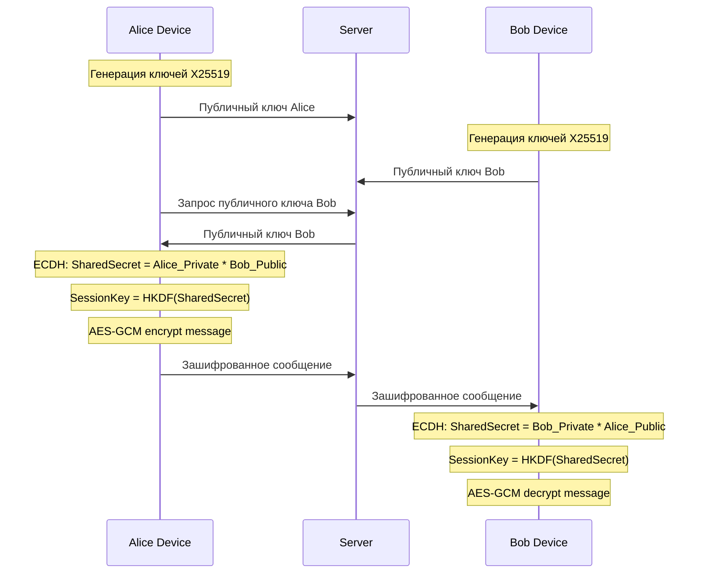

# Сквозное шифрование текстовых сообщений

## Архитектура шифрования

## Алгоритмы

| Компонент | Алгоритм | Назначение |

|-----------|----------|------------|

| Обмен ключами | X25519 ECDH | Легкий и безопасный обмен |

| Шифрование | AES-256-GCM | Быстрое симметричное шифрование |

| Деривация ключей | HKDF-SHA256 | Получение сессионных ключей |

| Хранение приватного ключа | flutter_secure_storage | Безопасное хранение на устройстве |

## Изменения

### Backend (ASP.NET Core)

1. **Расширение модели User** ([`User.cs`](_may_messenger_backend/src/MayMessenger.Domain/Entities/User.cs))

- Добавить `PublicKey` (Base64 строка, 32 байта X25519)

2. **Расширение модели Chat** ([`Chat.cs`](_may_messenger_backend/src/MayMessenger.Domain/Entities/Chat.cs))

- Добавить `EncryptedGroupKey` для групповых чатов (зашифрованный AES ключ)

3. **Расширение ChatParticipant**

- Добавить `EncryptedChatKey` (ключ чата, зашифрованный публичным ключом участника)

4. **API endpoints**

- `PUT /api/users/public-key` - обновить публичный ключ пользователя
- `GET /api/users/{userId}/public-key` - получить публичный ключ
- `GET /api/chats/{chatId}/keys` - получить зашифрованные ключи для чата

5. **Миграция БД** - добавить новые поля

### Mobile App (Flutter)

1. **Новый сервис шифрования** (`lib/core/services/encryption_service.dart`)

- Генерация ключей X25519 при регистрации
- ECDH для вычисления общего секрета
- AES-256-GCM шифрование/дешифрование
- Безопасное хранение приватного ключа

2. **Зависимости** ([`pubspec.yaml`](_may_messenger_mobile_app/pubspec.yaml))

- `cryptography: ^2.7.0` - X25519, AES-GCM, HKDF
- `flutter_secure_storage: ^9.0.0` - безопасное хранение ключей

3. **Модификация отправки сообщений**

- Перед отправкой: `encryptedContent = encrypt(content, sessionKey)`
- При получении: `content = decrypt(encryptedContent, sessionKey)`

4. **Кэширование сессионных ключей**

- Хранить вычисленные ключи в памяти для производительности
- Пересчитывать при перезапуске приложения

### Логика для групповых чатов

1. Создатель группы генерирует случайный AES ключ группы
2. Ключ шифруется публичным ключом каждого участника
3. Зашифрованные ключи сохраняются в ChatParticipant.EncryptedChatKey
4. При добавлении нового участника: ключ группы шифруется его публичным ключом

### Обратная совместимость

- Поле `Content` в Message может содержать как открытый текст (старые сообщения), так и зашифрованный
- Добавить флаг `IsEncrypted` в Message для определения типа
- Клиент пытается расшифровать только если `IsEncrypted = true`

## Ограничения простой реализации

- Нет Perfect Forward Secrecy (PFS) - один ключ на чат
- Нет ротации ключей при компрометации
- При смене устройства нужно заново обмениваться ключами