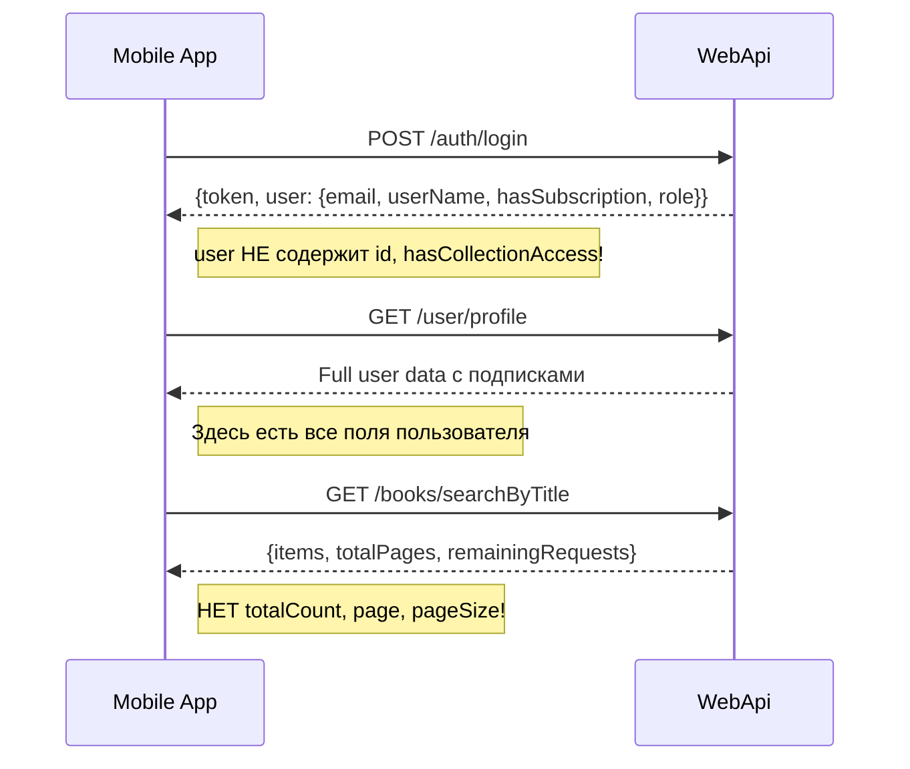

# Исправление типов данных мобильного приложения

## Обнаруженные проблемы

### 1. Несоответствие регистра (PascalCase vs camelCase)

ASP.NET Core автоматически сериализует JSON в camelCase, но модель User в мобильном приложении ожидает PascalCase:

**API возвращает (camelCase):**
```json
{"token": "...", "user": {"email": "...", "userName": "...", "hasSubscription": true, "role": "..."}}
```

**Мобильное приложение ожидает (PascalCase):**
```dart
// user.dart - НЕПРАВИЛЬНО
@JsonKey(name: 'Id') final String? id;
@JsonKey(name: 'Email') final String? email;
@JsonKey(name: 'HasSubscription') final bool hasSubscription;
```

### 2. Несоответствие структуры BookSearchResponse

**API возвращает:**
```json
{"items": [...], "totalPages": 5, "remainingRequests": 100}
```

**Мобильное приложение ожидает:**
```dart
// book.dart - НЕПРАВИЛЬНО
final int totalCount;  // НЕТ в ответе API!
final int page;        // НЕТ в ответе API!
final int pageSize;    // НЕТ в ответе API!
```

### 3. Login response не содержит полных данных пользователя

API `/api/auth/login` возвращает только базовые поля User:
```csharp
User = new { user.Email, user.UserName, user.HasSubscription, user.Role }
```
Нет `Id`, `hasCollectionAccess`, `currentSubscription` и других полей.

---

## План исправления

### 1. Исправить модель User

Файл: [`lib/models/user.dart`](rarebooks_mobile/lib/models/user.dart)

Убрать все `@JsonKey(name: 'PascalCase')` аннотации, использовать camelCase:
- `id` вместо `Id`
- `email` вместо `Email`
- `userName` вместо `UserName`
- `role` вместо `Role`
- `hasSubscription` вместо `HasSubscription`

### 2. Исправить модель BookSearchResponse

Файл: [`lib/models/book.dart`](rarebooks_mobile/lib/models/book.dart)

Привести структуру в соответствие с API:
```dart
class BookSearchResponse {
  final List<Book> items;
  final int totalPages;
  final int? remainingRequests;
  // Удалить: totalCount, page, pageSize
}
```

### 3. Обновить BooksProvider для работы без totalCount

Файл: [`lib/providers/books_provider.dart`](rarebooks_mobile/lib/providers/books_provider.dart)

Убрать использование `response.totalCount` и `response.page`.

### 4. Исправить AuthService для получения полных данных пользователя

Файл: [`lib/services/auth_service.dart`](rarebooks_mobile/lib/services/auth_service.dart)

После успешного логина всегда вызывать `getCurrentUser()` для получения полных данных, т.к. ответ login не содержит всех нужных полей.

### 5. Проверить модель Book на соответствие BookSearchResultDto

Сравнить поля модели Book с [`BookSearchResultDto.cs`](RareBooksService.Common/Models/Dto/BookSearchResultDto.cs):
- API возвращает `firstImageName` для миниатюр
- API возвращает `category` вместо `categoryName`
- API не возвращает многие поля (author, year, etc.) в поиске - они только в деталях книги

### 6. Перегенерировать .g.dart файлы

После изменения моделей запустить:
```bash
flutter pub run build_runner build --delete-conflicting-outputs
```

---

## Диаграмма потока данных



---

## Приоритеты

| Приоритет | Файл | Проблема |
|-----------|------|----------|
| Критический | user.dart + user.g.dart | PascalCase vs camelCase |
| Критический | book.dart + book.g.dart | Отсутствующие поля в ответе |
| Критический | auth_service.dart | Неполные данные после login |
| Высокий | books_provider.dart | Использование несуществующих полей |