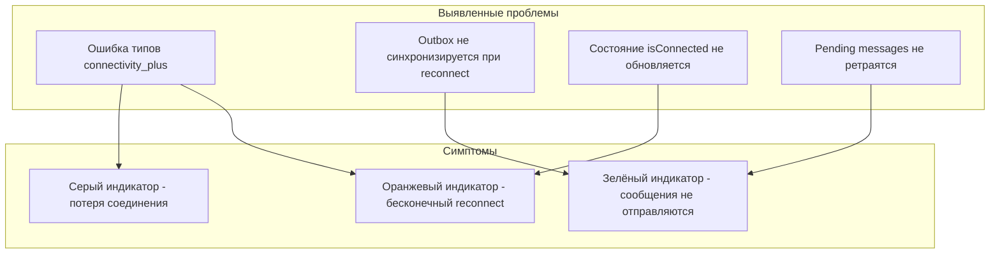

# Исправление системы переподключения SignalR и синхронизации Outbox

## Диагностика проблемы

Анализ скриншотов и кода выявил **4 критические ошибки**:



---

## Ошибка 1: Некорректная типизация connectivity_plus (КРИТИЧЕСКАЯ)

**Файл**: [`_may_messenger_mobile_app/lib/data/datasources/signalr_service.dart`](_may_messenger_mobile_app/lib/data/datasources/signalr_service.dart)В connectivity_plus v5.x метод `onConnectivityChanged` возвращает `List<ConnectivityResult>`, а не одиночный `ConnectivityResult`:

```dart
// ТЕКУЩИЙ КОД (строка 375) - ОШИБКА:
_connectivitySubscription = _connectivity.onConnectivityChanged.listen((result) {
  _hasInternetConnection = result != ConnectivityResult.none; // result это List!
});
```

Сравнение `List != enum` всегда true, поэтому приложение НИКОГДА не определяет потерю интернета!**Исправление**: Проверять первый элемент списка.---

## Ошибка 2: Outbox не синхронизируется при восстановлении соединения

**Файл**: [`_may_messenger_mobile_app/lib/presentation/providers/signalr_provider.dart`](_may_messenger_mobile_app/lib/presentation/providers/signalr_provider.dart)В callback `setOnReconnectedCallback` синхронизируются только статусы, но **НЕ** pending messages из outbox:

```dart
_signalRService.setOnReconnectedCallback(() async {
  await statusSyncService.forceSync();  // Только статусы!
  // Outbox НЕ синхронизируется!
});
```

**Исправление**: Создать `OutboxSyncService` и вызывать его при reconnect.---

## Ошибка 3: Состояние isConnected не синхронизировано с реальным

**Файл**: [`_may_messenger_mobile_app/lib/presentation/providers/signalr_provider.dart](_may_messenger_mobile_app/lib/presentation/providers/signalr_provider.dart)_signalRService.setOnConnectionStateChanged()` никогда не вызывается, поэтому UI показывает неверный индикатор соединения.**Исправление**: Установить callback для обновления состояния.---

## Ошибка 4: Pending messages не синхронизируются при загрузке

**Файл**: [`_may_messenger_mobile_app/lib/presentation/providers/messages_provider.dart`](_may_messenger_mobile_app/lib/presentation/providers/messages_provider.dart)При `loadMessages()` pending сообщения загружаются из outbox и отображаются, но их синхронизация не запускается:

```dart
// Шаг 3: Load pending messages from outbox
final pendingMessages = await _outboxRepository.getPendingMessagesForChat(chatId);
// ... конвертация в Message для отображения
// НО НЕТ КОДА ДЛЯ ИХ ОТПРАВКИ!
```

---

## План исправлений

### Шаг 1: Исправить connectivity_plus типизацию

В `signalr_service.dart`:

- Изменить обработчик `onConnectivityChanged` для работы с `List<ConnectivityResult>`
- Исправить `checkConnectivity()` для возврата `List`

### Шаг 2: Создать OutboxSyncService

Новый файл `_may_messenger_mobile_app/lib/data/services/outbox_sync_service.dart`:

- Сервис для автоматической синхронизации pending messages
- Вызывается при восстановлении соединения
- Периодически проверяет outbox
- Использует exponential backoff

### Шаг 3: Интегрировать OutboxSyncService

В `signalr_provider.dart`:

- Добавить вызов OutboxSyncService в reconnected callback
- Установить `setOnConnectionStateChanged` callback для синхронизации состояния

### Шаг 4: Запускать синхронизацию при loadMessages

В `messages_provider.dart`:

- При загрузке сообщений проверять есть ли pending messages
- Если соединение активно - запускать их синхронизацию

### Шаг 5: Добавить провайдер для OutboxSyncService

В `auth_provider.dart`:

- Создать provider для OutboxSyncService

---

## Изменяемые файлы

| Файл | Изменения |

|------|-----------|

| [`signalr_service.dart`](_may_messenger_mobile_app/lib/data/datasources/signalr_service.dart) | Исправить типы connectivity_plus |

| [`signalr_provider.dart`](_may_messenger_mobile_app/lib/presentation/providers/signalr_provider.dart) | Добавить connection state callback и outbox sync |

| [`messages_provider.dart`](_may_messenger_mobile_app/lib/presentation/providers/messages_provider.dart) | Запускать синхронизацию pending при loadMessages |

| [`outbox_sync_service.dart`](_may_messenger_mobile_app/lib/data/services/outbox_sync_service.dart) | **Новый файл** - сервис синхронизации outbox |