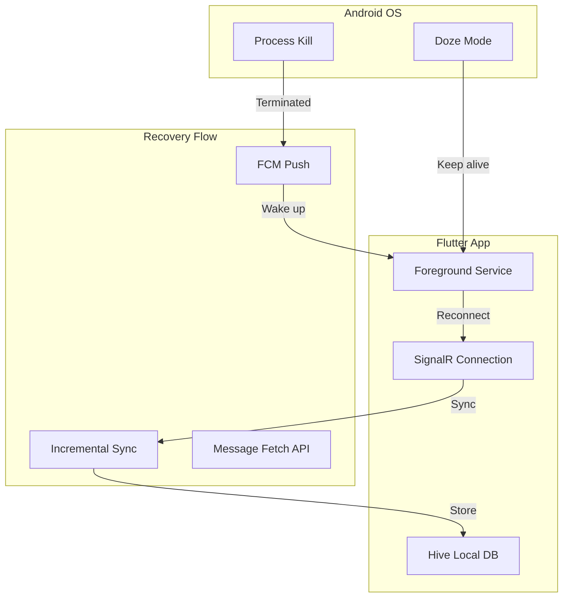

# План исправления переподключения SignalR и потери сообщений

## Диагностика: Выявленные критические проблемы

### 1. Отсутствие метода Ping на сервере

Клиент вызывает `invoke('Ping')` в [`signalr_service.dart:191`](d:\_SOURCES\source\RareBooksServicePublic\_may_messenger_mobile_app\lib\data\datasources\signalr_service.dart), но на сервере в [`ChatHub.cs`](d:\_SOURCES\source\RareBooksServicePublic\_may_messenger_backend\src\MayMessenger.API\Hubs\ChatHub.cs) этот метод отсутствует. Health check всегда падает с ошибкой.

### 2. Отсутствие фонового сервиса (КРИТИЧНО)

В [`pubspec.yaml`](d:\_SOURCES\source\RareBooksServicePublic\_may_messenger_mobile_app\pubspec.yaml) нет пакетов для работы в фоне:

- Нет `flutter_background_service`
- Нет `android_alarm_manager_plus`

Android убивает приложение, SignalR отключается, механизма восстановления нет.

### 3. Отсутствие FOREGROUND_SERVICE permission

В [`AndroidManifest.xml`](d:\_SOURCES\source\RareBooksServicePublic\_may_messenger_mobile_app\android\app\src\main\AndroidManifest.xml) нет необходимых разрешений для фонового сервиса.

### 4. IncrementalSync не подключен

В [`signalr_provider.dart`](d:\_SOURCES\source\RareBooksServicePublic\_may_messenger_mobile_app\lib\presentation\providers\signalr_provider.dart) не настроен обработчик `onIncrementalSyncResult`, хотя метод существует в SignalRService.

### 5. Неоптимальные таймауты

- `requestTimeout: 3000` слишком мал для мобильных сетей
- Delay 2 секунды в `_attemptReconnect()` замедляет переподключение

### 6. FCM Background Handler не сохраняет сообщения

В [`main.dart:30-72`](d:\_SOURCES\source\RareBooksServicePublic\_may_messenger_mobile_app\lib\main.dart) фоновый обработчик только показывает уведомление, но не сохраняет сообщение в Hive.---

## Архитектура решения



---

## Шаги реализации

### Шаг 1: Добавить метод Ping на сервер

Добавить простой метод в `ChatHub.cs` для проверки соединения:

```csharp
public async Task Ping()
{
    await Clients.Caller.SendAsync("Pong");
}
```


### Шаг 2: Добавить flutter_background_service

Добавить в `pubspec.yaml`:

```yaml
flutter_background_service: ^5.0.5
flutter_background_service_android: ^6.2.2
```


### Шаг 3: Добавить разрешения в AndroidManifest

```xml
<uses-permission android:name="android.permission.FOREGROUND_SERVICE"/>
<uses-permission android:name="android.permission.FOREGROUND_SERVICE_DATA_SYNC"/>
```


### Шаг 4: Создать BackgroundService

Новый файл `lib/core/services/background_service.dart`:

- Запуск foreground service при входе в фон
- Поддержание SignalR heartbeat
- Обработка переподключения

### Шаг 5: Подключить IncrementalSyncResult handler

В `signalr_provider.dart` добавить обработчик:

```dart
_signalRService.onIncrementalSyncResult((syncData) {
  // Process missed messages
  // Update local cache
});
```


### Шаг 6: Улучшить логику переподключения

В `signalr_service.dart`:

- Увеличить `requestTimeout` до 10000
- Убрать delay 2s в `_attemptReconnect()`
- Добавить агрессивный reconnect при resume

### Шаг 7: Исправить FCM Background Handler

В `main.dart` сохранять сообщение в Hive:

```dart
Future<void> _firebaseMessagingBackgroundHandler(RemoteMessage message) async {
  // Parse message
  // Save to Hive cache
  // Show notification
}
```


### Шаг 8: Улучшить lifecycle handling

В `main.dart` `didChangeAppLifecycleState`:

- При `paused` - запустить foreground service
- При `resumed` - немедленный reconnect + incremental sync
- При `detached` - cleanup

---

## Ожидаемый результат

- Приложение поддерживает соединение в фоне через foreground service
- При "убийстве" процесса FCM доставляет push, приложение восстанавливает сообщения
- Мгновенное переподключение при возврате в foreground