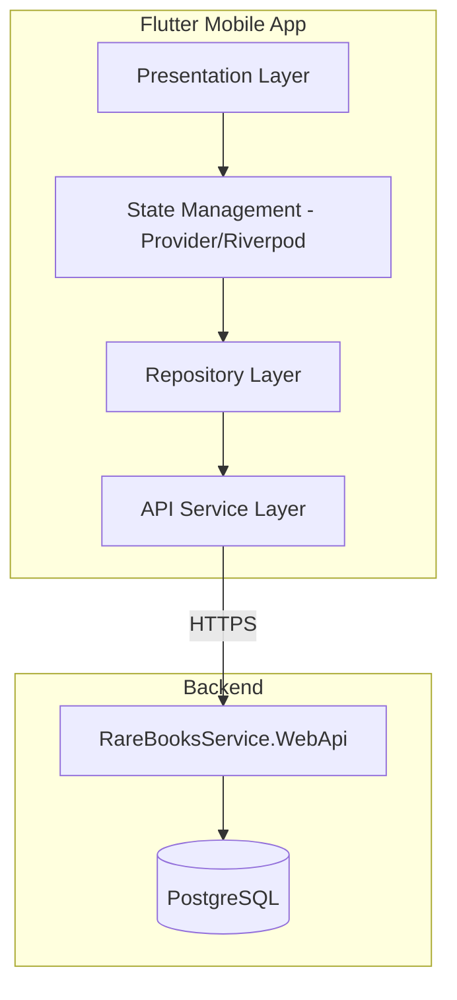

# Rare Books Service - Flutter Mobile App

## Overview

Create a Flutter mobile application that provides the same functionality as the existing React web client ([rarebooksservice.frontend.v3/src/App.jsx](rarebooksservice.frontend.v3/src/App.jsx)), connecting to the API at `https://rare-books.ru/api`.

## Architecture




## Project Structure

```javascript
rarebooks_mobile/
├── lib/
│   ├── main.dart
│   ├── config/
│   │   ├── api_config.dart
│   │   └── theme.dart
│   ├── models/
│   │   ├── book.dart
│   │   ├── user.dart
│   │   ├── category.dart
│   │   ├── subscription.dart
│   │   └── collection_book.dart
│   ├── services/
│   │   ├── api_service.dart
│   │   ├── auth_service.dart
│   │   └── storage_service.dart
│   ├── providers/
│   │   ├── auth_provider.dart
│   │   ├── books_provider.dart
│   │   └── language_provider.dart
│   ├── screens/
│   │   ├── home_screen.dart
│   │   ├── login_screen.dart
│   │   ├── register_screen.dart
│   │   ├── book_detail_screen.dart
│   │   ├── search_results_screen.dart
│   │   ├── favorites_screen.dart
│   │   ├── categories_screen.dart
│   │   ├── collection_screen.dart
│   │   ├── subscription_screen.dart
│   │   ├── profile_screen.dart
│   │   └── notifications_screen.dart
│   ├── widgets/
│   │   ├── book_card.dart
│   │   ├── search_bar.dart
│   │   ├── image_gallery.dart
│   │   └── subscription_status.dart
│   └── l10n/
│       ├── app_ru.arb
│       └── app_en.arb
├── pubspec.yaml
└── android/
```


## Features to Implement

### Phase 1: Core Infrastructure

- Project setup with Flutter 3.x
- API client with Dio (HTTP library)
- Secure token storage using flutter_secure_storage
- State management with Provider or Riverpod
- Theme and styling matching web client (Material Design)
- Localization (Russian/English)

### Phase 2: Authentication

- Login screen
- Registration screen with captcha support
- Token management and auto-refresh
- Logout functionality

### Phase 3: Book Search and Browse

- Home screen with hero section and search
- Search by title with exact match option
- Search by description
- Search by price range
- Search by category
- Search by seller
- Paginated results list

### Phase 4: Book Details

- Book detail screen with full information
- Image gallery with pinch-to-zoom (photo_view package)
- Add/remove from favorites
- Seller link navigation

### Phase 5: User Features

- Favorites list with pagination
- Categories browser
- User profile screen
- Subscription status and management

### Phase 6: Collection Management (Premium Feature)

- View user collection
- Add/edit/delete collection books
- Collection statistics
- Image upload for collection items
- Export collection (PDF/JSON)

### Phase 7: Notifications

- Notification preferences
- Telegram integration status

## Key Dependencies

```yaml
dependencies:
  flutter:
    sdk: flutter
  dio: ^5.4.0               # HTTP client
  flutter_secure_storage: ^9.0.0  # Secure token storage
  provider: ^6.1.1          # State management
  go_router: ^13.0.0        # Navigation
  cached_network_image: ^3.3.1  # Image caching
  photo_view: ^0.14.0       # Image zoom
  flutter_localizations:    # Localization
    sdk: flutter
  intl: ^0.18.1             # Internationalization
  url_launcher: ^6.2.0      # Open external links
  share_plus: ^7.2.0        # Share functionality
```


## API Endpoints (from [rarebooksservice.frontend.v3/src/api.js](rarebooksservice.frontend.v3/src/api.js))

| Feature | Endpoint | Method ||---------|----------|--------|| Login | `/api/auth/login` | POST || Register | `/api/auth/register` | POST || Get User | `/api/auth/user` | GET || Search by Title | `/api/books/searchByTitle` | GET || Search by Description | `/api/books/searchByDescription` | GET || Search by Price Range | `/api/books/searchByPriceRange` | GET || Search by Category | `/api/books/searchByCategory` | GET || Search by Seller | `/api/books/searchBySeller` | GET || Get Book Details | `/api/books/{id}` | GET || Get Book Images | `/api/books/{id}/images` | GET || Get Favorites | `/api/books/favorites` | GET || Add to Favorites | `/api/books/{id}/favorite` | POST || Get Categories | `/api/categories` | GET || User Collection | `/api/usercollection` | GET/POST || Subscription Plans | `/api/subscription/plans` | GET |

## Design Approach

- Material Design 3 with custom theme matching web client colors
- Primary color: `#d32f2f` (red)
- Clean, modern UI with card-based layouts
- Bottom navigation for main sections
- Pull-to-refresh on list screens
- Skeleton loading states
- Offline-first approach with local caching

## Excluded Features (Admin Panel)

- User management