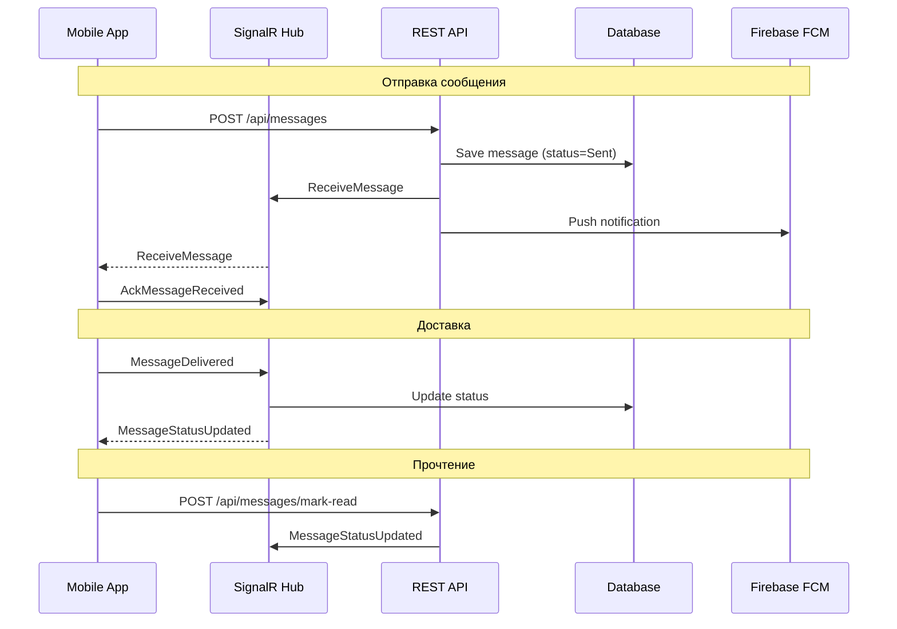

# Исправление системы доставки сообщений и связанных проблем

## Анализ текущего состояния

### Архитектура системы доставки сообщений:

### Выявленные проблемы:

1. **Sticky Date Header всегда показывает "вчера"**

- В [`chat_screen.dart`](c:\rarebooks\_may_messenger_mobile_app\lib\presentation\screens\chat_screen.dart) функция `_updateVisibleDate()` вызывается при построении списка, но `_currentVisibleDate` инициализируется как `null` и обновляется только при скролле
- При отображении sticky header используется дата, которая может быть неактуальной

2. **Ненадежная доставка статусов**

- SignalR-обновления могут теряться при плохом соединении
- Отсутствует гарантированная синхронизация статуса `played` для аудиосообщений
- `AckRetryService` имеет ограничение в 5 попыток, после чего сообщение теряется

3. **Отсутствие полноэкранного просмотра аватаров**

- В [`user_profile_screen.dart`](c:\rarebooks\_may_messenger_mobile_app\lib\presentation\screens\user_profile_screen.dart) аватар не кликабелен
- Нет возможности сохранить аватар в галерею

4. **Отсутствие сохранения изображений из чата**

- В [`fullscreen_image_viewer.dart`](c:\rarebooks\_may_messenger_mobile_app\lib\presentation\widgets\fullscreen_image_viewer.dart) нет кнопки сохранения

---

## План исправлений

### 1. Исправление Sticky Date Header

**Файл:** [`chat_screen.dart`](c:\rarebooks\_may_messenger_mobile_app\lib\presentation\screens\chat_screen.dart)**Проблема:** `_updateVisibleDate()` использует приблизительный расчет позиции, который может давать неверные результаты.**Решение:**

- Использовать `ScrollNotification` для точного определения видимых элементов
- Вычислять дату на основе реальной позиции прокрутки относительно items с учетом reverse списка
- Инициализировать `_currentVisibleDate` при первой загрузке сообщений

### 2. Повышение надежности доставки статусов

#### 2.1 Мобильное приложение

**Файлы:**

- [`signalr_service.dart`](c:\rarebooks\_may_messenger_mobile_app\lib\data\datasources\signalr_service.dart)
- [`status_sync_service.dart`](c:\rarebooks\_may_messenger_mobile_app\lib\data\services\status_sync_service.dart)
- [`messages_provider.dart`](c:\rarebooks\_may_messenger_mobile_app\lib\presentation\providers\messages_provider.dart)

**Улучшения:**

- Добавить обработчик `BatchMessageStatusUpdated` в SignalR
- Увеличить частоту polling для исходящих сообщений (особенно для delivered и read)
- Добавить периодическую синхронизацию статусов из API как fallback
- Улучшить обработку `played` статуса с гарантированной записью в Hive

#### 2.2 Бэкенд

**Файлы:**

- [`ChatHub.cs`](c:\rarebooks\_may_messenger_backend\src\MayMessenger.API\Hubs\ChatHub.cs)
- [`MessagesController.cs`](c:\rarebooks\_may_messenger_backend\src\MayMessenger.API\Controllers\MessagesController.cs)
- [`AckRetryService.cs`](c:\rarebooks\_may_messenger_backend\src\MayMessenger.API\Services\AckRetryService.cs)

**Улучшения:**

- Увеличить `MaxRetries` в `AckRetryService` с 5 до 10
- Добавить API endpoint для получения статусов всех сообщений за период
- Улучшить логику `CalculateAggregateStatusAsync` для групповых чатов

### 3. Полноэкранный просмотр и сохранение аватаров

**Новый файл:** `fullscreen_avatar_viewer.dart`**Изменения в:**

- [`user_profile_screen.dart`](c:\rarebooks\_may_messenger_mobile_app\lib\presentation\screens\user_profile_screen.dart) - сделать аватар кликабельным
- [`cached_avatar.dart`](c:\rarebooks\_may_messenger_mobile_app\lib\presentation\widgets\cached_avatar.dart) - добавить onTap callback

**Функционал:**

- Полноэкранный просмотр с pinch-to-zoom
- Кнопка сохранения в галерею (используя `image_gallery_saver`)
- Swipe-to-dismiss

### 4. Сохранение изображений из чата

**Файл:** [`fullscreen_image_viewer.dart`](c:\rarebooks\_may_messenger_mobile_app\lib\presentation\widgets\fullscreen_image_viewer.dart)**Изменения:**

- Добавить кнопку сохранения в toolbar
- Использовать `image_gallery_saver` или `gal` для сохранения
- Показывать индикатор загрузки и подтверждение сохранения

---

## Порядок реализации

1. Исправить sticky date header (быстрое исправление)
2. Добавить сохранение изображений в FullScreenImageViewer
3. Создать FullScreenAvatarViewer и интегрировать