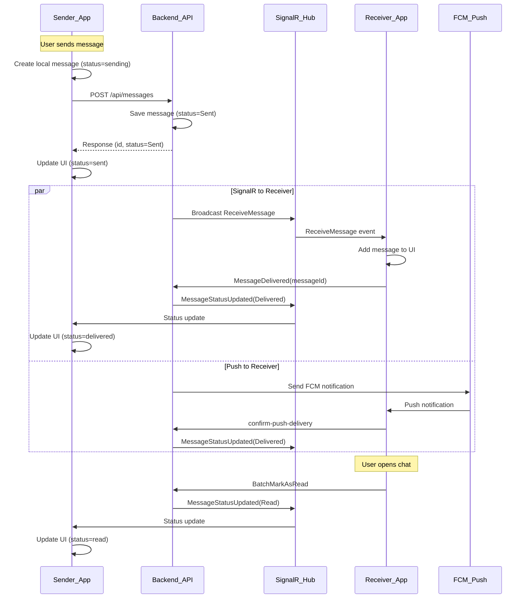

# Переработка архитектуры статусов сообщений

## Выявленные критические проблемы

### 1. Множественные дублирующие механизмы синхронизации

Текущая система имеет **4+ параллельных механизма** обновления статусов, которые конфликтуют:

- SignalR `MessageStatusUpdated` callback
- Polling в `_checkOutgoingMessageStatuses()` каждые 10 сек
- Outbox sync каждые 15 сек  
- StatusSyncService каждые 5 сек
- Push-notification delivery confirmation

### 2. Race condition при смене ID сообщения

После успешной отправки локальный ID (`localId`) заменяется на серверный (`serverId`). SignalR обновления приходят с серверным ID, но UI может ещё ссылаться на старый localId.

### 3. Неправильный flow статусов при отправке

```
Текущий (неправильный):
[UI: sending] -> [API: Sent] -> [UI: sent] -> [SignalR: ???] -> [UI: spinner forever]

Правильный:
[UI: sending] -> [API: Sent] -> [UI: sent] -> [SignalR: Delivered] -> [UI: delivered]
```

### 4. Отсутствие единого источника правды

Статус обновляется из разных мест без приоритизации, что приводит к "status flapping".

---

## Новая архитектура



---

## План изменений

### Шаг 1: Упростить архитектуру - один механизм вместо четырёх

**Оставить только:**

1. **SignalR** - основной real-time канал (немедленные обновления)
2. **REST API fallback** - polling каждые 30 сек ТОЛЬКО для offline recovery

**Удалить/отключить:**

- Отдельный StatusSyncService (объединить логику в MessagesNotifier)
- Агрессивный polling каждые 5-10 сек
- Дублирующие проверки в _checkOutgoingMessageStatuses

**Файл:** [`messages_provider.dart`](_may_messenger_mobile_app/lib/presentation/providers/messages_provider.dart)

### Шаг 2: Гарантировать немедленное обновление статуса после отправки

После успешного `POST /api/messages`:

1. Сразу обновить UI на статус `sent` (без ожидания SignalR)
2. Зарегистрировать ID mapping
3. Удалить таймер "stuck message" - сообщение уже отправлено
```dart
// После успешной синхронизации
state = state.copyWith(messages: updatedMessages);
// НЕ нужен updateMessageStatus - статус уже в serverMessage
// НЕ нужен таймер retry - сообщение уже на сервере
```


**Файл:** [`messages_provider.dart`](_may_messenger_mobile_app/lib/presentation/providers/messages_provider.dart)

### Шаг 3: Исправить обработку SignalR статусов

Текущая проблема: SignalR callback может прийти ДО того как UI обновил ID с localId на serverId.

Решение: использовать `_findMessageIndex()` для надёжного поиска:

```dart
void _handleStatusUpdate(String messageId, MessageStatus status, String? chatId) {
  // Искать по id, localId, И через mapping
  final index = _findMessageIndex(messageId);
  if (index != -1) {
    updateMessageStatus(messageId, status);
  }
}
```

**Файлы:**

- [`signalr_provider.dart`](_may_messenger_mobile_app/lib/presentation/providers/signalr_provider.dart)
- [`messages_provider.dart`](_may_messenger_mobile_app/lib/presentation/providers/messages_provider.dart)

### Шаг 4: Правильная логика "Доставлено"

**Триггеры статуса Delivered:**

1. Получатель получил сообщение через SignalR -> вызов `MessageDelivered`
2. Получатель получил push-notification -> вызов `confirm-push-delivery`

**Изменения на бэкенде:**

- Убедиться что `confirm-push-delivery` корректно отправляет `MessageStatusUpdated`

**Файл:** [`MessagesController.cs`](_may_messenger_backend/src/MayMessenger.API/Controllers/MessagesController.cs)

### Шаг 5: Правильная логика "Прочитано"

**Триггеры статуса Read:**

1. Получатель открывает чат И скроллит до сообщения
2. Debounce 500ms чтобы избежать спама

**Текущая реализация работает**, но нужно:

- Убрать дублирующую логику в StatusSyncService
- Единственный вызов через SignalR `MessageRead`

**Файл:** [`chat_screen.dart`](_may_messenger_mobile_app/lib/presentation/screens/chat_screen.dart)

### Шаг 6: Убрать UI fallback таймер

Текущий `_sendingTimeoutTimer` в `message_bubble.dart` показывает "Retry" через 30 сек. Это неправильно, т.к.:

- Если API вернул успех - сообщение УЖЕ отправлено
- "Retry" создаёт дублирование

**Решение:** Показывать "Retry" только если API вернул ошибку (статус `failed`).

**Файл:** [`message_bubble.dart`](_may_messenger_mobile_app/lib/presentation/widgets/message_bubble.dart)

### Шаг 7: Добавить recovery при переподключении SignalR

После переподключения SignalR:

1. Запросить пропущенные статусы через `IncrementalSync`
2. Обновить все сообщения в текущем чате

**Файл:** [`signalr_provider.dart`](_may_messenger_mobile_app/lib/presentation/providers/signalr_provider.dart)

---

## Файлы для изменения

### Mobile App

1. [`messages_provider.dart`](_may_messenger_mobile_app/lib/presentation/providers/messages_provider.dart) - упростить механизмы синхронизации
2. [`signalr_provider.dart`](_may_messenger_mobile_app/lib/presentation/providers/signalr_provider.dart) - улучшить обработку статусов
3. [`message_bubble.dart`](_may_messenger_mobile_app/lib/presentation/widgets/message_bubble.dart) - убрать неправильный timeout
4. [`chat_screen.dart`](_may_messenger_mobile_app/lib/presentation/screens/chat_screen.dart) - оптимизировать mark as read
5. [`status_sync_service.dart`](_may_messenger_mobile_app/lib/data/services/status_sync_service.dart) - упростить или удалить

### Backend (минимальные изменения)

6. [`MessagesController.cs`](_may_messenger_backend/src/MayMessenger.API/Controllers/MessagesController.cs) - убедиться в корректной отправке статусов
7. [`ChatHub.cs`](_may_messenger_backend/src/MayMessenger.API/Hubs/ChatHub.cs) - проверить логику статусов

---

## Ожидаемый результат

После изменений:

- Сообщение сразу показывает "sent" после успешной отправки (без задержки)
- "Delivered" появляется когда получатель получил push или SignalR событие  
- "Read" появляется когда получатель открыл чат и увидел сообщение
- Нет бесконечных спиннеров и ложных "Retry"