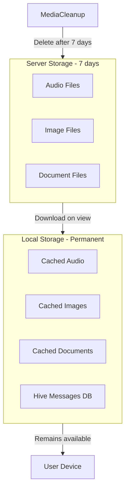

# Комплексное обновление мессенджера

## Часть 1: Инфраструктура для хранения файлов

### nginx/nginx_prod.conf

Добавить location для файлов по аналогии с images/audio:

```nginx
# File attachments (documents, etc.)
location /files/ {
    proxy_pass http://maymessenger_backend/files/;
    proxy_http_version 1.1;
    proxy_set_header Host $host;
    proxy_set_header X-Real-IP $remote_addr;
    proxy_cache_valid 200 1d;
    expires 1d;
    add_header Cache-Control "public, immutable";
}
```


### docker-compose.yml

Добавить volume для файлов:

```yaml
volumes:
    - maymessenger_files:/app/wwwroot/files
# ...
volumes:
  maymessenger_files:
```


### [MediaCleanupService.cs](_may_messenger_backend/src/MayMessenger.Application/Services/MediaCleanupService.cs)

Добавить очистку файлов типа File:

```csharp
else if (message.Type == MessageType.File)
{
    message.Content = "[Файл удален с сервера]";
    filesUpdated++;
}
```

---

## Часть 2: Улучшение аудио виджета

### Проблемы и решения:

1. **Длительность не показывается сразу** - загружать metadata аудио при инициализации виджета
2. **Анимация гистограммы не работает при первом воспроизведении** - использовать StreamBuilder для position
3. **Нет различия "прослушано"** - добавить визуальный индикатор (иконка наушников или галочка)

### [message_bubble.dart](_may_messenger_mobile_app/lib/presentation/widgets/message_bubble.dart)

Изменения в initState:

```dart
// Preload audio duration for immediate display
if (widget.message.type == MessageType.audio) {
  _preloadAudioDuration();
}
```

Добавить индикатор "прослушано":

```dart
// Show "played" indicator for received audio messages
if (widget.message.status == MessageStatus.played && !isMe)
  Icon(Icons.headphones, size: 14, color: Colors.green)
```

---

## Часть 3: Расширение модели сообщений

### Backend: [Message.cs](_may_messenger_backend/src/MayMessenger.Domain/Entities/Message.cs)

Добавить поля:

```csharp
// Reply functionality
public Guid? ReplyToMessageId { get; set; }
public Message? ReplyToMessage { get; set; }

// Forward functionality  
public Guid? ForwardedFromMessageId { get; set; }
public Guid? ForwardedFromUserId { get; set; }
public string? ForwardedFromUserName { get; set; }

// Edit functionality
public bool IsEdited { get; set; } = false;
public DateTime? EditedAt { get; set; }

// Deletion
public bool IsDeleted { get; set; } = false;
public DateTime? DeletedAt { get; set; }
```


### Backend: [MessageDto.cs](_may_messenger_backend/src/MayMessenger.Application/DTOs/MessageDto.cs)

Добавить соответствующие поля в DTO.

### Backend: Миграция

Создать миграцию для новых полей.

### Mobile: [message_model.dart](_may_messenger_mobile_app/lib/data/models/message_model.dart)

Добавить поля:

```dart
final String? replyToMessageId;
final Message? replyToMessage;
final String? forwardedFromUserId;
final String? forwardedFromUserName;
final bool isEdited;
final bool isDeleted;
```

---

## Часть 4: API Endpoints

### [MessagesController.cs](_may_messenger_backend/src/MayMessenger.API/Controllers/MessagesController.cs)

1. **PUT /api/messages/{messageId}** - редактирование текста (только для своих текстовых)
2. **POST /api/messages/forward** - пересылка сообщения
3. **DELETE /api/messages/{messageId}** - полное удаление (обновить существующий)

### [ChatHub.cs](_may_messenger_backend/src/MayMessenger.API/Hubs/ChatHub.cs)

Добавить SignalR события:

- `MessageEdited(messageId, newContent, editedAt)`
- `MessageDeleted(messageId, chatId)`
- `MessageForwarded(messageDto)`

---

## Часть 5: UI - Контекстное меню

### Новый виджет: message_context_menu.dart

Создать виджет меню с опциями:

- Ответить
- Переслать
- Редактировать (только для своих текстовых)
- Удалить
- Копировать текст

### [message_bubble.dart](_may_messenger_mobile_app/lib/presentation/widgets/message_bubble.dart)

Обернуть в GestureDetector с onLongPress для показа меню.---

## Часть 6: Reply (Ответ на сообщение)

### [chat_screen.dart](_may_messenger_mobile_app/lib/presentation/screens/chat_screen.dart)

1. Добавить state для режима ответа:
```dart
Message? _replyToMessage;
```


2. При ответе показывать preview над полем ввода

### [message_input.dart](_may_messenger_mobile_app/lib/presentation/widgets/message_input.dart)

Добавить виджет reply preview над полем ввода.

### [message_bubble.dart](_may_messenger_mobile_app/lib/presentation/widgets/message_bubble.dart)

1. Добавить swipe-to-reply (горизонтальный drag вправо)
2. Если replyToMessageId != null - показывать цитату с tap для навигации

---

## Часть 7: Локальное хранение

### [local_datasource.dart](_may_messenger_mobile_app/lib/data/datasources/local_datasource.dart)

Обеспечить сохранение всех сообщений локально в Hive, включая:

- Файлы (localFilePath)
- Метаданные ответов/пересылок
- Флаги isEdited/isDeleted



---

## Файлы для изменения

**Backend:**

- [nginx_prod.conf](nginx/nginx_prod.conf) - location для /files/
- [docker-compose.yml](docker-compose.yml) - volume maymessenger_files
- [Message.cs](_may_messenger_backend/src/MayMessenger.Domain/Entities/Message.cs) - новые поля
- [MessageDto.cs](_may_messenger_backend/src/MayMessenger.Application/DTOs/MessageDto.cs) - новые поля
- [MessagesController.cs](_may_messenger_backend/src/MayMessenger.API/Controllers/MessagesController.cs) - edit, forward, delete
- [ChatHub.cs](_may_messenger_backend/src/MayMessenger.API/Hubs/ChatHub.cs) - новые события
- [MediaCleanupService.cs](_may_messenger_backend/src/MayMessenger.Application/Services/MediaCleanupService.cs) - cleanup files
- Новая миграция

**Mobile:**

- [message_model.dart](_may_messenger_mobile_app/lib/data/models/message_model.dart) - новые поля
- [message_bubble.dart](_may_messenger_mobile_app/lib/presentation/widgets/message_bubble.dart) - улучшения аудио, swipe-to-reply, reply preview, context menu
- [audio_waveform.dart](_may_messenger_mobile_app/lib/presentation/widgets/audio_waveform.dart) - анимация
- [chat_screen.dart](_may_messenger_mobile_app/lib/presentation/screens/chat_screen.dart) - reply mode, context menu
- [message_input.dart](_may_messenger_mobile_app/lib/presentation/widgets/message_input.dart) - reply preview
- [api_datasource.dart](_may_messenger_mobile_app/lib/data/datasources/api_datasource.dart) - edit, forward, delete
- [messages_provider.dart](_may_messenger_mobile_app/lib/presentation/providers/messages_provider.dart) - методы edit, forward, delete, reply
- [signalr_service.dart](_may_messenger_mobile_app/lib/data/datasources/signalr_service.dart) - новые события