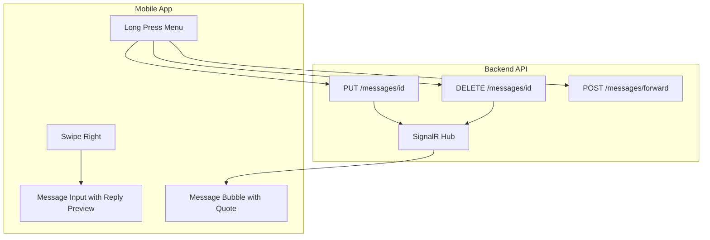

# Расширение функциональности сообщений

## Часть 1: Docker, Nginx и хранение файлов

### 1.1 Создание `docker-compose.yml`

Создать файл для развертывания с:

- Сервис API с volume для wwwroot (audio, images, files)
- PostgreSQL с persistence
- Nginx для reverse proxy и статики

### 1.2 Создание `nginx_prod.conf`

Настроить:

- Проксирование `/api/` и `/chathub` на API
- Статика `/audio/`, `/images/`, `/files/` с cache headers
- Лимит upload 25MB (`client_max_body_size`)
- Gzip компрессия

### 1.3 Обновление [`MediaCleanupService.cs`](C:\rarebooks\_may_messenger_backend\src\MayMessenger.Application\Services\MediaCleanupService.cs)

Добавить обработку `MessageType.File`:

```csharp
else if (message.Type == MessageType.File)
{
    message.Content = "[Файл удален с сервера]";
    filesDeleted++;
}
```

---

## Часть 2: Улучшение аудио виджета

### 2.1 Показ длительности сразу при загрузке

В [`message_bubble.dart`](C:\rarebooks\_may_messenger_mobile_app\lib\presentation\widgets\message_bubble.dart):

- В `_initAudio()` вызывать `_audioPlayer.setUrl()` сразу для получения duration
- Отображать duration даже до первого воспроизведения

### 2.2 Анимация гистограммы при воспроизведении

- Исправить проблему: position stream не обновляется при первом проигрывании
- Убедиться, что `setUrl()` вызывается ДО `play()` для правильной подписки на streams

### 2.3 Визуальное отличие для прослушанных сообщений

Добавить иконку "наушники" или другой индикатор для статуса `played`:

```dart
if (isPlayed) Icon(Icons.headphones, size: 14, color: textColor)
```

---

## Часть 3: Локальное хранение медиа

### 3.1 Автоматическое кеширование при получении

В [`messages_provider.dart`](C:\rarebooks\_may_messenger_mobile_app\lib\presentation\providers\messages_provider.dart):

- При получении сообщения через SignalR с медиа - автоматически скачивать и сохранять локально
- Использовать существующие сервисы `audioStorageService`, `imageStorageService`
- Добавить `fileStorageService` для файлов

### 3.2 Проверка локальной копии при отображении

В `message_bubble.dart`:

- Для каждого типа медиа - сначала проверять локальную копию
- Если локальной нет и сервер вернул null - показывать placeholder

---

## Часть 4: Backend для редактирования, удаления, ответов

### 4.1 Расширение модели [`Message.cs`](C:\rarebooks\_may_messenger_backend\src\MayMessenger.Domain\Entities\Message.cs)

Добавить поля:

```csharp
public Guid? ReplyToMessageId { get; set; }
public Message? ReplyToMessage { get; set; }

public bool IsEdited { get; set; }
public DateTime? EditedAt { get; set; }

public bool IsDeletedForAll { get; set; }
public bool IsDeletedForSender { get; set; }
```


### 4.2 Обновление [`MessageDto.cs`](C:\rarebooks\_may_messenger_backend\src\MayMessenger.Application\DTOs\MessageDto.cs)

Добавить те же поля + `ReplyToMessagePreview` для цитаты

### 4.3 Endpoints в [`MessagesController.cs`](C:\rarebooks\_may_messenger_backend\src\MayMessenger.API\Controllers\MessagesController.cs)

- `PUT /api/messages/{id}` - редактирование текста
- `DELETE /api/messages/{id}?forAll=true/false` - удаление
- `POST /api/messages/{chatId}/forward` - пересылка

### 4.4 SignalR события в [`ChatHub.cs`](C:\rarebooks\_may_messenger_backend\src\MayMessenger.API\Hubs\ChatHub.cs)

- `MessageEdited(messageId, newContent, editedAt)`
- `MessageDeleted(messageId, forAll)`

### 4.5 Миграция БД

Создать миграцию для новых полей---

## Часть 5: Mobile - Пересылка, редактирование, удаление

### 5.1 Обновление [`message_model.dart`](C:\rarebooks\_may_messenger_mobile_app\lib\data\models\message_model.dart)

Добавить поля:

```dart
final String? replyToMessageId;
final Message? replyToMessage;
final bool isEdited;
final DateTime? editedAt;
final bool isDeletedForAll;
```


### 5.2 Меню действий при долгом нажатии

В `message_bubble.dart`:

- Обернуть в `GestureDetector` с `onLongPress`
- Показать panel сверху экрана с кнопками: Ответить, Переслать, Редактировать*, Удалить
- *Редактировать только для текстовых сообщений от текущего пользователя

### 5.3 Диалог редактирования

- Открывать текстовое поле с текущим содержимым
- После сохранения - отправлять PUT запрос

### 5.4 Диалог удаления

- Показать выбор: "Удалить у меня" / "Удалить у всех"
- Отправить DELETE запрос

### 5.5 Пересылка

- Открыть список чатов для выбора
- Отправить POST запрос с ID сообщения и целевым chatId

---

## Часть 6: Mobile - Ответ на сообщения

### 6.1 Свайп для ответа

В `message_bubble.dart`:

- Обернуть в `Dismissible` или `GestureDetector` для свайпа вправо
- При свайпе вызвать callback `onReply(message)`

### 6.2 UI режима ответа

В [`message_input.dart`](C:\rarebooks\_may_messenger_mobile_app\lib\presentation\widgets\message_input.dart):

- Добавить state `replyToMessage`
- Показывать preview цитируемого сообщения над полем ввода
- Кнопка X для отмены режима ответа

### 6.3 Отображение цитаты в сообщении

В `message_bubble.dart`:

- Если `message.replyToMessage != null` - показать цитату сверху
- При нажатии на цитату - scrollTo оригинальному сообщению

### 6.4 Навигация к сообщению

В [`chat_screen.dart`](C:\rarebooks\_may_messenger_mobile_app\lib\presentation\screens\chat_screen.dart):

- Добавить `ScrollController` с `GlobalKey` для каждого сообщения
- Метод `scrollToMessage(messageId)` с highlight

---

## Архитектура потока данных



---

## Порядок реализации (todos)

1. Docker/Nginx конфигурации
2. MediaCleanupService для файлов
3. Улучшения аудио виджета
4. Backend: новые поля в Message + миграция
5. Backend: endpoints для edit/delete/forward
6. Backend: SignalR события
7. Mobile: обновление модели
8. Mobile: локальное хранение медиа
9. Mobile: меню при долгом нажатии
10. Mobile: редактирование и удаление