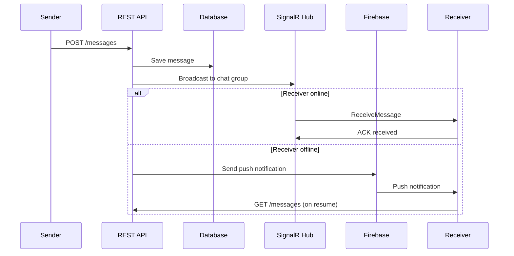

# План оптимизации May Messenger

## Обзор

Этот план охватывает 8 ключевых проблем: производительность доставки сообщений, исправление аватаров, ошибка создания группы, просмотр изображений серией, сохранение в галерею, фокус при ответе на сообщение, и корректный статус онлайн.---

## 1. Исправление проблемы с аватарами (КРИТИЧНО)

**Проблема:** Аватары перепутаны между пользователями. При отсутствии аватара у пользователя отображается чужой аватар.**Причина:** В [`cached_avatar.dart`](_may_messenger_mobile_app/lib/presentation/widgets/cached_avatar.dart) и [`avatar_cache_service.dart`](_may_messenger_mobile_app/lib/core/services/avatar_cache_service.dart) используется `userId` для кеширования, но `avatarPath` может быть `null`, и при этом возвращается cached file от другого пользователя.**Решение:**

- В `getCachedPath()` и `getLocalPath()` - возвращать `null` если `avatarPath == null` (пользователь не установил аватар)
- Добавить проверку соответствия avatarPath в метаданных кеша
- В `CachedAvatar` - если `avatarPath == null`, сразу показывать fallback (инициалы)

---

## 2. Ошибка создания группы (код 500)

**Проблема:** DioException с кодом 500 при создании группы.**Причина:** В [`create_group_screen.dart`](_may_messenger_mobile_app/lib/presentation/screens/create_group_screen.dart) `_selectedUserIds` - это `Set<String>`, но бэкенд ожидает `List<Guid>`. Возможно отправляются userId в неверном формате.**Решение:**

- Добавить try-catch с логированием полного ответа сервера
- Проверить формат userId (должен быть валидный GUID)
- Добавить валидацию на бэкенде в [`ChatsController.cs`](_may_messenger_backend/src/MayMessenger.API/Controllers/ChatsController.cs) с понятными сообщениями об ошибках
- Использовать `validateStatus: (status) => true` для получения полного error body

---

## 3. Фокус при ответе на сообщение

**Проблема:** При выборе "Ответить" не ставится фокус в текстовое поле.**Решение:** В [`chat_screen.dart`](_may_messenger_mobile_app/lib/presentation/screens/chat_screen.dart) метод `_setReplyToMessage()` должен запрашивать фокус у `MessageInput`.Нужно:

- Добавить `FocusNode` для текстового поля в `MessageInput`
- Экспортировать метод `requestFocus()` через callback или GlobalKey
- Вызывать `requestFocus()` после установки `_replyToMessage`

---

## 4. Просмотр изображений серией

**Проблема:** При просмотре изображения нельзя листать к предыдущему/следующему.**Решение:** Модифицировать [`fullscreen_image_viewer.dart`](_may_messenger_mobile_app/lib/presentation/widgets/fullscreen_image_viewer.dart):

```dart
class FullScreenImageViewer extends StatefulWidget {
  final List<ImageData> images; // Все изображения из чата
  final int initialIndex;       // Начальный индекс
  // ...
}
```


- Использовать `PageView` для горизонтального пролистывания
- Передавать список изображений из `message_bubble.dart`
- Фильтровать сообщения с типом `MessageType.image` в чате

---

## 5. Сохранение изображений в галерею

**Проблема:** Изображение не появляется в галерее устройства.**Решение:** Использовать пакет `saver_gallery` для правильной работы с MediaStore API:

```yaml
# pubspec.yaml
dependencies:
  saver_gallery: ^3.0.6
```

Обновить [`gallery_service.dart`](_may_messenger_mobile_app/lib/core/services/gallery_service.dart):

- Использовать `SaverGallery.saveImage()` вместо ручного копирования файлов
- Пакет автоматически работает с MediaStore на Android

---

## 6. Статус онлайн только при активном приложении

**Проблема:** Пользователь помечается онлайн при получении push уведомления.**Анализ:** В [`main.dart`](_may_messenger_mobile_app/lib/main.dart) при `didChangeAppLifecycleState` не отправляется статус офлайн. В [`ChatHub.cs`](_may_messenger_backend/src/MayMessenger.API/Hubs/ChatHub.cs) статус онлайн устанавливается только при подключении SignalR.**Решение:**

- **Frontend:** При `AppLifecycleState.paused` - отправлять запрос на сервер `/api/users/go-offline`
- **Frontend:** При `AppLifecycleState.resumed` - отправлять `/api/users/go-online`
- **Backend:** Добавить эндпоинты для явного управления статусом
- **Backend:** Убрать автоматическое `IsOnline = true` при Heartbeat (только при явном вызове)

---

## 7. Оптимизация доставки сообщений и push уведомлений

**Цель:** Максимально быстрая доставка, гарантированное хранение на сервере.**Текущая архитектура:**

- Сообщения отправляются через REST API, доставляются через SignalR
- Push уведомления через Firebase FCM
- Локальное хранение через Hive

**Оптимизации:**

### 7.1 Frontend (mobile app)

- **Outbox pattern уже реализован** в [`outbox_repository.dart`](_may_messenger_mobile_app/lib/data/repositories/outbox_repository.dart) - проверить работоспособность
- Добавить retry с exponential backoff для failed messages
- Реализовать optimistic UI update (сообщение показывается сразу, синхронизируется в фоне)

### 7.2 Backend

- В [`MessagesController.cs`](MessagesController.cs) добавить очередь для недоставленных сообщений
- Увеличить приоритет SignalR событий
- Добавить batch status updates для снижения нагрузки

### 7.3 Push уведомления

- Проверить настройки FCM priority (должен быть HIGH)
- Добавить data-only сообщения для фоновой синхронизации

---

## 8. Гарантированная доставка офлайн-пользователям

**Текущее состояние:** Сообщения хранятся на сервере, но могут быть задержки при sync.**Решение:**

- Добавить `PendingMessages` таблицу на сервере для явного отслеживания недоставленных сообщений
- При подключении пользователя - автоматически отправлять все pending messages
- Реализовать incremental sync по timestamp (уже частично есть в `IncrementalSync`)

---

## Диаграмма архитектуры доставки сообщений



---

## Приоритет задач

| Приоритет | Задача | Сложность |

|-----------|--------|-----------|

| 1 | Исправление аватаров | Низкая |

| 2 | Фокус при ответе | Низкая |

| 3 | Статус онлайн | Средняя |

| 4 | Ошибка создания группы | Низкая |

| 5 | Просмотр изображений серией | Средняя |

| 6 | Сохранение в галерею | Низкая |

| 7 | Оптимизация доставки | Высокая |

| 8 | Гарантированная доставка | Высокая |---

## Файлы для изменения

### Frontend (Flutter)

- [`avatar_cache_service.dart`](_may_messenger_mobile_app/lib/core/services/avatar_cache_service.dart)
- [`cached_avatar.dart`](_may_messenger_mobile_app/lib/presentation/widgets/cached_avatar.dart)
- [`create_group_screen.dart`](_may_messenger_mobile_app/lib/presentation/screens/create_group_screen.dart)
- [`fullscreen_image_viewer.dart`](_may_messenger_mobile_app/lib/presentation/widgets/fullscreen_image_viewer.dart)
- [`message_bubble.dart`](_may_messenger_mobile_app/lib/presentation/widgets/message_bubble.dart)
- [`chat_screen.dart`](_may_messenger_mobile_app/lib/presentation/screens/chat_screen.dart)
- [`message_input.dart`](_may_messenger_mobile_app/lib/presentation/widgets/message_input.dart)
- [`gallery_service.dart`](_may_messenger_mobile_app/lib/core/services/gallery_service.dart)
- [`main.dart`](_may_messenger_mobile_app/lib/main.dart)
- [`pubspec.yaml`](_may_messenger_mobile_app/pubspec.yaml)

### Backend (C#)

- [`ChatsController.cs`](_may_messenger_backend/src/MayMessenger.API/Controllers/ChatsController.cs)
- [`UsersController.cs`](_may_messenger_backend/src/MayMessenger.API/Controllers/UsersController.cs)