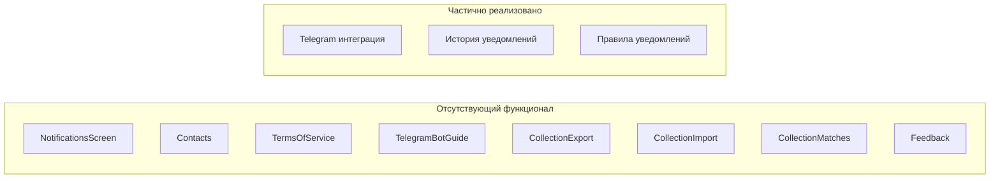

# Анализ и план доработки мобильного приложения

## Текущее состояние

### Что реализовано в мобильном приложении

| Функционал | Мобильное | Веб | Статус ||------------|-----------|-----|--------|| Главная страница с поиском | + | + | Готово || Авторизация/Регистрация | + | + | Готово || Категории | + | + | Готово || Избранное | + | + | Готово || Коллекция (базовый функционал) | + | + | Частично || Детали книги | + | + | Готово || Подписка | + | + | Готово || Профиль пользователя | + | + | Готово || Поиск (все типы) | + | + | Готово || Локализация RU/EN | + | + | Готово |

### Что требует доработки



---

## План доработки

### 1. Доработка NotificationsScreen

**Файл:** [`lib/screens/notifications_screen.dart`](rarebooks_mobile/lib/screens/notifications_screen.dart)Текущее состояние - только заглушки с "Функция в разработке". Необходимо реализовать:

- Создание/редактирование/удаление правил уведомлений
- Список существующих правил с отображением статуса
- Подключение/отключение Telegram (генерация токена привязки)
- История уведомлений (вкладка или отдельный экран)
- Отправка тестового уведомления

**API методы уже реализованы в** [`lib/services/api_service.dart`](rarebooks_mobile/lib/services/api_service.dart):

- `getNotificationPreferences()`
- `createNotificationPreference()`
- `updateNotificationPreference()`
- `deleteNotificationPreference()`
- `getNotificationHistory()`
- `getTelegramStatus()`
- `connectTelegram()` / `disconnectTelegram()`

### 2. Добавление отсутствующих экранов

#### 2.1 ContactsScreen (Контакты)

Простой экран с контактной информацией:

- Email: vk-87@mail.ru
- Telegram: @doomkinn

#### 2.2 TermsOfServiceScreen (Публичная оферта)

Экран с текстом публичной оферты. Можно загружать из API или встроить статически.

#### 2.3 TelegramBotGuideScreen (Руководство по Telegram боту)

Пошаговое руководство по подключению бота @RareBooksReminderBot:

- Инструкции по настройке
- Описание возможностей
- Пример уведомления
- FAQ

### 3. Расширение функционала коллекции

**Файл:** [`lib/screens/collection_screen.dart`](rarebooks_mobile/lib/screens/collection_screen.dart)Добавить:

- Экспорт в PDF (скачивание файла)
- Экспорт в ZIP/JSON
- Импорт коллекции из JSON
- Удаление всей коллекции с подтверждением
- Кнопка "Найти совпадения" на экране детали книги коллекции

**Требуется добавить API методы:**

```dart
// В api_service.dart
Future<Uint8List> exportCollectionPdf();
Future<Uint8List> exportCollectionJson();
Future<void> importCollection(Uint8List data);
Future<void> deleteAllCollection();
```


### 4. Добавление CollectionBookMatchesScreen

Новый экран для отображения похожих книг из базы данных для книги из коллекции. API метод `getCollectionBookMatches()` уже реализован.

### 5. Обратная связь (Feedback)

Добавить возможность отправки обратной связи. API метод `sendFeedback()` уже реализован в [`api_service.dart`](rarebooks_mobile/lib/services/api_service.dart).Варианты размещения:

- В ProfileScreen
- В отдельном диалоге/экране, доступном из меню

### 6. Навигация (Footer)

Добавить доступ к новым экранам. В веб-версии в футере есть ссылки:

- Публичная оферта
- Контакты  
- Telegram бот

В мобильном приложении можно:

- Добавить в ProfileScreen
- Или в drawer/меню "Ещё"

---

## Приоритеты

| Приоритет | Задача | Сложность ||-----------|--------|-----------|| Высокий | Доработка NotificationsScreen | Средняя || Высокий | CollectionExport/Import | Средняя || Средний | TelegramBotGuideScreen | Низкая || Средний | ContactsScreen | Низкая || Средний | TermsOfServiceScreen | Низкая || Средний | CollectionBookMatchesScreen | Низкая || Низкий | Feedback функционал | Низкая |---

## Структура новых файлов

```javascript
lib/screens/
├── contacts_screen.dart          (новый)
├── terms_of_service_screen.dart  (новый)
├── telegram_guide_screen.dart    (новый)
├── collection_matches_screen.dart (новый)
└── notifications_screen.dart     (доработка)

lib/services/
└── api_service.dart              (добавить методы экспорта/импорта)


```