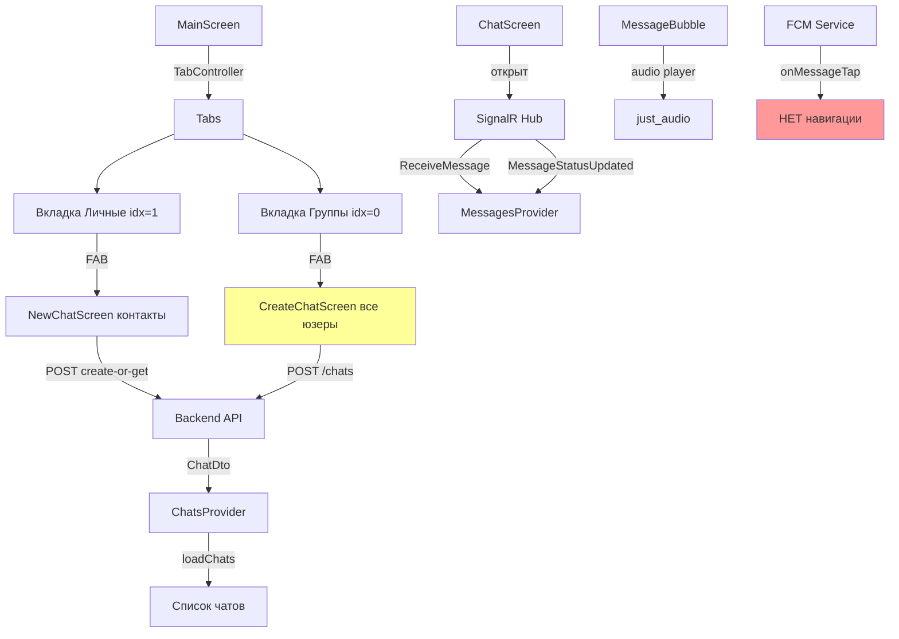
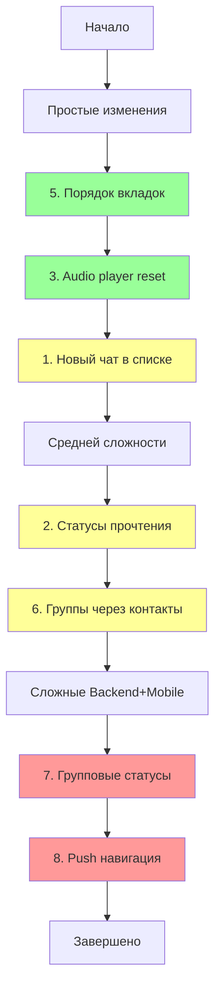
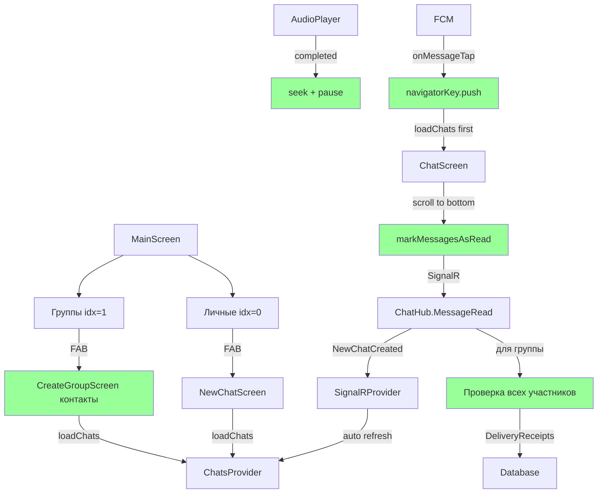

# План улучшений мобильного приложения May Messenger

## Обзор проблем

Выявлено 8 критичных проблем в работе мобильного приложения, требующих исправлений как на mobile, так и на backend уровне.

## Архитектура текущего состояния



## 1. Новый чат не появляется в списке

**Проблема:** После создания чата в [`NewChatScreen.dart:81-150`](c:\rarebooks\_may_messenger_mobile_app\lib\presentation\screens\new_chat_screen.dart) чат создается на backend, но не появляется в списке [`MainScreen`](c:\rarebooks\_may_messenger_mobile_app\lib\presentation\screens\main_screen.dart) до полного перезапуска.

**Причина:** В `NewChatScreen._createOrOpenChat()` после успешного создания вызывается `Navigator.pop()`, но список чатов в `ChatsProvider` не обновляется.

**Решение Mobile:**

- В [`new_chat_screen.dart:81-150`](c:\rarebooks\_may_messenger_mobile_app\lib\presentation\screens\new_chat_screen.dart) после успешного создания чата:

  1. Вызвать `ref.read(chatsProvider.notifier).loadChats(forceRefresh: true)`
  2. Только после загрузки чатов делать `Navigator.pop()` и открывать ChatScreen
  3. Альтернатива: обновлять список чатов через SignalR (см. п.8)

## 2. Статусы прочтения не обновляются

**Проблема:** При открытии чата и прокрутке до конца сообщения не помечаются как прочитанные, счетчик непрочитанных не сбрасывается.

**Текущее состояние:**

- ✅ Backend [`ChatHub.cs:102-115`](c:\rarebooks\_may_messenger_backend\src\MayMessenger.API\Hubs\ChatHub.cs) - метод `MessageRead` реализован
- ✅ Mobile [`signalr_service.dart:54-56`](c:\rarebooks\_may_messenger_mobile_app\lib\data\datasources\signalr_service.dart) - метод `markMessageAsRead` реализован
- ❌ НЕТ вызова `markMessageAsRead` при открытии/прокрутке чата

**Решение Mobile:**

- В [`chat_screen.dart`](c:\rarebooks\_may_messenger_mobile_app\lib\presentation\screens\chat_screen.dart):

  1. Добавить `ScrollController` listener для отслеживания прокрутки
  2. При достижении нижней части списка вызывать `markMessageAsRead` для всех непрочитанных сообщений
  3. Добавить метод `markMessagesAsRead()` в `MessagesProvider`
  4. Вызывать этот метод при `initState()` и при прокрутке до конца

**Решение Backend:**

- В [`ChatsController.cs:33-81`](c:\rarebooks\_may_messenger_backend\src\MayMessenger.API\Controllers\ChatsController.cs):

  1. Метод `GetChats()` уже вызывает `GetUnreadCountAsync`
  2. Добавить пересчет `unreadCount` после `MessageRead` в [`ChatHub.cs`](c:\rarebooks\_may_messenger_backend\src\MayMessenger.API\Hubs\ChatHub.cs)
  3. Отправлять SignalR событие `ChatUnreadCountUpdated` с новым счетчиком

## 3. Audio player не сбрасывается после окончания

**Проблема:** В [`message_bubble.dart:48-92`](c:\rarebooks\_may_messenger_mobile_app\lib\presentation\widgets\message_bubble.dart) кнопка остается в состоянии "пауза" после окончания воспроизведения.

**Текущее состояние:**

- `_audioPlayer.playerStateStream.listen()` отслеживает `state.playing`
- ❌ НЕТ обработки события `ProcessingState.completed`

**Решение Mobile:**

```dart
_audioPlayer.playerStateStream.listen((state) {
  setState(() {
    _isPlaying = state.playing;
  });
  
  // Сброс при окончании
  if (state.processingState == ProcessingState.completed) {
    _audioPlayer.seek(Duration.zero);
    _audioPlayer.pause();
  }
});
```

Изменения в [`message_bubble.dart:41-45`](c:\rarebooks\_may_messenger_mobile_app\lib\presentation\widgets\message_bubble.dart).

## 4. Статусы сообщений - отслеживание и отображение

**Проблема:** Статусы уже реализованы, но не везде работают корректно.

**Текущее состояние:**

- ✅ UI отображает галочки в [`message_bubble.dart:100-139`](c:\rarebooks\_may_messenger_mobile_app\lib\presentation\widgets\message_bubble.dart)
- ✅ Backend обновляет статусы в [`ChatHub.cs:87-115`](c:\rarebooks\_may_messenger_backend\src\MayMessenger.API\Hubs\ChatHub.cs)
- ✅ Mobile получает обновления через SignalR

**Решение:** Проверить корректность работы после исправления п.2.

## 5. Порядок вкладок

**Проблема:** В [`main_screen.dart:69-71`](c:\rarebooks\_may_messenger_mobile_app\lib\presentation\screens\main_screen.dart) порядок вкладок: "Группы" (idx=0), "Личные" (idx=1).

**Решение Mobile:**

```dart
tabs: const [
  Tab(text: 'Личные', icon: Icon(Icons.person)), // idx=0
  Tab(text: 'Группы', icon: Icon(Icons.group)),   // idx=1
],
```

И обновить проверку в [`main_screen.dart:87`](c:\rarebooks\_may_messenger_mobile_app\lib\presentation\screens\main_screen.dart):

```dart
final isGroupChat = _tabController.index == 1; // было 0
```

## 6. Создание групп через контакты

**Проблема:** В [`main_screen.dart:89-97`](c:\rarebooks\_may_messenger_mobile_app\lib\presentation\screens\main_screen.dart) для групп используется [`CreateChatScreen`](c:\rarebooks\_may_messenger_mobile_app\lib\presentation\screens\create_chat_screen.dart), который загружает всех пользователей через `apiDataSource.getUsers()`.

**Решение Mobile:**

- Создать новый `CreateGroupScreen` по аналогии с [`NewChatScreen`](c:\rarebooks\_may_messenger_mobile_app\lib\presentation\screens\new_chat_screen.dart):

  1. Использовать `ContactsService.syncContacts()` для получения зарегистрированных контактов
  2. Добавить `TextField` для названия группы
  3. Добавить `CheckboxListTile` для выбора нескольких участников
  4. Вызывать `POST /api/chats` с `participantIds.length > 1`

- Удалить старый [`CreateChatScreen`](c:\rarebooks\_may_messenger_mobile_app\lib\presentation\screens\create_chat_screen.dart) или переименовать

## 7. Групповые статусы сообщений

**Проблема:** В группах статус должен быть:

- `delivered` - если доставлено хотя бы одному участнику
- `read` - если прочитано ВСЕМИ участниками

**Текущее состояние:** [`ChatHub.cs:87-100`](c:\rarebooks\_may_messenger_backend\src\MayMessenger.API\Hubs\ChatHub.cs) обновляет статус для любого пользователя, не учитывая групповую логику.

**Решение Backend:**

В [`ChatHub.cs`](c:\rarebooks\_may_messenger_backend\src\MayMessenger.API\Hubs\ChatHub.cs):

1. **MessageDelivered:**
```csharp
public async Task MessageDelivered(Guid messageId, Guid chatId)
{
    var message = await _unitOfWork.Messages.GetByIdAsync(messageId);
    var chat = await _unitOfWork.Chats.GetByIdAsync(chatId);
    var userId = GetCurrentUserId();
    
    // Создаем или обновляем DeliveryReceipt для этого пользователя
    var receipt = await GetOrCreateReceipt(messageId, userId);
    receipt.DeliveredAt = DateTime.UtcNow;
    
    // Если это первая доставка и статус Sent - меняем на Delivered
    if (message.Status == MessageStatus.Sent)
    {
        message.Status = MessageStatus.Delivered;
        await _unitOfWork.SaveChangesAsync();
        
        await Clients.Group(chatId.ToString())
            .SendAsync("MessageStatusUpdated", messageId, MessageStatus.Delivered);
    }
}
```

2. **MessageRead:**
```csharp
public async Task MessageRead(Guid messageId, Guid chatId)
{
    var message = await _unitOfWork.Messages.GetByIdAsync(messageId);
    var chat = await _unitOfWork.Chats.GetByIdAsync(chatId);
    var userId = GetCurrentUserId();
    
    // Обновляем DeliveryReceipt для этого пользователя
    var receipt = await GetOrCreateReceipt(messageId, userId);
    receipt.ReadAt = DateTime.UtcNow;
    
    // Для личных чатов - сразу Read
    if (chat.Type == ChatType.Private)
    {
        message.Status = MessageStatus.Read;
        await _unitOfWork.SaveChangesAsync();
        await Clients.Group(chatId.ToString())
            .SendAsync("MessageStatusUpdated", messageId, MessageStatus.Read);
    }
    // Для групп - проверяем всех участников
    else
    {
        var allParticipants = chat.Participants.Count;
        var readReceipts = await _unitOfWork.DeliveryReceipts
            .GetReadCountAsync(messageId);
        
        // Если все прочитали (кроме отправителя) - статус Read
        if (readReceipts >= allParticipants - 1)
        {
            message.Status = MessageStatus.Read;
            await _unitOfWork.SaveChangesAsync();
            await Clients.Group(chatId.ToString())
                .SendAsync("MessageStatusUpdated", messageId, MessageStatus.Read);
        }
    }
}
```

3. **Новая сущность `DeliveryReceipt`:**
```csharp
public class DeliveryReceipt
{
    public Guid Id { get; set; }
    public Guid MessageId { get; set; }
    public Guid UserId { get; set; }
    public DateTime? DeliveredAt { get; set; }
    public DateTime? ReadAt { get; set; }
    
    public Message Message { get; set; }
    public User User { get; set; }
}
```

4. **Миграция БД:**

- Создать таблицу `DeliveryReceipts`
- Добавить `IDeliveryReceiptRepository` в `IUnitOfWork`

## 8. Push уведомления - навигация к чату

**Проблема:** В [`fcm_service.dart:140-145`](c:\rarebooks\_may_messenger_mobile_app\lib\core\services\fcm_service.dart) callback `onMessageTap` вызывается, но не подключен к навигации. В [`main.dart`](c:\rarebooks\_may_messenger_mobile_app\lib\main.dart) нет `navigatorKey`.

**Решение Mobile:**

1. В [`main.dart`](c:\rarebooks\_may_messenger_mobile_app\lib\main.dart):
```dart
final GlobalKey<NavigatorState> navigatorKey = GlobalKey<NavigatorState>();

class MyApp extends ConsumerWidget {
  @override
  Widget build(BuildContext context, WidgetRef ref) {
    // ...
    
    // Setup FCM navigation callback
    if (authState.isAuthenticated) {
      Future.microtask(() {
        final fcmService = ref.read(fcmServiceProvider);
        fcmService.onMessageTap = (chatId) {
          // Сначала обновляем список чатов
          ref.read(chatsProvider.notifier).loadChats(forceRefresh: true).then((_) {
            // Затем переходим к чату
            navigatorKey.currentState?.push(
              MaterialPageRoute(
                builder: (context) => ChatScreen(chatId: chatId),
              ),
            );
          });
        };
      });
    }
    
    return MaterialApp(
      navigatorKey: navigatorKey,
      // ...
    );
  }
}
```

2. **Проблема "сообщения не видно":**

   - При открытии чата из push, `ChatsProvider` может не содержать этот чат
   - **Решение:** В callback `onMessageTap` сначала вызывать `loadChats(forceRefresh: true)`, затем открывать ChatScreen
   - Альтернативно: Добавить в backend SignalR событие `NewChatCreated`, которое автоматически обновит список чатов у всех участников

**Решение Backend (опционально):**

В [`MessagesController.cs:66-148`](c:\rarebooks\_may_messenger_backend\src\MayMessenger.API\Controllers\MessagesController.cs) после создания первого сообщения в новом чате отправлять:

```csharp
await _hubContext.Clients.User(participant.UserId.ToString())
    .SendAsync("NewChatCreated", chatDto);
```

И в Mobile [`signalr_provider.dart`](c:\rarebooks\_may_messenger_mobile_app\lib\presentation\providers\signalr_provider.dart) слушать это событие:

```dart
_signalRService.onNewChatCreated((chat) {
  _ref.read(chatsProvider.notifier).loadChats(forceRefresh: true);
});
```

## Порядок реализации



## Ключевые файлы для изменений

**Mobile:**

- [`main_screen.dart`](c:\rarebooks\_may_messenger_mobile_app\lib\presentation\screens\main_screen.dart) - порядок вкладок
- [`message_bubble.dart`](c:\rarebooks\_may_messenger_mobile_app\lib\presentation\widgets\message_bubble.dart) - audio player reset
- [`chat_screen.dart`](c:\rarebooks\_may_messenger_mobile_app\lib\presentation\screens\chat_screen.dart) - mark as read при прокрутке
- [`new_chat_screen.dart`](c:\rarebooks\_may_messenger_mobile_app\lib\presentation\screens\new_chat_screen.dart) - обновление списка чатов
- [`main.dart`](c:\rarebooks\_may_messenger_mobile_app\lib\main.dart) - navigatorKey и FCM callback
- Новый файл: `create_group_screen.dart` - создание групп через контакты
- [`signalr_provider.dart`](c:\rarebooks\_may_messenger_mobile_app\lib\presentation\providers\signalr_provider.dart) - NewChatCreated event
- [`messages_provider.dart`](c:\rarebooks\_may_messenger_mobile_app\lib\presentation\providers\messages_provider.dart) - markMessagesAsRead

**Backend:**

- [`ChatHub.cs`](c:\rarebooks\_may_messenger_backend\src\MayMessenger.API\Hubs\ChatHub.cs) - групповые статусы, NewChatCreated
- [`MessagesController.cs`](c:\rarebooks\_may_messenger_backend\src\MayMessenger.API\Controllers\MessagesController.cs) - NewChatCreated event
- [`ChatsController.cs`](c:\rarebooks\_may_messenger_backend\src\MayMessenger.API\Controllers\ChatsController.cs) - ChatUnreadCountUpdated
- Новая сущность: `DeliveryReceipt` entity, repository, migration
- Новый интерфейс: `IDeliveryReceiptRepository`

## Итоговая архитектура

