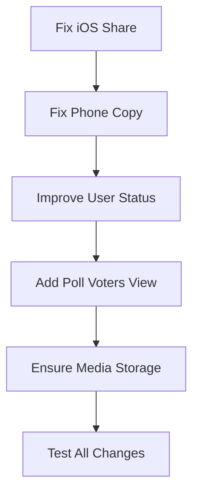

# Mobile App Multi-Fix Plan

## 1. Надежный статус пользователя (онлайн/оффлайн)

### Проблема

Пользователь сворачивает приложение, но остается "онлайн" у партнера на несколько минут.

### Причины

- `goOffline()` в [main.dart](main.dart) вызывается без `await` и может не успеть выполниться
- При аварийном закрытии `goOffline()` не вызывается вообще
- PresenceMonitorService проверяет heartbeat каждые 60с с таймаутом 90с — слишком долго

### Решение

**Клиент (main.dart)**:

- Вызывать `goOffline()` синхронно через `then()` (await не работает в lifecycle)
- Добавить немедленный вызов `goOnline()` после восстановления токена при старте

**Бэкенд (PresenceMonitorService.cs)**:

- Уменьшить `HeartbeatTimeoutSeconds` с 90 до 45 секунд
- Уменьшить `CheckIntervalSeconds` с 60 до 30 секунд

**Бэкенд (UsersController.cs)**:

- При `go-online` отправлять SignalR уведомление `UserStatusChanged` для мгновенного обновления

---

## 2. Локальное хранение медиа при просмотре

### Проблема

Медиа удаляются с сервера через неделю, нужно надежное локальное хранение.

### Текущая реализация

- [ImageStorageService](image_storage_service.dart) и [AudioStorageService](audio_storage_service.dart) существуют
- Сохранение вызывается, но нужно проверить надежность

### Решение

- При загрузке изображения/аудио в `message_bubble.dart` вызывать `saveImageLocally`/`saveAudioLocally`
- Сохранять путь в локальную БД (Hive) для быстрого доступа
- При загрузке сообщений проверять локальный путь перед обращением к серверу

---

## 3. Копирование телефона в профиле

### Файл

[user_profile_screen.dart](user_profile_screen.dart)

### Решение

Добавить `onTap` в `_buildInfoCard` для телефона:

```dart
GestureDetector(
  onTap: () {
    Clipboard.setData(ClipboardData(text: phoneNumber));
    ScaffoldMessenger.of(context).showSnackBar(
      SnackBar(content: Text('Телефон скопирован')),
    );
  },
  child: // existing Card
)
```

---

## 4. Улучшение системы голосований

### Текущая реализация

- Бэкенд: полностью работает ([PollsController.cs](PollsController.cs))
- Клиент: [poll_widget.dart](poll_widget.dart) показывает голосование

### Недостающее

- Виджет для просмотра голосовавших (для не анонимных опросов)
- Обработка `PollUpdated` SignalR события на клиенте

### Решение

**Клиент**:

- В `poll_widget.dart` добавить кнопку "Кто проголосовал" для не анонимных опросов
- Создать bottom sheet с списком голосовавших по каждому варианту
- Добавить обработчик `PollUpdated` в `signalr_provider.dart`
- Обновлять poll в `messages_provider.dart` при получении события

---

## 5. Исправление iOS Share

### Ошибка

```
PlatformException(error, sharePositionOrigin: argument must be set, {{0, 0}, {0, 0}} must be non-zero...
```

### Причина

На iPad обязателен параметр `sharePositionOrigin` для `Share.share()` и `Share.shareXFiles()`.

### Файл

[share_send_service.dart](share_send_service.dart)

### Решение

Передавать `sharePositionOrigin` во все методы Share:

```dart
final box = context.findRenderObject() as RenderBox?;
final rect = box != null
    ? box.localToGlobal(Offset.zero) & box.size
    : Rect.fromLTWH(0, 0, 100, 100);

await Share.share(text, sharePositionOrigin: rect);
await Share.shareXFiles(files, sharePositionOrigin: rect);
```

Методы сервиса должны принимать `Rect? sharePositionOrigin` параметр.

---

## 6. Проверка: статусы сообщений не затронуты

Изменения НЕ касаются:

- `MessageStatus` enum (sending, sent, delivered, read, played)
- `DeliveryReceipts` логики
- `confirm-push-delivery` эндпоинта
- `MessageStatusEvents` event sourcing
- SignalR событий `MessageStatusUpdated`

---

## Порядок выполнения

