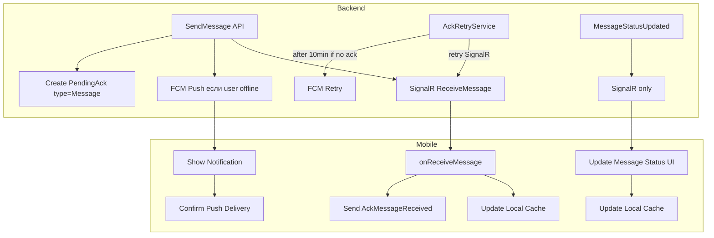

# Рефакторинг Push-уведомлений, статусов сообщений и аудио воспроизведения

## Выявленные проблемы

### 1. Push-уведомления для статусов сообщений

**Файл:** [`_may_messenger_backend/src/MayMessenger.API/Services/AckRetryService.cs`](_may_messenger_backend/src/MayMessenger.API/Services/AckRetryService.cs)В методе `TryFcmFallbackAsync` (строки 240-244) для `AckType.StatusUpdate` отправляется push с текстом статуса:

```csharp
title = "Обновление статуса сообщения";
body = $"Сообщение {message.Status}"; // "message played", "прочитано"
```


### 2. Повторные push-уведомления

`AckRetryService` повторяет FCM каждые 5 минут (`FcmRetryAfterSeconds = 300`) если клиент не подтвердил получение через SignalR. Это приводит к дубликатам push.

### 3. Отсутствие глобального аудиоплеера

[`AudioPlayerManager`](_may_messenger_mobile_app/lib/presentation/widgets/audio_player_manager.dart) только управляет текущим активным плеером, но:

- При выходе из чата `MessageBubble` dispose-ится вместе с AudioPlayer
- Нет фонового воспроизведения при сворачивании приложения
- Нет UI для управления воспроизведением вне чата

## План исправлений

### Backend

#### 1. Убрать push для статусов

- **Файл:** [`AckRetryService.cs`](_may_messenger_backend/src/MayMessenger.API/Services/AckRetryService.cs)
- Удалить блок `else // StatusUpdate` в `TryFcmFallbackAsync`
- Статусы должны доставляться только через SignalR
- При отсутствии подключения - синхронизировать при следующем входе через `IncrementalSync`

#### 2. Оптимизация PendingAck системы

- **Файл:** [`MessagesController.cs`](_may_messenger_backend/src/MayMessenger.API/Controllers/MessagesController.cs)
- Не создавать `PendingAck` с типом `StatusUpdate` вообще
- Создавать `PendingAck` только для новых сообщений (`AckType.Message`)
- Уменьшить `FcmRetryAfterSeconds` с 300 до 600 секунд (10 минут) или отключить повторные FCM

#### 3. Дедупликация push-уведомлений

- **Файл:** [`MessagesController.cs`](_may_messenger_backend/src/MayMessenger.API/Controllers/MessagesController.cs)
- Добавить проверку: если сообщение уже доставлено через SignalR (есть `DeliveryReceipt`), не отправлять push
- Удалять `PendingAck` сразу после успешной отправки через SignalR

### Mobile App

#### 4. Глобальный аудио сервис

- **Новый файл:** `lib/core/services/global_audio_service.dart`
- Singleton сервис с AudioPlayer, работающий независимо от виджетов
- Поддержка `just_audio_background` для фонового воспроизведения
- Хранение текущего воспроизводимого сообщения (id, chatId, url, позиция)

#### 5. Мини-плеер в списке чатов

- **Файл:** [`main_screen.dart`](_may_messenger_mobile_app/lib/presentation/screens/main_screen.dart)
- Добавить виджет `GlobalAudioMiniPlayer` поверх списка чатов
- Показывать: прогресс, имя отправителя, кнопки play/pause/stop
- При нажатии - переход в чат с сообщением

#### 6. Рефакторинг MessageBubble

- **Файл:** [`message_bubble.dart`](_may_messenger_mobile_app/lib/presentation/widgets/message_bubble.dart)
- Удалить локальный `AudioPlayer` из виджета
- Использовать `GlobalAudioService` для воспроизведения
- Подписка на stream для обновления UI (прогресс, isPlaying)

#### 7. Обработка lifecycle приложения

- **Файл:** [`main.dart`](_may_messenger_mobile_app/lib/main.dart)
- Регистрация `just_audio_background` для продолжения воспроизведения в фоне
- Media notification controls (play/pause/stop)

#### 8. Синхронизация локального кэша со статусами

- **Файл:** [`local_datasource.dart`](_may_messenger_mobile_app/lib/data/datasources/local_datasource.dart)
- При обновлении статуса - немедленно обновлять кэш
- При загрузке сообщений - применять pending status updates из памяти

## Диаграмма потоков данных

