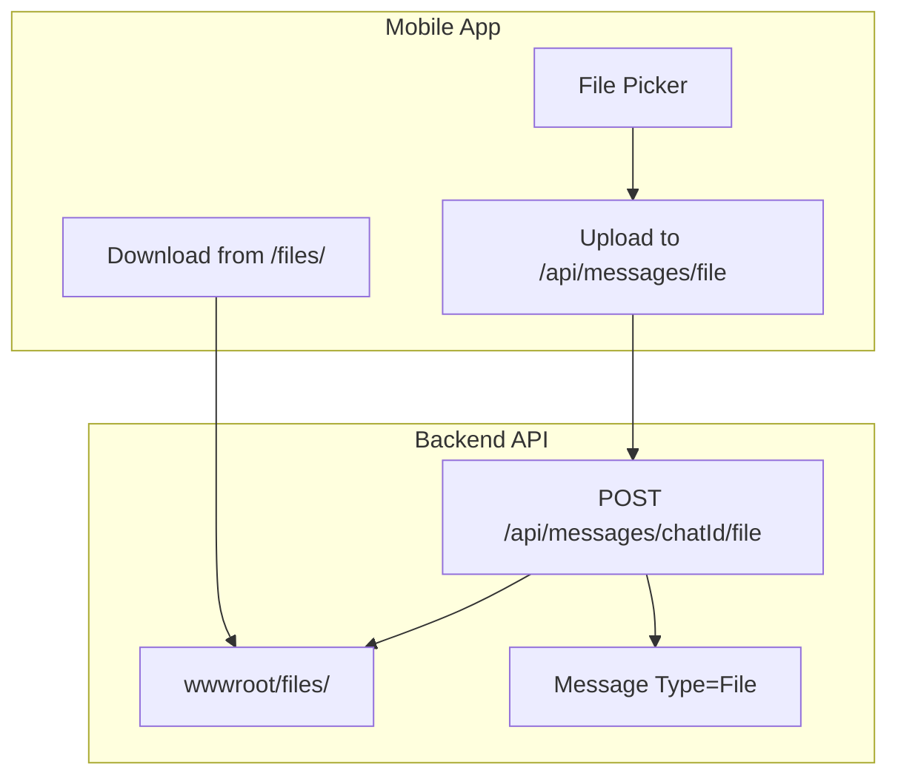

# Исправление статусов сообщений и добавление обмена файлами

## Часть 1: Исправление механизма статусов

### Выявленные проблемы

1. **SignalR уведомление не отправляется если статус уже равен целевому** - в [`ChatHub.cs`](C:\rarebooks\_may_messenger_backend\src\MayMessenger.API\Hubs\ChatHub.cs) метод `MessageRead` отправляет SignalR только при `message.Status != aggregateStatus`. Если сообщение уже помечено как Read, уведомление не отправится отправителю.
2. **Дублирование вызовов** - клиент отправляет статус сразу через SignalR И REST API параллельно, вызывая race conditions.
3. **Кеширование мешает обновлению** - список чатов читается из кеша даже при `forceRefresh`.

### Решения

**Backend ([`ChatHub.cs`](C:\rarebooks\_may_messenger_backend\src\MayMessenger.API\Hubs\ChatHub.cs))**

- В методах `MessageDelivered`, `MessageRead`, `MessagePlayed` - ВСЕГДА отправлять SignalR уведомление `MessageStatusUpdated`, даже если статус не изменился (для синхронизации UI).
- Добавить explicit `chatId` в SignalR уведомление для корректной маршрутизации.

**Mobile ([`messages_provider.dart`](C:\rarebooks\_may_messenger_mobile_app\lib\presentation\providers\messages_provider.dart))**

- В `markMessagesAsRead()` - использовать только REST API `batchMarkAsRead` (он надёжнее), убрать цикл SignalR вызовов для каждого сообщения.
- Исключить сообщения со статусом `played` из фильтра непрочитанных.

**Mobile ([`signalr_provider.dart`](C:\rarebooks\_may_messenger_mobile_app\lib\presentation\providers\signalr_provider.dart))**

- Добавить `chatId` в обработчик `onMessageStatusUpdated` для точечного обновления.
- Вызывать `clearUnreadCount` при получении статуса `read` для своих сообщений.

**Mobile ([`chats_provider.dart`](C:\rarebooks\_may_messenger_mobile_app\lib\presentation\providers\chats_provider.dart))**

- Удалить старый кеш ПЕРЕД запросом при `forceRefresh: true`.

---

## Часть 2: Добавление обмена файлами (до 20 МБ)

### Архитектура




### Backend изменения

1. **Добавить тип сообщения File** в [`MessageType.cs`](C:\rarebooks\_may_messenger_backend\src\MayMessenger.Domain\Enums\MessageType.cs):
```csharp
File = 3
```


2. **Добавить поле для имени файла** в [`Message.cs`](C:\rarebooks\_may_messenger_backend\src\MayMessenger.Domain\Entities\Message.cs):
```csharp
public string? OriginalFileName { get; set; }
public long? FileSize { get; set; }
```


3. **Создать endpoint для загрузки файлов** в [`MessagesController.cs`](C:\rarebooks\_may_messenger_backend\src\MayMessenger.API\Controllers\MessagesController.cs):

- Путь: `POST /api/messages/{chatId}/file`
- Лимит: 20 МБ
- Хранилище: `wwwroot/files/`

4. **Настроить Kestrel для больших файлов** в [`Program.cs`](C:\rarebooks\_may_messenger_backend\src\MayMessenger.API\Program.cs):
```csharp
options.Limits.MaxRequestBodySize = 20 * 1024 * 1024;
```


5. **Создать миграцию** для новых полей `OriginalFileName` и `FileSize`.

### Mobile изменения

1. **Добавить тип File** в [`message_model.dart`](C:\rarebooks\_may_messenger_mobile_app\lib\data\models\message_model.dart):
```dart
enum MessageType { text, audio, image, file }
```


2. **Добавить метод отправки файла** в [`api_datasource.dart`](C:\rarebooks\_may_messenger_mobile_app\lib\data\datasources\api_datasource.dart) и [`messages_provider.dart`](C:\rarebooks\_may_messenger_mobile_app\lib\presentation\providers\messages_provider.dart).
3. **Добавить UI для выбора файла** в [`message_input.dart`](C:\rarebooks\_may_messenger_mobile_app\lib\presentation\widgets\message_input.dart) - кнопка прикрепления файла.
4. **Добавить виджет отображения файла** в [`message_bubble.dart`](C:\rarebooks\_may_messenger_mobile_app\lib\presentation\widgets\message_bubble.dart) - иконка файла, имя, размер, кнопка скачать.
5. **Обновить превью в списке чатов** в [`chat_list_item.dart`](C:\rarebooks\_may_messenger_mobile_app\lib\presentation\widgets\chat_list_item.dart):
```dart
case MessageType.file:
  content = '[Файл]';

```