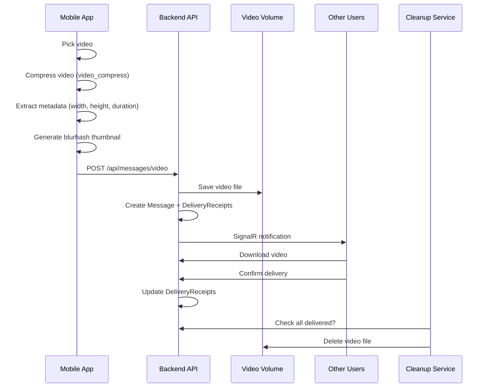

# Добавление поддержки видео сообщений в May Messenger

## Обзор изменений

Реализация отправки сжатых видео по образцу `_mixin_messenger`, включая:

- Сжатие видео на клиенте перед отправкой
- Хранение видео в отдельном томе Docker
- Автоматическое удаление после доставки всем участникам

---

## 1. Backend (_may_messenger_backend)

### 1.1. Добавить тип сообщения Video

Файл: [`_may_messenger_backend/src/MayMessenger.Domain/Enums/MessageType.cs`](_may_messenger_backend/src/MayMessenger.Domain/Enums/MessageType.cs)

```csharp
public enum MessageType
{
    Text = 0,
    Audio = 1,
    Image = 2,
    File = 3,
    Poll = 4,
    Video = 5  // Новый тип
}
```

### 1.2. Добавить поля для видео метаданных

Файл: `Message.cs` - добавить поля:

- `int? VideoWidth`
- `int? VideoHeight`
- `int? VideoDuration` (в миллисекундах)
- `string? VideoThumbnail` (base64 blurhash)

### 1.3. Добавить эндпоинт для загрузки видео

Файл: [`_may_messenger_backend/src/MayMessenger.API/Controllers/MessagesController.cs`](_may_messenger_backend/src/MayMessenger.API/Controllers/MessagesController.cs)

Добавить метод по аналогии с `SendImageMessage`:

```csharp
[HttpPost("video")]
[RequestSizeLimit(100 * 1024 * 1024)] // 100MB limit
[RequestFormLimits(MultipartBodyLengthLimit = 100 * 1024 * 1024)]
public async Task<ActionResult<MessageDto>> SendVideoMessage(
    [FromForm] Guid chatId, 
    IFormFile videoFile, 
    [FromForm] string? clientMessageId = null,
    [FromForm] int? width = null,
    [FromForm] int? height = null,
    [FromForm] int? duration = null,
    [FromForm] string? thumbnail = null)
```

### 1.4. Добавить сервис очистки видео

Создать `VideoCleanupService.cs` - фоновый сервис для удаления видео после получения всеми участниками:

- Проверяет `DeliveryReceipts` для каждого видео-сообщения
- Удаляет файл когда все участники получили видео
- Запускается периодически (каждые 5 минут)

---

## 2. Docker конфигурация

### 2.1. Добавить том для видео

Файл: [`docker-compose.yml`](docker-compose.yml)

```yaml
volumes:
  maymessenger_videos:  # Новый том для видео

services:
  maymessenger_backend:
    volumes:
      - maymessenger_videos:/app/wwwroot/videos  # Монтирование
```

### 2.2. Добавить nginx location для видео

Файл: [`nginx/nginx_prod.conf`](nginx/nginx_prod.conf)

```nginx
# Video files (temporary storage)
location /videos/ {
    proxy_pass http://maymessenger_backend/videos/;
    proxy_http_version 1.1;
    # ... аналогично /images/
    client_max_body_size 100M;
}
```

---

## 3. Mobile App (_may_messenger_mobile_app)

### 3.1. Добавить зависимости

Файл: [`_may_messenger_mobile_app/pubspec.yaml`](_may_messenger_mobile_app/pubspec.yaml)

```yaml
dependencies:
  video_compress: ^3.1.4      # Сжатие видео (как в mixin_messenger)
  video_player: ^2.10.1       # Воспроизведение видео
  video_thumbnail: ^0.5.3     # Генерация превью
  chewie: ^1.8.4              # UI плеер для видео
```

### 3.2. Добавить тип video в MessageType

Файл: [`_may_messenger_mobile_app/lib/data/models/message_model.dart`](_may_messenger_mobile_app/lib/data/models/message_model.dart)

```dart
enum MessageType {
  text,
  audio,
  image,
  file,
  poll,
  video,  // Новый тип
}
```

### 3.3. Создать VideoStorageService

Файл: `lib/data/services/video_storage_service.dart`

По образцу `image_storage_service.dart`:

- Локальное кеширование видео
- Загрузка с сервера
- Очистка старых файлов

### 3.4. Создать VideoCompressionService

Файл: `lib/core/services/video_compression_service.dart`

По образцу `_mixin_messenger/lib/utils/video.dart`:

- Сжатие видео с помощью `video_compress`
- Извлечение метаданных (width, height, duration)
- Генерация blurhash для превью

### 3.5. Расширить ImagePickerButtons для видео

Файл: [`_may_messenger_mobile_app/lib/presentation/widgets/image_picker_buttons.dart`](_may_messenger_mobile_app/lib/presentation/widgets/image_picker_buttons.dart)

Добавить:

- Кнопку выбора видео из галереи
- Кнопку записи видео с камеры
- Вызов `ImagePicker().pickVideo()`

### 3.6. Создать VideoPreviewDialog

Файл: `lib/presentation/widgets/video_preview_dialog.dart`

По образцу `image_preview_dialog.dart`:

- Предпросмотр видео перед отправкой
- Отображение длительности
- Кнопки "Отправить" / "Отмена"

### 3.7. Создать VideoMessageWidget

Файл: `lib/presentation/widgets/video_message_widget.dart`

По образцу `_mixin_messenger/lib/widgets/message/item/video/video_message.dart`:

- Отображение превью (blurhash или thumbnail)
- Кнопка воспроизведения
- Индикатор длительности
- Статусы загрузки/скачивания

### 3.8. Обновить message_bubble.dart

Файл: [`_may_messenger_mobile_app/lib/presentation/widgets/message_bubble.dart`](_may_messenger_mobile_app/lib/presentation/widgets/message_bubble.dart)

Добавить обработку `MessageType.video`:

- Отображение VideoMessageWidget
- Обработка нажатия (открытие полноэкранного плеера)

### 3.9. Обновить message_input.dart

Файл: [`_may_messenger_mobile_app/lib/presentation/widgets/message_input.dart`](_may_messenger_mobile_app/lib/presentation/widgets/message_input.dart)

Добавить в `PopupMenuButton`:

- Пункт "Видео" с иконкой `Icons.videocam`
- Вызов `_pickVideo()` 

### 3.10. Добавить API метод отправки видео

Файл: `lib/data/datasources/api_datasource.dart`

```dart
Future<Message> sendVideoMessage({
  required String chatId,
  required String videoPath,
  int? width,
  int? height,
  int? duration,
  String? thumbnail,
  String? clientMessageId,
});
```

---

## 4. Очистка видео на сервере

### 4.1. Логика удаления

- При отправке видео создаются `DeliveryReceipt` для каждого участника
- `VideoCleanupService` проверяет: если все участники (кроме отправителя) имеют `DeliveredAt != null`, файл удаляется
- Поле `FilePath` в сообщении сохраняется для истории (клиенты используют локальный кеш)

### 4.2. Fallback для групповых чатов

- Для групп с 3+ участниками: удаление через 7 дней вместо проверки delivery receipts
- Это предотвращает вечное хранение если один участник оффлайн

---

## Диаграмма потока данных



---

## Критические моменты

- Сжатие видео выполняется на клиенте для экономии трафика сервера
- Blurhash thumbnail генерируется на клиенте и передается на сервер
- Видео хранится в отдельном томе для удобства управления местом
- Автоматическая очистка предотвращает переполнение диска