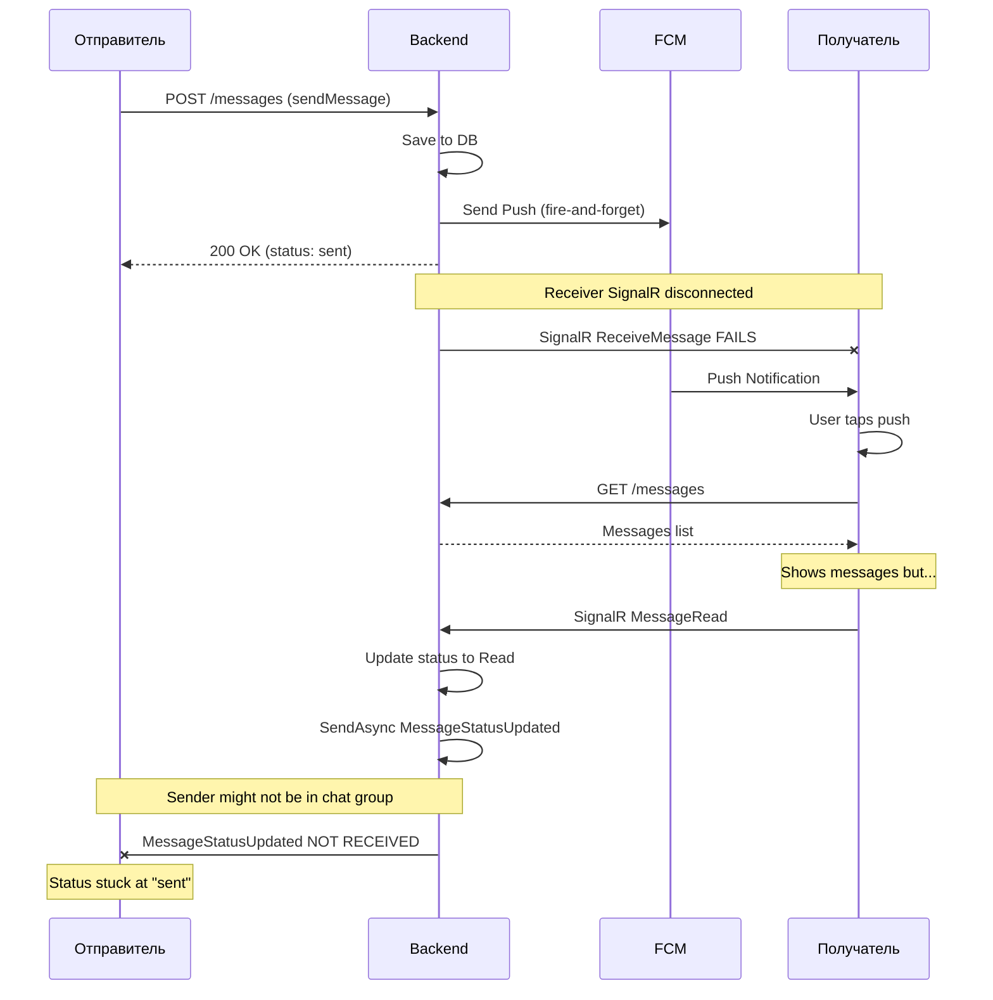

# Исправление синхронизации статусов и доставки сообщений

## Выявленные проблемы

### Проблема 1: Статус "прочитано" не доходит до отправителя

**Симптом**: Получатель открыл чат, но у отправителя статус остаётся "отправлено".**Причина**: В [`signalr_provider.dart`](signalr_provider.dart) строки 226-241 обработчик `onMessageStatusUpdated` пытается обновить статус во всех провайдерах чатов:

```dart
for (final chat in chatsState.chats) {
  try {
    _ref.read(messagesProvider(chat.id).notifier).updateMessageStatus(messageId, status);
```

Если `messagesProvider` для нужного чата не инициализирован (чат не открыт), обновление проваливается молча. Также сервер отправляет `MessageStatusUpdated` только в группу чата - если отправитель вышел из группы (например, вернулся на список чатов), он не получит обновление.**Решение**:

1. Добавить глобальный кэш статусов сообщений, который хранит обновления для неинициализированных провайдеров
2. При инициализации `messagesProvider` применять накопленные обновления из глобального кэша
3. Добавить REST API fallback для проверки статусов при открытии чата

### Проблема 2: Потерянное сообщение при отправке в фоновом режиме

**Симптом**: Сообщение "и новый тест..." не дошло до получателя.**Причина**: Race condition при открытии приложения по push. В [`main.dart`](main.dart) строки 336-360:

```dart
await ref.read(chatsProvider.notifier).loadChats(forceRefresh: true);
await ref.read(messagesProvider(chatId).notifier).loadMessages(forceRefresh: true);
await Future.delayed(const Duration(milliseconds: 300));
// Navigate
```

Проблемы:

- `loadMessages` создаёт новый `MessagesNotifier` который начинает загрузку
- Навигация происходит через 300мс, но `loadMessages` может ещё не завершиться
- При навигации создаётся новый экземпляр `ChatScreen`, который снова вызывает загрузку
- Возможна потеря данных из-за конкуренции двух загрузок

**Решение**:

1. Убрать предзагрузку сообщений из `onMessageTap` - пусть `ChatScreen` сам загружает данные
2. Добавить ожидание полной загрузки в `ChatScreen.initState`
3. Добавить проверку на дублирование загрузки в `loadMessages`

### Проблема 3: Онлайн-статус не обновляется

**Симптом**: Показывает "был(а) 3 ч назад" хотя оба пользователя в сети.**Причина**:

1. `ChatHub.OnConnectedAsync` отправляет `UserStatusChanged` в группы чатов
2. Если получатель не подключён к SignalR в момент подключения отправителя - он пропустит уведомление
3. При открытии чата в [`chat_screen.dart`](chat_screen.dart) есть загрузка статуса, но она выполняется в `Future.microtask` параллельно с UI

**Решение**:

1. Загружать статус пользователя ПЕРЕД отображением UI в `ChatScreen`
2. Добавить периодическое обновление статуса каждые 30 секунд пока чат открыт
3. Запрашивать статус сразу после успешного подключения SignalR

### Проблема 4: Отсутствие подтверждения доставки через Push

**Симптом**: Статус не обновляется до "доставлено" при получении push.**Причина**: В backend [`MessagesController.cs`](MessagesController.cs) строки 387-401 push отправляется fire-and-forget, без связи с подтверждением доставки. Даже если push доставлен, это не отмечается как "delivered" в БД.На клиенте в `_firebaseMessagingBackgroundHandler` в `main.dart` показывается уведомление, но НЕ отправляется подтверждение доставки на сервер.**Решение**:

1. В background handler отправлять REST API запрос на подтверждение доставки
2. Добавить endpoint для подтверждения доставки по push без полной авторизации (с FCM token verification)
3. Или при открытии приложения сразу отправлять batch подтверждение для всех сообщений в push

### Проблема 5: SignalR disconnected при работе в фоне

**Симптом**: Все real-time обновления теряются когда приложение в фоне.**Причина**: Android убивает WebSocket соединение для экономии батареи.**Решение** (частичное, без разрешения на работу в фоне):

1. При возврате из фона (`didChangeAppLifecycleState`) выполнять полную синхронизацию
2. Добавить batch запрос статусов всех непрочитанных сообщений
3. Добавить incremental sync на уровне `ChatScreen` при открытии

---

## Диаграмма текущего проблемного потока



---

## План исправления

### Файлы для изменения

1. **[_may_messenger_mobile_app/lib/presentation/providers/signalr_provider.dart](_may_messenger_mobile_app/lib/presentation/providers/signalr_provider.dart)** - добавить глобальный кэш статусов
2. **[_may_messenger_mobile_app/lib/presentation/providers/messages_provider.dart](_may_messenger_mobile_app/lib/presentation/providers/messages_provider.dart)** - применять кэшированные статусы при инициализации