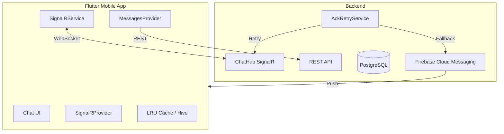

# Исправление проблем синхронизации сообщений в May Messenger

## Анализ текущей архитектуры




## Выявленные критические проблемы

### Проблема 1: Обработчик IncrementalSyncResult не зарегистрирован (КРИТИЧЕСКАЯ)

В [`signalr_service.dart`](_may_messenger_mobile_app/lib/data/datasources/signalr_service.dart) есть метод `onIncrementalSyncResult()`, но он **никогда не вызывается** в [`signalr_provider.dart`](_may_messenger_mobile_app/lib/presentation/providers/signalr_provider.dart). Это означает, что результаты инкрементной синхронизации от сервера полностью игнорируются.

### Проблема 2: Неправильная инициализация lastSyncTimestamp (КРИТИЧЕСКАЯ)

```356:365:_may_messenger_mobile_app/lib/data/datasources/signalr_service.dart
if (_lastSyncTimestamp == null) {
  _lastSyncTimestamp = DateTime.now();
  return;
}
```

При первом запуске или после потери соединения `_lastSyncTimestamp` устанавливается в текущее время, что означает **потерю всех сообщений**, полученных до этого момента.

### Проблема 3: Слишком редкий heartbeat (30 секунд)

Heartbeat каждые 30 секунд с таймаутом 90 секунд означает, что потеря соединения обнаруживается через 60-90 секунд. В это время сообщения теряются.

### Проблема 4: Рассинхронизация превью чата и содержимого

Сообщения добавляются в превью чата через `updateChatLastMessage()`, но `messagesProvider` для конкретного чата может не быть инициализирован. При открытии чата новое сообщение может отсутствовать, если:

- Соединение было потеряно
- IncrementalSync не отработал корректно
- Сообщение не было кэшировано

### Проблема 5: Отсутствие полной синхронизации при возврате из фона

В [`main.dart`](_may_messenger_mobile_app/lib/main.dart) при `resumed` вызывается `reconnect()`, но если приложение было в фоне долго, полная синхронизация всех чатов не происходит.---

## План исправлений

### Этап 1: Регистрация обработчика IncrementalSyncResult

**Файл:** [`signalr_provider.dart`](_may_messenger_mobile_app/lib/presentation/providers/signalr_provider.dart)Добавить регистрацию обработчика в метод `_setupListeners()`:

```dart
// В _setupListeners() добавить:
_signalRService.onIncrementalSyncResult((syncData) {
  _handleIncrementalSyncResult(syncData);
});
```

Создать метод обработки:

```dart
void _handleIncrementalSyncResult(Map<String, dynamic> syncData) {
  final messages = syncData['Messages'] as List<dynamic>? ?? [];
  final statusUpdates = syncData['StatusUpdates'] as List<dynamic>? ?? [];
  
  // Обработать каждое сообщение
  for (final msgData in messages) {
    final message = Message.fromJson(msgData as Map<String, dynamic>);
    try {
      _ref.read(messagesProvider(message.chatId).notifier).addMessage(message);
    } catch (e) {
      print('[SignalR] Failed to add synced message: $e');
    }
  }
  
  // Обработать обновления статусов
  for (final update in statusUpdates) {
    final messageId = update['MessageId'] as String;
    final status = MessageStatus.values[update['Status'] as int];
    // Обновить статус во всех активных провайдерах
  }
  
  // Обновить список чатов
  _ref.read(chatsProvider.notifier).loadChats(forceRefresh: true);
}
```

---

### Этап 2: Исправление инициализации lastSyncTimestamp

**Файл:** [`signalr_service.dart`](_may_messenger_mobile_app/lib/data/datasources/signalr_service.dart)Изменить логику `_performIncrementalSync()`:

```dart
Future<void> _performIncrementalSync() async {
  // Использовать сохраненный timestamp или синхронизировать за последний час
  final syncTimestamp = _lastSyncTimestamp ?? DateTime.now().subtract(const Duration(hours: 1));
  
  try {
    await _hubConnection?.invoke(
      'IncrementalSync',
      args: [syncTimestamp.toIso8601String()],
    );
    
    _lastSyncTimestamp = DateTime.now();
  } catch (e) {
    print('[SignalR] Incremental sync failed: $e');
  }
}
```

---

### Этап 3: Ускорение heartbeat и обнаружения потери соединения

**Файл:** [`signalr_service.dart`](_may_messenger_mobile_app/lib/data/datasources/signalr_service.dart)

```dart
// Изменить интервалы:
_heartbeatTimer = Timer.periodic(const Duration(seconds: 10), (timer) async {
  // ...
  if (timeSinceLastPong.inSeconds > 30) { // Было 90
    // Форсировать переподключение
  }
});
```

---

### Этап 4: Добавление полной синхронизации при возврате из фона

**Файл:** [`main.dart`](_may_messenger_mobile_app/lib/main.dart)Улучшить `_performResumeSync()`:

```dart
Future<void> _performResumeSync() async {
  try {
    // 1. Reconnect SignalR
    await ref.read(signalRConnectionProvider.notifier).reconnect();
    
    // 2. Дождаться установки соединения
    await Future.delayed(const Duration(milliseconds: 500));
    
    // 3. Принудительно запустить IncrementalSync для всех чатов
    final signalRService = ref.read(signalRServiceProvider);
    if (signalRService.isConnected) {
      await signalRService.performIncrementalSyncForAllChats();
    }
    
    // 4. Обновить все активные провайдеры сообщений
    final chatsState = ref.read(chatsProvider);
    for (final chat in chatsState.chats) {
      try {
        await ref.read(messagesProvider(chat.id).notifier).loadMessages(forceRefresh: true);
      } catch (e) {
        // Ignore - provider might not be active
      }
    }
    
    // ...остальная логика
  } catch (e) {
    // ...
  }
}
```

---

### Этап 5: Добавление REST API fallback при потере SignalR

**Файл:** [`messages_provider.dart`](_may_messenger_mobile_app/lib/presentation/providers/messages_provider.dart)Улучшить `_performIncrementalSync()` для использования REST API если SignalR недоступен:

```dart
Future<void> _performIncrementalSync() async {
  try {
    // Попытка через REST API (более надежно)
    final updates = await _messageRepository.getMessageUpdates(
      chatId: chatId,
      since: sinceTimestamp,
      take: 100,
    );
    
    // Обработать обновления...
    
  } catch (e) {
    print('[SYNC] Incremental sync failed: $e');
    // Fallback: полная перезагрузка
    await loadMessages(forceRefresh: true);
  }
}
```

---

### Этап 6: Улучшение обработки FCM для запуска полной синхронизации

**Файл:** [`main.dart`](_may_messenger_mobile_app/lib/main.dart)Изменить `onMessageReceived` callback:

```dart
fcmService.onMessageReceived = (messageId, chatId) async {
  // Вместо загрузки одного сообщения - полная синхронизация чата
  await ref.read(messagesProvider(chatId).notifier).loadMessages(forceRefresh: true);
  
  // Также обновить список чатов для корректного превью
  await ref.read(chatsProvider.notifier).loadChats(forceRefresh: true);
};
```

---

## Ожидаемый результат

После внесения исправлений:

1. Сообщения не будут теряться при длительном отключении
2. Переподключение будет происходить в течение 10-30 секунд вместо 60-90