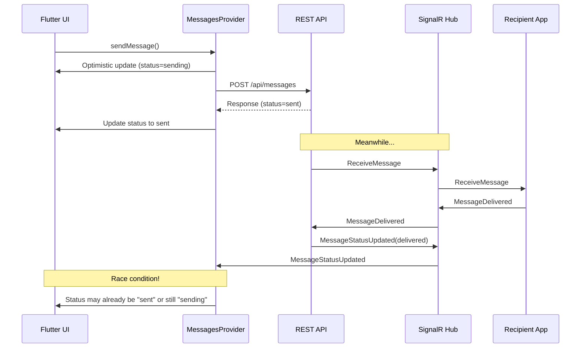

# Исправление проблемы обновления статусов сообщений

## Выявленные проблемы

### Проблема 1: КРИТИЧЕСКИЙ конфликт заголовков WebSocket в nginx (ГЛАВНАЯ ПРИЧИНА)

В [`nginx/nginx_prod.conf`](nginx/nginx_prod.conf) (строки 306-326) обнаружен конфликт:

```nginx
# WebSocket upgrade headers
proxy_set_header Upgrade $http_upgrade;
proxy_set_header Connection "upgrade";    # Устанавливается "upgrade"

# ...

# Keep-alive settings for WebSocket
proxy_set_header Connection "";           # ПЕРЕЗАПИСЫВАЕТСЯ пустой строкой!
```

**Последствие**: Заголовок `Connection: upgrade` перезаписывается пустой строкой, что может нарушать WebSocket handshake и приводить к нестабильным соединениям SignalR. Статус-обновления через SignalR могут не доходить до отправителя.---

### Проблема 2: Race condition при обновлении статуса после отправки

В [`messages_provider.dart`](C:\rarebooks\_may_messenger_mobile_app\lib\presentation\providers\messages_provider.dart) метод `_syncMessageToBackend`:



**Проблема**: REST API возвращает сообщение со статусом `Sent`, но к этому моменту SignalR уже мог отправить `MessageStatusUpdated` с более новым статусом `Delivered`. Из-за race condition обновление может быть потеряно или применено в неправильном порядке.---

### Проблема 3: Неправильное сопоставление сообщений при обновлении

В [`messages_provider.dart`](C:\rarebooks\_may_messenger_mobile_app\lib\presentation\providers\messages_provider.dart) (строка 556):

```dart
final messageIndex = state.messages.indexWhere((m) => m.id == localId);
```

Поиск ведется по `id == localId`, но после успешной отправки:

- Локальное сообщение имеет `id = localId` (UUID)
- Серверное сообщение имеет `id = serverId` (другой UUID)
- `clientMessageId` используется для дедупликации, но не всегда для обновления статуса

---

### Проблема 4: Блокировка статуса "sending" при потере SignalR события

В [`message_bubble.dart`](C:\rarebooks\_may_messenger_mobile_app\lib\presentation\widgets\message_bubble.dart):

```dart
case MessageStatus.sending:
  return const SizedBox(
    width: 14, height: 14,
    child: CircularProgressIndicator(...),
  );
```

Если SignalR событие `MessageStatusUpdated` не доходит до клиента (из-за проблемы 1 с nginx), сообщение навсегда остается в статусе `sending`, показывая бесконечный spinner.---

### Проблема 5: Отсутствие fallback-механизма для обновления статусов

Хотя есть [`status_sync_service.dart`](C:\rarebooks\_may_messenger_mobile_app\lib\data\services\status_sync_service.dart) для синхронизации входящих статусов, отсутствует аналогичный механизм для **исходящих** сообщений. Если отправитель не получил статус своего сообщения через SignalR, нет способа узнать реальный статус с сервера.---

## План исправления

### Шаг 1: Исправить nginx конфигурацию для WebSocket

Удалить конфликтующую строку `proxy_set_header Connection "";` и использовать условное переключение:

```nginx
location /hubs/ {
    proxy_pass http://maymessenger_backend/hubs/;
    proxy_http_version 1.1;
    
    # WebSocket upgrade (conditional)
    proxy_set_header Upgrade $http_upgrade;
    proxy_set_header Connection $connection_upgrade;
    # ...
}
```

С определением map в начале http блока:

```nginx
map $http_upgrade $connection_upgrade {
    default upgrade;
    ''      close;
}
```

---

### Шаг 2: Добавить polling fallback для статусов исходящих сообщений

Создать механизм периодической проверки статусов недавно отправленных сообщений, которые все еще в статусе `sending` или `sent`.---

### Шаг 3: Улучшить логику обновления статуса после синхронизации

В `_syncMessageToBackend` добавить повторную проверку статуса через короткий интервал, если SignalR обновление не пришло.---

### Шаг 4: Добавить таймаут для статуса "sending"

Если сообщение находится в статусе `sending` более 30 секунд, автоматически запросить актуальный статус с сервера или показать ошибку.---

## Рекомендуемый порядок действий

1. **Немедленно**: Исправить nginx конфигурацию (Проблема 1) - это главная причина
2. **Высокий приоритет**: Добавить polling fallback для исходящих сообщений