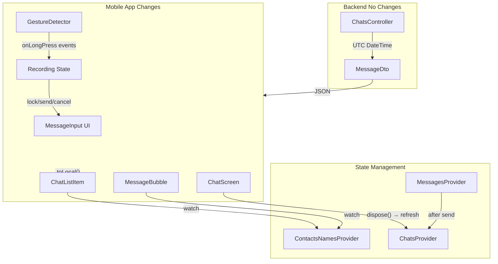

# План улучшений May Messenger

## 1. Часовые пояса (UTC → Local Time)

### Проблема

Backend хранит и отправляет время в UTC (DateTime), но клиент должен отображать его в локальном часовом поясе пользователя.

### Решение

**Backend (без изменений):** Продолжаем отправлять DateTime в ISO 8601 формате (UTC)

**Mobile (Flutter):**

- В [`chat_list_item.dart`](c:\rarebooks\_may_messenger_mobile_app\lib\presentation\widgets\chat_list_item.dart) строка 63: `DateFormat('HH:mm').format(chat.lastMessage!.createdAt.toLocal())`
- В [`message_bubble.dart`](c:\rarebooks\_may_messenger_mobile_app\lib\presentation\widgets\message_bubble.dart): Добавить `.toLocal()` при форматировании времени сообщения

**Проверка:** При парсинге DateTime из JSON (`DateTime.parse()`) Flutter автоматически определяет UTC и конвертирует. Метод `.toLocal()` конвертирует в часовой пояс устройства.

---

## 2. Голосовые сообщения (Hold-to-Record)

### Текущая реализация

- Нажатие на микрофон → переключает режим записи
- Открывается [`AudioRecorderWidget`](c:\rarebooks\_may_messenger_mobile_app\lib\presentation\widgets\audio_recorder_widget.dart) с кнопками отмена/отправка

### Новая реализация (WhatsApp-style)

**Изменения в [`message_input.dart`](c:\rarebooks\_may_messenger_mobile_app\lib\presentation\widgets\message_input.dart):**

1. Заменить `IconButton` на `GestureDetector` для микрофона
2. Добавить состояния:

   - `RecordingState`: idle, recording, locked
   - `Offset _dragPosition` для отслеживания свайпа

3. События:

   - `onLongPressStart`: Начать запись
   - `onLongPressMoveUpdate`: Отслеживать свайп влево для lock (< -100px)
   - `onLongPressEnd`: Отправить если не locked, иначе продолжить
   - `onLongPressCancel`: Отменить запись

4. UI индикация:

   - При recording: показать таймер, кнопку отмены, hint "← Сдвиньте для блокировки"
   - При locked: показать полный [`AudioRecorderWidget`](c:\rarebooks\_may_messenger_mobile_app\lib\presentation\widgets\audio_recorder_widget.dart)
   - Анимация: Scale + Fade для микрофона

**Модификация [`audio_recorder_widget.dart`](c:\rarebooks\_may_messenger_mobile_app\lib\presentation\widgets\audio_recorder_widget.dart):**

- Добавить параметр `bool isLocked` для отображения кнопки отмены
- Если не locked - автоматически отправлять при остановке

---

## 3. Имена из телефонной книги (исправление)

### Проблема

Сейчас в превью последнего сообщения и внутри чата отображается `message.senderName` с сервера, а не из телефонной книги.

### Решение

**Шаг 1: Добавить senderId в превью**

Backend [`ChatsController.cs`](c:\rarebooks\_may_messenger_backend\src\MayMessenger.API\Controllers\ChatsController.cs) строка 69-80:

```csharp
LastMessage = lastMessage != null ? new MessageDto
{
    // ... existing fields
    SenderId = lastMessage.SenderId,  // Уже есть
    SenderName = lastMessage.Sender.DisplayName,  // Оставляем как fallback
    // ...
}
```

**Шаг 2: Mobile - маппинг имен**

В [`chat_list_item.dart`](c:\rarebooks\_may_messenger_mobile_app\lib\presentation\widgets\chat_list_item.dart) строка 50-56:

```dart
subtitle: chat.lastMessage != null
    ? Text(
        _formatLastMessage(chat.lastMessage!, contactsNames),
        maxLines: 1,
        overflow: TextOverflow.ellipsis,
      )
    : const Text('Нет сообщений'),

// Добавить метод
String _formatLastMessage(Message msg, Map<String, String> contacts) {
  final content = msg.content ?? '[Голосовое сообщение]';
  // Для групп - добавить имя отправителя
  if (chat.type == ChatType.group) {
    final senderName = contacts[msg.senderId] ?? msg.senderName;
    return '$senderName: $content';
  }
  return content;
}
```

**Шаг 3: Имена в самом чате**

В [`message_bubble.dart`](c:\rarebooks\_may_messenger_mobile_app\lib\presentation\widgets\message_bubble.dart) строка 170-179:

```dart
class MessageBubble extends ConsumerWidget {  // Изменить на ConsumerWidget
  
  @override
  Widget build(BuildContext context, WidgetRef ref) {
    final contactsNames = ref.watch(contactsNamesProvider);
    final displayName = contactsNames[widget.message.senderId] 
                        ?? widget.message.senderName;
    
    // В строке 172 заменить:
    Text(displayName, ...)  // вместо widget.message.senderName
  }
}
```

---

## 4. Обновление превью чата после отправки

### Проблема

После отправки сообщения и возврата назад, превью чата не обновляется (не показывает последнее сообщение).

### Решение

**Вариант 1: Обновление при отправке**

В [`messages_provider.dart`](c:\rarebooks\_may_messenger_mobile_app\lib\presentation\providers\messages_provider.dart) после успешной отправки:

```dart
Future<void> sendMessage(String content) async {
  // ... existing code
  
  // После успешной отправки обновить chats
  _ref.read(chatsProvider.notifier).loadChats(forceRefresh: true);
}
```

**Вариант 2: Обновление при возврате (лучше)**

В [`chat_screen.dart`](c:\rarebooks\_may_messenger_mobile_app\lib\presentation\screens\chat_screen.dart) в методе `dispose()`:

```dart
@override
void dispose() {
  // Refresh chats when leaving chat screen
  ref.read(chatsProvider.notifier).loadChats(forceRefresh: true);
  
  // ... existing code
  super.dispose();
}
```

---

## 5. Счетчик непрочитанных в группах

### Статус

✅ Уже работает! Backend возвращает `unreadCount` для всех типов чатов через метод `GetUnreadCountAsync`, который учитывает все сообщения независимо от типа чата.

Проверка в [`ChatsController.cs`](c:\rarebooks\_may_messenger_backend\src\MayMessenger.API\Controllers\ChatsController.cs):

```csharp
var unreadCount = await _unitOfWork.Messages.GetUnreadCountAsync(chat.Id, userId);
```

---

## Архитектура изменений



---

## Порядок реализации

1. **Часовые пояса** (5 мин) - добавить `.toLocal()` в 2 местах
2. **Имена из контактов** (20 мин) - обновить ChatListItem, MessageBubble
3. **Обновление превью** (5 мин) - добавить refresh в dispose()
4. **Hold-to-record** (40 мин) - переделать MessageInput с GestureDetector и lock логикой

---

## Тестирование

- **Часовые пояса**: Отправить сообщение, проверить время в списке и в чате
- **Hold-to-record**: Зажать микрофон, отпустить (отправка), зажать и свайпнуть влево (lock)
- **Имена**: Проверить в списке чатов (превью) и внутри группового чата
- **Превью**: Отправить сообщение, нажать "назад", проверить превью в списке