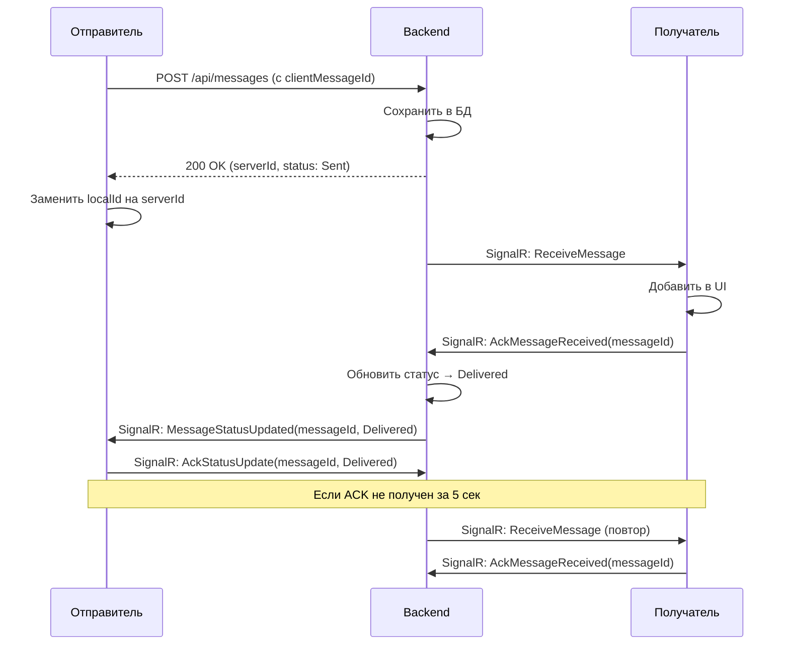

# План улучшений мессенджера Депеша

## 1. Использование имен из телефонной книги в chat_screen

### Проблема

В [`chat_screen.dart`](_may_messenger_mobile_app/lib/presentation/screens/chat_screen.dart) (строки 126-136) уже используется `contactsNamesProvider`, но механизм работает корректно. В [`new_chat_screen.dart`](_may_messenger_mobile_app/lib/presentation/screens/new_chat_screen.dart) реализован локальный маппинг имен.

### Решение

Код в `chat_screen.dart` **уже правильно использует имена из телефонной книги**:

- Использует `contactsNamesProvider` для получения маппинга userId → displayName
- Для приватных чатов проверяет `otherParticipantId` и заменяет серверное имя на имя из телефонной книги
- Аналогично работает в [`chat_list_item.dart`](_may_messenger_mobile_app/lib/presentation/widgets/chat_list_item.dart) (строки 86-93)

**Действия:** Проверить, что `otherParticipantId` корректно приходит с backend для всех приватных чатов.---

## 2. Клиентское сжатие изображений

### Текущая ситуация

Сжатие происходит **дважды**:

1. **Клиент** ([`image_picker_buttons.dart`](_may_messenger_mobile_app/lib/presentation/widgets/image_picker_buttons.dart), строки 76-81, 113-132): 

- `image_picker` с `maxWidth: 1920, maxHeight: 1920, imageQuality: 85`
- `flutter_image_compress` с `quality: 85`

2. **Сервер** ([`ImageCompressionService.cs`](_may_messenger_backend/src/MayMessenger.Application/Services/ImageCompressionService.cs), строки 14-53):

- `SixLabors.ImageSharp` с `MaxWidth: 1920, MaxHeight: 1920, JpegQuality: 85`

### Решение

**Убрать серверное сжатие**, оставить только клиентское:**Backend изменения:**

- Обновить `ImageCompressionService` - убрать ресайз и пере-сжатие, только сохранить файл
- Обновить `MessagesController.SendImageMessage` - убрать вызов compression service или сделать его pass-through
- **Важно:** сохранить валидацию формата и размера файла (макс 10MB на входе)

**Frontend изменения:**

- Усилить клиентское сжатие:
- Сжимать до **макс 2048x2048** (вместо 1920) для запаса качества
- Качество снизить до **80%** для лучшего сжатия
- Добавить проверку размера после сжатия (если > 5MB, пережать с quality: 70)

---

## 3. Проверка хранения изображений в Docker

### Текущая конфигурация

Dockerfile ([`Dockerfile`](_may_messenger_backend/Dockerfile), строки 29-31):

```dockerfile
RUN mkdir -p /app/wwwroot/audio && \
    mkdir -p /app/wwwroot/images
```

Program.cs (строка 281):

```csharp
app.UseStaticFiles();
```


### Проблема

**Docker volumes не настроены** в самом Dockerfile, но должны быть в `docker-compose.yml` (файла нет в репозитории).

### Решение

**Документация для production:**Создать файл `DOCKER_DEPLOYMENT.md` с инструкциями для `docker-compose.yml`:

```yaml
volumes:
    - ./wwwroot/audio:/app/wwwroot/audio
    - ./wwwroot/images:/app/wwwroot/images
```

И инструкции для Nginx:

```nginx
location /images/ {
    alias /app/wwwroot/images/;
    expires 30d;
    add_header Cache-Control "public, immutable";
}
```

**Проверка:** Убедиться, что на production сервере папки существуют и доступны для записи.---

## 4. Система ACK для гарантированной доставки

### Текущая реализация

**Frontend** ([`messages_provider.dart`](_may_messenger_mobile_app/lib/presentation/providers/messages_provider.dart)):

- ✅ **Outbox pattern** (строки 359-363): локальное хранение перед отправкой
- ✅ **Exponential backoff** (строки 381-481): повторные попытки с задержками [1, 2, 4, 8, 16, 30 сек]
- ✅ **ClientMessageId** (строка 366): идемпотентность для защиты от дублей
- ✅ **Status polling** ([`message_sync_service.dart`](_may_messenger_mobile_app/lib/data/services/message_sync_service.dart), строки 14-79): опрос статусов при отсутствии SignalR

**Backend** ([`ChatHub.cs`](_may_messenger_backend/src/MayMessenger.API/Hubs/ChatHub.cs)):

- ✅ `MessageDelivered` (строки 66-110): обработка доставки через SignalR
- ✅ `MessageRead` (строки 112-178): обработка прочтения
- ✅ Auto-delivery ([`MessagesController.cs`](_may_messenger_backend/src/MayMessenger.API/Controllers/MessagesController.cs), строки 214-254): автоматическая отметка при получении списка

### Проблемы

1. **Нет подтверждения (ACK) от клиента о получении сообщения через SignalR**
2. **Нет гарантии обновления статуса на стороне отправителя**
3. **Нет механизма повторной отправки статусов** при их потере

### Решение: Двусторонняя система ACK




### Backend изменения

**1. Добавить таблицу PendingAcks:**

```csharp
public class PendingAck
{
    public Guid Id { get; set; }
    public Guid MessageId { get; set; }
    public Guid RecipientUserId { get; set; }
    public AckType Type { get; set; } // Message, StatusUpdate
    public int RetryCount { get; set; }
    public DateTime CreatedAt { get; set; }
    public DateTime? LastRetryAt { get; set; }
}

public enum AckType
{
    Message = 0,
    StatusUpdate = 1
}
```

**2. Расширить ChatHub:**

- Добавить метод `AckMessageReceived(Guid messageId)`
- Добавить метод `AckStatusUpdate(Guid messageId, int status)`
- При отправке `ReceiveMessage` создавать PendingAck
- При получении ACK удалять PendingAck

**3. Создать AckRetryService (Background Service):**

- Каждые 5 секунд проверять PendingAcks старше 5 секунд
- Повторно отправлять через SignalR (макс 3 попытки)
- После 3 неудачных попыток: fallback на REST API при следующем подключении

### Frontend изменения

**1. Расширить SignalRService:**

- При получении `ReceiveMessage` сразу отправлять `AckMessageReceived`
- При получении `MessageStatusUpdated` сразу отправлять `AckStatusUpdate`
- Добавить локальную очередь ACK на случай временной недоступности SignalR

**2. Добавить StatusUpdateQueue (аналог Outbox для статусов):**

```dart
class StatusUpdateQueue {
  final LocalDataSource _localDataSource;
  
  // Сохранить статус для отправки
  Future<void> enqueueStatusUpdate(String messageId, MessageStatus status);
  
  // Получить все pending статусы
  Future<List<StatusUpdate>> getPendingUpdates();
  
  // Отметить как отправленный
  Future<void> markAsSent(String messageId, MessageStatus status);
  
  // Очистить старые (> 7 дней)
  Future<void> cleanup();
}
```

**3. Обновить MessagesProvider:**

- При вызове `markMessagesAsRead()` сохранять в StatusUpdateQueue
- При вызове `markAudioAsPlayed()` сохранять в StatusUpdateQueue
- При восстановлении соединения отправлять все pending статусы

**4. Добавить StatusSyncService:**

- Периодически (каждые 10 сек при активном чате) синхронизировать pending статусы
- Retry с exponential backoff [2, 5, 10, 30 сек]
- Макс 10 попыток, после чего отметить как failed

### Файлы для изменения

**Backend:**

- `_may_messenger_backend/src/MayMessenger.Domain/Entities/PendingAck.cs` (новый)
- `_may_messenger_backend/src/MayMessenger.Domain/Enums/AckType.cs` (новый)
- `_may_messenger_backend/src/MayMessenger.Infrastructure/Data/AppDbContext.cs`
- `_may_messenger_backend/src/MayMessenger.Infrastructure/Repositories/PendingAckRepository.cs` (новый)
- `_may_messenger_backend/src/MayMessenger.Application/Services/AckRetryService.cs` (новый)
- `_may_messenger_backend/src/MayMessenger.API/Hubs/ChatHub.cs`
- `_may_messenger_backend/src/MayMessenger.API/Program.cs` (зарегистрировать AckRetryService)
- EF Migration для PendingAcks

**Frontend:**

- `_may_messenger_mobile_app/lib/data/models/status_update_model.dart` (новый)
- `_may_messenger_mobile_app/lib/data/repositories/status_update_queue_repository.dart` (новый)
- `_may_messenger_mobile_app/lib/data/services/status_sync_service.dart` (новый)
- `_may_messenger_mobile_app/lib/data/services/signalr_service.dart`
- `_may_messenger_mobile_app/lib/presentation/providers/messages_provider.dart`

---

## 5. Проверка otherParticipantId

### Действие

Проверить, что backend корректно возвращает `otherParticipantId` для приватных чатов в API `/api/chats`.**Файл для проверки:**

- `_may_messenger_backend/src/MayMessenger.API/Controllers/ChatsController.cs`
- `_may_messenger_backend/src/MayMessenger.Application/DTOs/ChatDto.cs`

Если `otherParticipantId` не заполняется, добавить логику его определения при формировании DTO.---

## Итоговый порядок выполнения

1. **Проверка otherParticipantId на backend** (быстрая проверка)
2. **Клиентское сжатие изображений** (frontend + backend cleanup)
3. **Документация Docker volumes** (новый файл)
4. **Backend: миграция и репозиторий для PendingAcks**
5. **Backend: AckRetryService**
6. **Backend: расширение ChatHub**
7. **Frontend: StatusUpdateQueue**
8. **Frontend: StatusSyncService**