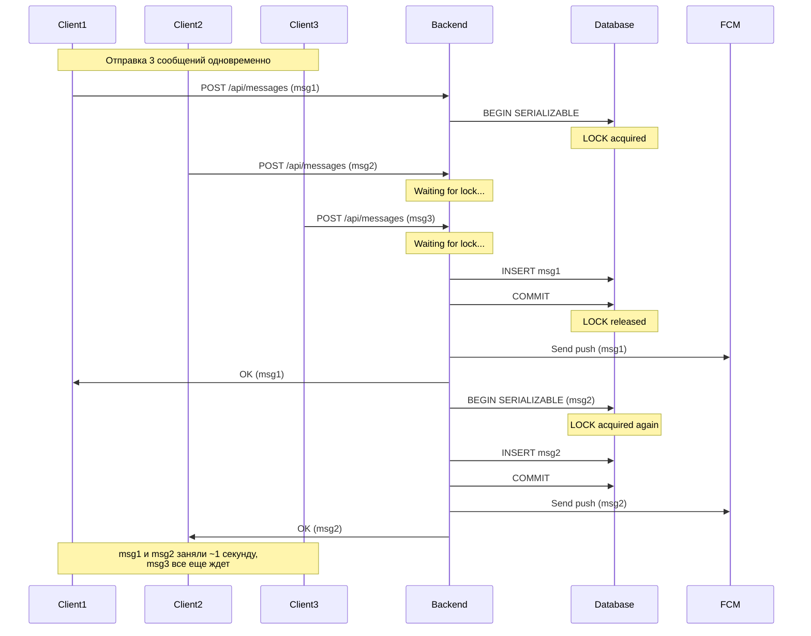
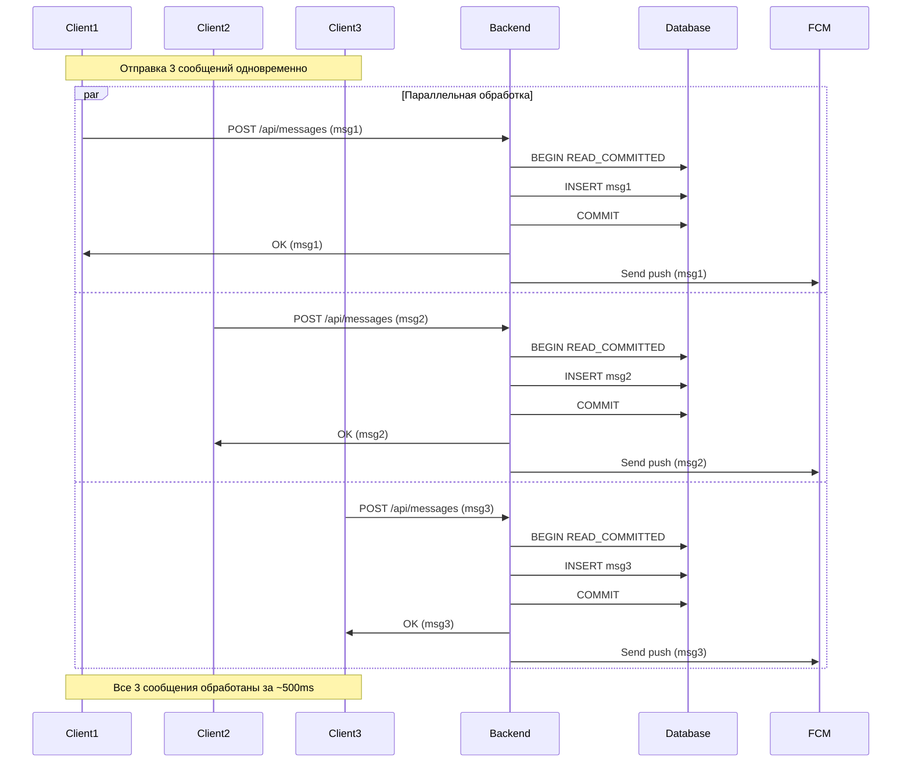

# Улучшения мессенджера: статусы, UI, производительность

## Проблема 1: Race condition в статусе "прослушано" для аудио

### Анализ проблемы

В [`message_bubble.dart`](_may_messenger_mobile_app/lib/presentation/widgets/message_bubble.dart) метод `_markAudioAsPlayed()` вызывается из listener'а аудиоплеера:

```dart
_audioPlayer.playerStateStream.listen((state) {
  if (state.playing && !_hasMarkedAsPlayed && widget.message.type == MessageType.audio) {
    _markAudioAsPlayed();
  }
});
```

**Проблемы:**

1. Listener может срабатывать несколько раз до установки флага `_hasMarkedAsPlayed`
2. Одновременное обновление локального состояния и вызов API создает race condition
3. При быстрой перемотке или паузе/возобновлении listener срабатывает повторно

### Решение

**Файл:** [`message_bubble.dart`](_may_messenger_mobile_app/lib/presentation/widgets/message_bubble.dart)

1. Установить `_hasMarkedAsPlayed = true` ДО вызова API:
```dart
Future<void> _markAudioAsPlayed() async {
  if (_hasMarkedAsPlayed) return;
  
  // CRITICAL: Set flag BEFORE any async operations
  _hasMarkedAsPlayed = true;
  
  final profileState = ref.read(profileProvider);
  final currentUserId = profileState.profile?.id;
  
  if (currentUserId == null || widget.message.senderId == currentUserId) {
    return;
  }
  
  try {
    await ref.read(messagesProvider(widget.message.chatId).notifier)
        .markAudioAsPlayed(widget.message.id);
    print('[AUDIO] Marked as played: ${widget.message.id}');
  } catch (e) {
    print('[AUDIO] Failed to mark as played: $e');
    // Don't reset flag - queue will retry
  }
}
```


2. Добавить debounce в listener для предотвращения множественных вызовов:
```dart
Timer? _markAsPlayedTimer;

@override
void initState() {
  super.initState();
  
  _audioPlayer.playerStateStream.listen((state) {
    if (state.playing && 
        !_hasMarkedAsPlayed && 
        widget.message.type == MessageType.audio) {
      // Debounce: wait 200ms before marking
      _markAsPlayedTimer?.cancel();
      _markAsPlayedTimer = Timer(const Duration(milliseconds: 200), () {
        if (mounted && !_hasMarkedAsPlayed) {
          _markAudioAsPlayed();
        }
      });
    }
  });
}

@override
void dispose() {
  _markAsPlayedTimer?.cancel();
  // ... rest of dispose
}
```


---

## Проблема 2: Долгий Reconnecting при восстановлении из фона

### Анализ проблемы

**Текущее поведение:**

- При resume из фона в [`main.dart`](_may_messenger_mobile_app/lib/main.dart) вызывается `_performResumeSync()`, который:

1. Reconnect SignalR (блокирующая операция)
2. Force sync статусов
3. Refresh чатов

- Индикатор "Reconnecting..." показывается всегда, даже при коротком pause

**Проблемы:**

1. SignalR reconnect занимает 2-5 секунд
2. UI блокируется индикатором "Reconnecting"
3. Не учитывается, как долго приложение было в фоне

### Решение

**Часть 1: Условное отображение ReconnectingФайл:** [`main.dart`](_may_messenger_mobile_app/lib/main.dart)Отслеживать длительность паузы и не показывать индикатор для коротких пауз:

```dart
DateTime? _lastPausedAt;
bool _shouldShowReconnecting = false;

void didChangeAppLifecycleState(AppLifecycleState state) {
  final now = DateTime.now();
  
  if (state == AppLifecycleState.paused) {
    _lastPausedAt = now;
  } else if (state == AppLifecycleState.resumed) {
    final pauseDuration = _lastPausedAt != null 
        ? now.difference(_lastPausedAt!)
        : Duration.zero;
    
    // Show reconnecting only for long pauses (> 10 seconds)
    _shouldShowReconnecting = pauseDuration.inSeconds > 10;
    
    if (_shouldShowReconnecting) {
      // Trigger reconnecting indicator
      ref.read(signalRConnectionProvider.notifier).setReconnecting(true);
    }
    
    // Always perform sync (but UI won't block for short pauses)
    _performResumeSync();
  }
}
```

**Часть 2: Оптимизация reconnect логикиФайл:** [`signalr_service.dart`](_may_messenger_mobile_app/lib/data/datasources/signalr_service.dart)

1. Добавить быстрый health check перед полным reconnect:
```dart
Future<bool> _quickHealthCheck() async {
  if (_connection?.state == HubConnectionState.connected) {
    try {
      // Try a lightweight ping operation (if server supports it)
      await _connection!.invoke('Ping').timeout(const Duration(seconds: 2));
      print('[SignalR] Health check passed, no reconnect needed');
      return true;
    } catch (e) {
      print('[SignalR] Health check failed: $e');
      return false;
    }
  }
  return false;
}

Future<void> forceReconnectFromLifecycle() async {
  // Quick health check first
  if (await _quickHealthCheck()) {
    print('[SignalR] Connection healthy, skipping reconnect');
    return;
  }
  
  // Proceed with reconnect if health check failed
  // ... existing reconnect logic
}
```


2. Уменьшить таймауты для быстрого reconnect:
```dart
final connection = HubConnectionBuilder()
    .withUrl(hubUrl, HttpConnectionOptions(
      accessTokenFactory: () async => token,
      transport: HttpTransportType.webSockets,
      skipNegotiation: true,
      requestTimeout: 3000, // Reduce from 15s to 3s
    ))
    .withAutomaticReconnect([0, 500, 1000, 2000]) // Faster retry intervals
    .build();
```


**Часть 3: Фоновый reconnect без блокировки UIФайл:** [`signalr_provider.dart`](_may_messenger_mobile_app/lib/presentation/providers/signalr_provider.dart)Добавить состояние "silent reconnecting":

```dart
enum SignalRConnectionState {
  disconnected,
  connecting,
  connected,
  reconnecting,
  silentReconnecting, // New: reconnect without UI indicator
}

class SignalRConnectionNotifier extends StateNotifier<SignalRConnectionState> {
  // ...
  
  Future<void> silentReconnect() async {
    if (state == SignalRConnectionState.connected) return;
    
    state = SignalRConnectionState.silentReconnecting;
    await _signalRService.forceReconnectFromLifecycle();
    // State will be updated by connection callbacks
  }
}
```

**Файл:** [`main_screen.dart`](_may_messenger_mobile_app/lib/presentation/screens/main_screen.dart)Показывать индикатор только для `reconnecting`, но не для `silentReconnecting`:

```dart
final connectionState = ref.watch(signalRConnectionProvider);

if (connectionState == SignalRConnectionState.reconnecting) {
  // Show reconnecting banner
}
// Don't show anything for silentReconnecting
```

---

## Проблема 3: Имя отправителя картинки не из телефонной книги

### Решение

**Файл:** [`message_bubble.dart`](_may_messenger_mobile_app/lib/presentation/widgets/message_bubble.dart)В методе `_showFullScreenImage()` получить имя из контактов:

```dart
void _showFullScreenImage(BuildContext context) {
  final contactsNames = ref.read(contactsNamesProvider);
  
  // Try to get contact name, fallback to sender name from message
  String displayName = widget.message.senderName;
  if (contactsNames[widget.message.senderId] != null && 
      contactsNames[widget.message.senderId]!.isNotEmpty) {
    displayName = contactsNames[widget.message.senderId]!;
  }
  
  Navigator.of(context).push(
    MaterialPageRoute(
      builder: (context) => FullScreenImageViewer(
        imageUrl: widget.message.filePath != null
            ? '${ApiConstants.baseUrl}${widget.message.filePath}'
            : null,
        localPath: widget.message.localImagePath,
        senderName: displayName, // Use contact name
        createdAt: widget.message.createdAt,
      ),
    ),
  );
}
```

---

## Проблема 4: Добавить swipe-to-dismiss для полноэкранного просмотра картинки

### Решение

**Файл:** [`fullscreen_image_viewer.dart`](_may_messenger_mobile_app/lib/presentation/widgets/fullscreen_image_viewer.dart)Обернуть в `Dismissible` widget:

```dart
@override
Widget build(BuildContext context) {
  return Dismissible(
    key: const Key('fullscreen_image'),
    direction: DismissDirection.down, // Swipe down to dismiss
    onDismissed: (_) => Navigator.of(context).pop(),
    background: Container(color: Colors.black),
    child: Scaffold(
      backgroundColor: Colors.black,
      body: Stack(
        children: [
          // Existing image viewer with InteractiveViewer
          Center(
            child: InteractiveViewer(
              minScale: 0.5,
              maxScale: 4.0,
              child: _buildImage(),
            ),
          ),
          
          // Top app bar (unchanged)
          // ...
        ],
      ),
    ),
  );
}
```

**Альтернативный подход (более гибкий):** Использовать `GestureDetector` для vertical drag:

```dart
double _dragOffset = 0.0;
double _opacity = 1.0;

Widget build(BuildContext context) {
  return Scaffold(
    backgroundColor: Colors.black.withValues(alpha: _opacity),
    body: GestureDetector(
      onVerticalDragUpdate: (details) {
        setState(() {
          _dragOffset += details.delta.dy;
          _opacity = (1.0 - (_dragOffset.abs() / 300)).clamp(0.0, 1.0);
        });
      },
      onVerticalDragEnd: (details) {
        if (_dragOffset.abs() > 100 || details.velocity.pixelsPerSecond.dy.abs() > 500) {
          Navigator.of(context).pop();
        } else {
          setState(() {
            _dragOffset = 0.0;
            _opacity = 1.0;
          });
        }
      },
      child: Transform.translate(
        offset: Offset(0, _dragOffset),
        child: Stack(
          children: [
            Center(
              child: InteractiveViewer(
                minScale: 0.5,
                maxScale: 4.0,
                child: _buildImage(),
              ),
            ),
            // Top bar
            // ...
          ],
        ),
      ),
    ),
  );
}
```

---

## Проблема 5: Автопрокрутка к последнему сообщению при открытии чата

### Анализ проблемы

В [`chat_screen.dart`](_may_messenger_mobile_app/lib/presentation/screens/chat_screen.dart):

```dart
WidgetsBinding.instance.addPostFrameCallback((_) {
  if (messagesState.messages.isNotEmpty) {
    if (_highlightedMessageId != null) {
      _scrollToHighlightedMessage(messagesState.messages);
    } else {
      _scrollToBottom();
    }
  }
});
```

**Проблема:** `addPostFrameCallback` вызывается при КАЖДОМ rebuild, включая загрузку старых сообщений (infinite scroll).

### Решение

**Файл:** [`chat_screen.dart`](_may_messenger_mobile_app/lib/presentation/screens/chat_screen.dart)

1. Добавить флаг для однократной прокрутки при инициализации:
```dart
bool _hasInitialScrolled = false;

@override
void initState() {
  super.initState();
  // ... existing code
}

@override
Widget build(BuildContext context) {
  final messagesState = ref.watch(messagesProvider(widget.chatId));
  
  // Scroll to bottom only on first load
  if (!_hasInitialScrolled && 
      messagesState.messages.isNotEmpty && 
      !messagesState.isLoading) {
    WidgetsBinding.instance.addPostFrameCallback((_) {
      if (_highlightedMessageId != null) {
        _scrollToHighlightedMessage(messagesState.messages);
      } else {
        _scrollToBottom();
      }
      _hasInitialScrolled = true;
    });
  }
  
  // ... rest of build
}
```


2. Добавить явный вызов `_scrollToBottom()` при отправке нового сообщения:
```dart
void _sendMessage(String text) {
  if (text.trim().isEmpty) return;
  
  ref.read(messagesProvider(widget.chatId).notifier).sendMessage(text.trim());
  _textController.clear();
  
  // Scroll to bottom after sending
  Future.delayed(const Duration(milliseconds: 100), () {
    if (mounted) _scrollToBottom();
  });
}
```


---

## Проблема 6: Использовать chat_background.png как фон чата

### Решение

**Файл:** [`chat_screen.dart`](_may_messenger_mobile_app/lib/presentation/screens/chat_screen.dart)В Scaffold добавить `Container` с фоновым изображением:

```dart
return Scaffold(
  appBar: AppBar(/* ... */),
  body: Container(
    decoration: const BoxDecoration(
      image: DecorationImage(
        image: AssetImage('assets/chat_background.png'),
        fit: BoxFit.cover,
        opacity: 0.3, // Make it subtle, not too distracting
      ),
    ),
    child: Column(
      children: [
        // Existing messages list
        Expanded(
          child: messagesState.isLoading && messagesState.messages.isEmpty
              ? const Center(child: CircularProgressIndicator())
              : ListView.builder(
                  controller: _scrollController,
                  reverse: false,
                  padding: const EdgeInsets.symmetric(horizontal: 8, vertical: 8),
                  itemCount: messagesState.messages.length,
                  itemBuilder: (context, index) {
                    // ...
                  },
                ),
        ),
        // Message input
        // ...
      ],
    ),
  ),
);
```

**Примечание:** Убедиться, что `assets/chat_background.png` зарегистрирован в `pubspec.yaml`:

```yaml
flutter:
  assets:
    - assets/chat_background.png
```

---

## Проблема 7: Backend не справляется с множественными сообщениями

### Анализ проблемы

**Текущая реализация** в [`MessagesController.cs`](_may_messenger_backend/src/MayMessenger.API/Controllers/MessagesController.cs):

```csharp
await using var transaction = await _unitOfWork.BeginTransactionAsync(System.Data.IsolationLevel.Serializable);
```

**SERIALIZABLE** изоляция блокирует параллельную обработку сообщений:

- При 10 одновременных запросах они обрабатываются последовательно
- Каждое сообщение занимает ~500ms (включая FCM push)
- Итого: 10 сообщений = 5 секунд



### Решение: Оптимизация уровня изоляции

**Цель:** Перейти с SERIALIZABLE на READ_COMMITTED + retry logic для дубликатов.**Файл:** [`MessagesController.cs`](_may_messenger_backend/src/MayMessenger.API/Controllers/MessagesController.cs)**Новая стратегия:**

1. Использовать READ_COMMITTED для параллельной обработки
2. Полагаться на UNIQUE constraint для `ClientMessageId`
3. Добавить retry logic при конфликтах
4. Вынести FCM push полностью за пределы транзакции
```csharp
[HttpPost]
public async Task<ActionResult<MessageDto>> SendMessage([FromBody] SendMessageDto dto)
{
    var userId = GetCurrentUserId();
    
    _logger.LogInformation($"SendMessage called: userId={userId}, chatId={dto.ChatId}, clientMessageId={dto.ClientMessageId}");
    
    // Optimistic approach: try to insert, handle conflicts
    const int maxRetries = 3;
    int attempt = 0;
    
    while (attempt < maxRetries)
    {
        attempt++;
        
        try
        {
            // Use READ_COMMITTED for better concurrency
            await using var transaction = await _unitOfWork.BeginTransactionAsync(System.Data.IsolationLevel.ReadCommitted);
            
            try
            {
                // Fast idempotency check WITHOUT locking
                if (!string.IsNullOrEmpty(dto.ClientMessageId))
                {
                    var existingMessage = await _unitOfWork.Messages.GetByClientMessageIdAsync(dto.ClientMessageId);
                    if (existingMessage != null)
                    {
                        _logger.LogInformation($"Message with ClientMessageId {dto.ClientMessageId} already exists, returning existing");
                        await transaction.RollbackAsync();
                        
                        return Ok(MapToMessageDto(existingMessage));
                    }
                }
                
                var sender = await _unitOfWork.Users.GetByIdAsync(userId);
                var chat = await _unitOfWork.Chats.GetByIdAsync(dto.ChatId);
                
                if (sender == null || chat == null)
                {
                    return BadRequest("Invalid sender or chat");
                }
                
                // Create message
                var message = new Message
                {
                    ChatId = dto.ChatId,
                    SenderId = userId,
                    Type = dto.Type,
                    Content = dto.Content,
                    ClientMessageId = dto.ClientMessageId,
                    Status = MessageStatus.Sent
                };
                
                await _unitOfWork.Messages.AddAsync(message);
                await CreatePendingAcksForMessageAsync(chat, message, userId, AckType.Message);
                await _unitOfWork.SaveChangesAsync();
                await transaction.CommitAsync();
                
                _logger.LogInformation($"Message {message.Id} created successfully (attempt {attempt})");
                DiagnosticsController.IncrementMessageProcessed();
                
                var messageDto = MapToMessageDto(message, sender);
                
                // Send SignalR notification (non-blocking, outside transaction)
                _ = Task.Run(async () =>
                {
                    try
                    {
                        await _hubContext.Clients.Group(dto.ChatId.ToString())
                            .SendAsync("ReceiveMessage", messageDto);
                        _logger.LogInformation($"SignalR sent for {message.Id}");
                    }
                    catch (Exception ex)
                    {
                        _logger.LogError(ex, $"SignalR failed for {message.Id}");
                    }
                });
                
                // Send FCM push (fire-and-forget, outside transaction)
                var userTokensForPush = await GetFcmTokensForChatAsync(chat, userId);
                _ = Task.Run(async () =>
                {
                    try
                    {
                        await SendPushNotificationsAsync(sender, messageDto, userTokensForPush);
                    }
                    catch (Exception ex)
                    {
                        _logger.LogError(ex, $"FCM failed for {message.Id}");
                    }
                });
                
                return Ok(messageDto);
            }
            catch (Exception ex)
            {
                await transaction.RollbackAsync();
                throw;
            }
        }
        catch (DbUpdateException ex) when (
            ex.InnerException?.Message?.Contains("IX_Messages_ClientMessageId") == true)
        {
            // Duplicate detected by unique constraint - this is expected with READ_COMMITTED
            _logger.LogInformation($"Duplicate ClientMessageId on attempt {attempt}: {dto.ClientMessageId}");
            
            if (attempt >= maxRetries)
            {
                // Max retries reached, return existing message
                DiagnosticsController.IncrementDuplicateDetected();
                var existingMessage = await _unitOfWork.Messages.GetByClientMessageIdAsync(dto.ClientMessageId);
                if (existingMessage != null)
                {
                    return Ok(MapToMessageDto(existingMessage));
                }
                
                _logger.LogError($"Duplicate detected but message not found: {dto.ClientMessageId}");
                return StatusCode(500, "Internal server error");
            }
            
            // Retry with exponential backoff
            await Task.Delay(50 * attempt);
            continue;
        }
        catch (Exception ex)
        {
            _logger.LogError(ex, $"Error on attempt {attempt}: {ex.Message}");
            
            if (attempt >= maxRetries)
            {
                throw;
            }
            
            await Task.Delay(50 * attempt);
        }
    }
    
    return StatusCode(500, "Failed to create message after retries");
}

// Helper method
private async Task<Dictionary<Guid, List<FcmToken>>> GetFcmTokensForChatAsync(Chat chat, Guid senderId)
{
    var userTokensForPush = new Dictionary<Guid, List<FcmToken>>();
    foreach (var participant in chat.Participants)
    {
        if (participant.UserId != senderId)
        {
            var tokens = await _unitOfWork.FcmTokens.GetActiveTokensForUserAsync(participant.UserId);
            userTokensForPush[participant.UserId] = tokens.ToList();
        }
    }
    return userTokensForPush;
}

private MessageDto MapToMessageDto(Message message, User sender = null)
{
    return new MessageDto
    {
        Id = message.Id,
        ChatId = message.ChatId,
        SenderId = message.SenderId,
        SenderName = sender?.DisplayName ?? message.Sender?.DisplayName ?? "Unknown",
        Type = message.Type,
        Content = message.Content,
        FilePath = message.FilePath,
        Status = message.Status,
        CreatedAt = message.CreatedAt,
        ClientMessageId = message.ClientMessageId
    };
}
```


**Преимущества:**

1. Множественные запросы обрабатываются параллельно
2. Транзакция короче (без FCM внутри)
3. Дубликаты обрабатываются через unique constraint + retry
4. 10 сообщений обрабатываются за ~500ms вместо 5 секунд



---

## Порядок реализации

### Приоритет 1: Критические исправления (statuses and performance)

1. Исправить race condition в `markAudioAsPlayed` (message_bubble.dart)
2. Оптимизировать backend для множественных сообщений (MessagesController.cs)

### Приоритет 2: UX улучшения (reconnecting и UI)

3. Оптимизировать reconnecting логику (main.dart, signalr_service.dart, signalr_provider.dart)
4. Добавить условное отображение reconnecting (main.dart, main_screen.dart)
5. Исправить автопрокрутку к последнему сообщению (chat_screen.dart)
6. Добавить фон чата (chat_screen.dart)

### Приоритет 3: Дополнительные улучшения

7. Имя из телефонной книги для картинок (message_bubble.dart)
8. Swipe-to-dismiss для полноэкранного просмотра (fullscreen_image_viewer.dart)

---

## Тестирование

### Сценарий 1: Race condition в аудио

1. Открыть чат с аудио сообщением
2. Быстро переключаться play/pause несколько раз
3. Проверить, что статус "played" установлен только один раз

### Сценарий 2: Backend производительность

1. Отправить 10-15 сообщений практически одновременно (быстрая печать + Enter)
2. Проверить, что все сообщения доставлены за < 2 секунды
3. Проверить логи backend на отсутствие deadlocks

### Сценарий 3: Reconnecting

1. Свернуть приложение на 5 секунд, вернуться - не должно быть reconnecting banner
2. Свернуть приложение на 30 секунд, вернуться - должен появиться reconnecting banner
3. Проверить, что reconnect занимает < 3 секунд

### Сценарий 4: UI улучшения

1. Открыть чат - прокрутка должна быть внизу
2. Отправить сообщение - автопрокрутка вниз
3. Открыть картинку - имя из телефонной книги
4. Свайпнуть вниз - картинка закрывается