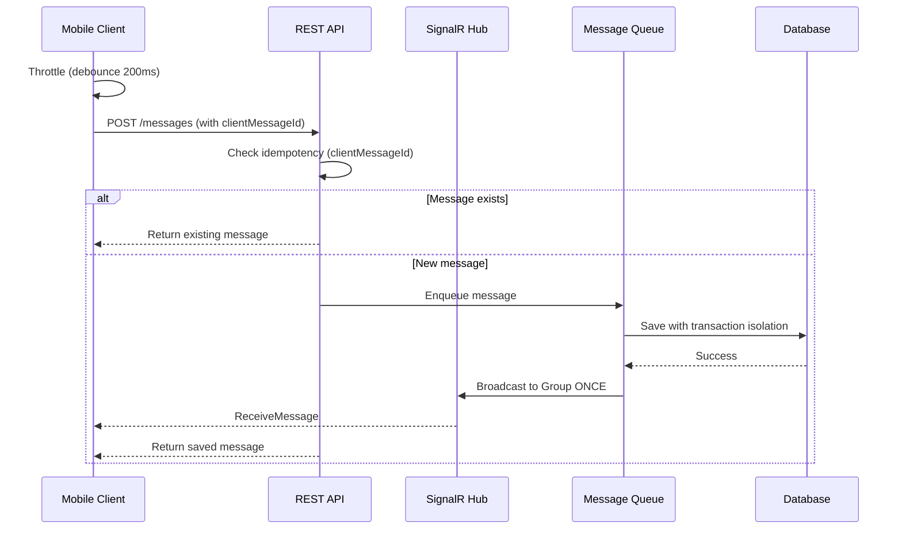

# План: Устойчивость мессенджера к средним нагрузкам

## Выявленные проблемы

**Основные причины сбоев:**

1. Дублирование отправки через SignalR (`Clients.User()` + `Clients.Group()`)
2. Отсутствие идемпотентности - нет проверки client-side messageId
3. Race conditions в БД при concurrent запросах
4. Отсутствие throttling на клиенте
5. Retry логика создает лавину дублирующихся запросов

## Архитектура решения



## Изменения Backend

### 1. Добавить поле clientMessageId в Message

**Файл:** [`_may_messenger_backend/src/MayMessenger.Domain/Entities/Message.cs`](_may_messenger_backend/src/MayMessenger.Domain/Entities/Message.cs)

- Добавить свойство `public string? ClientMessageId { get; set; }`
- Добавить индекс для быстрого поиска

### 2. Создать миграцию для clientMessageId

**Файл:** Новая миграция в `_may_messenger_backend/src/MayMessenger.Infrastructure/Migrations/`

- Добавить колонку `ClientMessageId` (nullable string)
- Создать индекс: `CREATE INDEX IX_Messages_ClientMessageId ON Messages(ClientMessageId)`

### 3. Реализовать идемпотентность в MessagesController

**Файл:** [`_may_messenger_backend/src/MayMessenger.API/Controllers/MessagesController.cs`](_may_messenger_backend/src/MayMessenger.API/Controllers/MessagesController.cs)

**Изменения в методе `SendMessage()`:**

```csharp
// 1. Добавить clientMessageId в DTO
// 2. Проверить существование по clientMessageId перед созданием
// 3. Если существует - вернуть существующее сообщение
// 4. Использовать transaction scope для атомарности
// 5. Убрать дублирующую отправку Clients.User() (оставить только Clients.Group)
```

### 4. Убрать дублирование SignalR рассылки

**Файл:** [`_may_messenger_backend/src/MayMessenger.API/Controllers/MessagesController.cs`](_may_messenger_backend/src/MayMessenger.API/Controllers/MessagesController.cs)

- Удалить цикл `foreach (var participant in chat.Participants)` с `Clients.User()`
- Оставить только `Clients.Group(dto.ChatId.ToString()).SendAsync("ReceiveMessage", messageDto)`
- Повторить для метода `SendAudioMessage()`

### 5. Добавить транзакционную изоляцию

**Файл:** [`_may_messenger_backend/src/MayMessenger.Infrastructure/Repositories/UnitOfWork.cs`](_may_messenger_backend/src/MayMessenger.Infrastructure/Repositories/UnitOfWork.cs)

- Обернуть `SaveChangesAsync()` в `BeginTransaction()` для критических операций
- Добавить retry logic для deadlock recovery

### 6. Добавить метод проверки дубликата в MessageRepository

**Файл:** [`_may_messenger_backend/src/MayMessenger.Infrastructure/Repositories/MessageRepository.cs`](_may_messenger_backend/src/MayMessenger.Infrastructure/Repositories/MessageRepository.cs)

```csharp
Task<Message?> GetByClientMessageIdAsync(string clientMessageId);
```

### 7. Оптимизировать rate limiting

**Файл:** [`_may_messenger_backend/src/MayMessenger.API/Middleware/RateLimitingMiddleware.cs`](_may_messenger_backend/src/MayMessenger.API/Middleware/RateLimitingMiddleware.cs)

- Увеличить лимит для `/api/messages` до 20 req/sec (сейчас 10)
- Добавить burst tolerance

### 8. Отключить SendMessage в ChatHub

**Файл:** [`_may_messenger_backend/src/MayMessenger.API/Hubs/ChatHub.cs`](_may_messenger_backend/src/MayMessenger.API/Hubs/ChatHub.cs)

- Удалить или deprecated метод `SendMessage()` в Hub
- Клиенты должны использовать только REST API для отправки

## Изменения Mobile App

### 9. Добавить clientMessageId в SendMessageDto

**Файл:** [`_may_messenger_mobile_app/lib/data/models/message_model.dart`](_may_messenger_mobile_app/lib/data/models/message_model.dart)

- Передавать localId как clientMessageId при отправке

### 10. Добавить throttling для отправки

**Файл:** [`_may_messenger_mobile_app/lib/presentation/providers/messages_provider.dart`](_may_messenger_mobile_app/lib/presentation/providers/messages_provider.dart)

**В методе `sendMessage()`:**

- Добавить debouncing 200ms для предотвращения спама
- Проверять, нет ли уже отправляемого сообщения с таким же localId

### 11. Улучшить дедупликацию получаемых сообщений

**Файл:** [`_may_messenger_mobile_app/lib/presentation/providers/messages_provider.dart`](_may_messenger_mobile_app/lib/presentation/providers/messages_provider.dart)

**В методе `addMessage()`:**

- Усилить проверку на дубликаты по clientMessageId
- Не полагаться только на timing при замене local сообщений

### 12. Передавать clientMessageId в API

**Файл:** [`_may_messenger_mobile_app/lib/data/datasources/api_datasource.dart`](_may_messenger_mobile_app/lib/data/datasources/api_datasource.dart)

**В методе `sendMessage()`:**

- Добавить параметр `clientMessageId`
- Передать в payload запроса

### 13. Обновить DTO на backend

**Файл:** [`_may_messenger_backend/src/MayMessenger.Application/DTOs/SendMessageDto.cs`](_may_messenger_backend/src/MayMessenger.Application/DTOs/SendMessageDto.cs)

- Добавить `public string? ClientMessageId { get; set; }`
- Добавить валидацию в соответствующий Validator

## Дополнительные улучшения

### 14. Добавить connection pooling для БД

**Файл:** [`_may_messenger_backend/src/MayMessenger.API/Program.cs`](_may_messenger_backend/src/MayMessenger.API/Program.cs)

- Настроить оптимальный размер connection pool
- Добавить resilience policy (Polly) для retry при transient failures

### 15. Логирование для отладки

- Добавить structured logging для trace message flow
- Логировать clientMessageId на каждом этапе

## Порядок выполнения

1. **Backend DB Schema** - добавить ClientMessageId в Message entity + миграция
2. **Backend Repository** - метод GetByClientMessageIdAsync
3. **Backend DTO** - добавить ClientMessageId в SendMessageDto
4. **Backend Controller** - идемпотентность в SendMessage()
5. **Backend Controller** - убрать дублирование SignalR отправки
6. **Backend Hub** - отключить SendMessage метод
7. **Mobile DTO** - передача clientMessageId
8. **Mobile Provider** - throttling и улучшенная дедупликация
9. **Тестирование** - stress test с 10+ сообщений в секунду
10. **Мониторинг** - проверка логов и метрик

## Ожидаемый результат

- ✅ Нет потерянных сообщений при burst отправке
- ✅ Нет дублирования сообщений
- ✅ Устойчивость к 20+ сообщений в секунду от одного пользователя
- ✅ Корректная работа retry логики
- ✅ Стабильная работа SignalR при reconnect