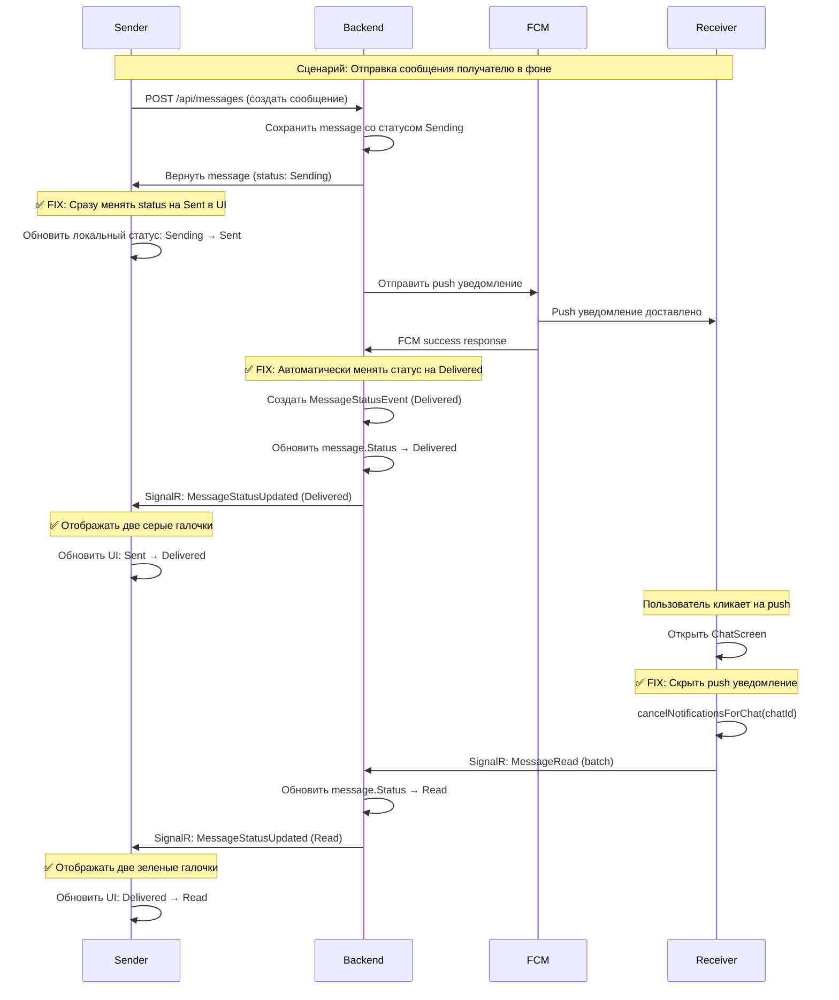

# Фикс статусов сообщений

## Проблема

На скриншоте видно, что у отправителя крутится индикатор загрузки (статус `sending`) вместо корректного статуса `delivered` (две серые галочки), хотя получатель уже получил push уведомление.

### Текущее поведение (НЕПРАВИЛЬНО):

1. Отправитель отправляет сообщение → статус `sending` (индикатор загрузки)
2. Сообщение приходит на сервер → статус остается `sending` ❌
3. Получатель в фоне получает push → статус все еще `sending` ❌
4. Только когда получатель кликает на push и открывает чат → статус меняется на `read` (две зеленые галочки)

### Ожидаемое поведение (ПРАВИЛЬНО):

1. Отправитель отправляет сообщение → статус `sending` (индикатор загрузки)
2. Сообщение успешно отправлено на сервер → статус `sent` (одна серая галочка) ✅
3. Получатель получает push уведомление → статус `delivered` (две серые галочки) ✅
4. Получатель открывает чат и читает → статус `read` (две зеленые галочки) ✅
5. Получатель прослушал аудио → статус `played` (зеленый индикатор) ✅

---

## Анализ кода

### Frontend (_may_messenger_mobile_app)

**1. Отображение статусов в [`message_bubble.dart`](_may_messenger_mobile_app/lib/presentation/widgets/message_bubble.dart)**

```189:252:_may_messenger_mobile_app/lib/presentation/widgets/message_bubble.dart
Widget _buildMessageStatusIcon() {
  switch (widget.message.status) {
    case MessageStatus.sending:
      return CircularProgressIndicator(); // 🔄 Индикатор загрузки
    case MessageStatus.sent:
      return Icon(Icons.check, color: Colors.white70); // ✓ Одна серая галочка
    case MessageStatus.delivered:
      return Icon(Icons.done_all, color: Colors.grey[400]); // ✓✓ Две серые галочки
    case MessageStatus.read:
      return Icon(Icons.done_all, color: Colors.green); // ✓✓ Две зеленые галочки
    case MessageStatus.played:
      return Icon(Icons.volume_up, color: Colors.blue); // 🔊 Синяя иконка
    case MessageStatus.failed:
      return Icon(Icons.error, color: Colors.red); // ❌ Ошибка
  }
}
```

**Проблема:** Статус `played` отображается синей иконкой, а должен быть зеленым. Также нужно визуально менять цвет аудио плеера.**2. Логика отправки в [`messages_provider.dart`](_may_messenger_mobile_app/lib/presentation/providers/messages_provider.dart)**В методе `_syncMessageToBackend()` (строка ~540):

```dart
print('[MSG_SEND] Message synced successfully. Server ID: ${serverMessage.id}');
// Сообщение успешно отправлено на сервер, но статус НЕ обновляется!
```

**Проблема:** После успешной отправки на сервер статус не гарантированно обновляется до `sent`. Сервер может вернуть статус `sending`.**3. Подтверждение доставки в [`signalr_provider.dart`](_may_messenger_mobile_app/lib/presentation/providers/signalr_provider.dart)**В методе `onReceiveMessage` (строка ~116-119):

```dart
if (!isFromMe) {
  _signalRService.markMessageAsDelivered(message.id, message.chatId);
}
```

**Проблема:** `markMessageAsDelivered()` вызывается только когда приложение в foreground и SignalR подключен. Если получатель в фоне, подтверждение доставки НЕ отправляется.

### Backend (_may_messenger_backend)

**1. Создание сообщения в [`MessagesController.cs`](_may_messenger_backend/src/MayMessenger.API/Controllers/MessagesController.cs)**При создании сообщения через `POST /api/messages`:

- Сообщение сохраняется в БД со статусом `Sending`
- Отправляется push уведомление
- **НО:** Статус НЕ меняется автоматически на `Delivered` после отправки push

**2. Подтверждение доставки в [`ChatHub.cs`](_may_messenger_backend/src/MayMessenger.API/Hubs/ChatHub.cs)**Метод `MessageDelivered()` (строка 110):

- Вызывается только когда клиент явно вызывает через SignalR
- Если клиент в фоне → метод НЕ вызывается → статус остается `Sending`

---

## Решение

### **Часть 1: Frontend - Гарантированный переход sending → sent**

#### 1.1 Обновить `_syncMessageToBackend()` в [`messages_provider.dart`](_may_messenger_mobile_app/lib/presentation/providers/messages_provider.dart)

**Файл:** `_may_messenger_mobile_app/lib/presentation/providers/messages_provider.dart`**Текущий код (строка ~540):**

```dart
print('[MSG_SEND] Message synced successfully. Server ID: ${serverMessage.id}');

// Update message in UI
final messageIndex = state.messages.indexWhere((m) => m.id == localId);
if (messageIndex != -1) {
  final updatedMessages = [...state.messages];
  final finalServerMessage = serverMessage.copyWith(
    localId: localId,
    isLocalOnly: false,
  );
  updatedMessages[messageIndex] = finalServerMessage;
}
```

**Новый код:**

```dart
print('[MSG_SEND] Message synced successfully. Server ID: ${serverMessage.id}, Status: ${serverMessage.status}');

// IMPORTANT: Ensure status is at least 'sent' after successful sync
// Server might return 'sending', but we know it's sent successfully
final finalStatus = serverMessage.status == MessageStatus.sending 
    ? MessageStatus.sent 
    : serverMessage.status;

final messageIndex = state.messages.indexWhere((m) => m.id == localId);
if (messageIndex != -1) {
  final updatedMessages = [...state.messages];
  final finalServerMessage = serverMessage.copyWith(
    localId: localId,
    isLocalOnly: false,
    status: finalStatus, // Ensure proper status
  );
  updatedMessages[messageIndex] = finalServerMessage;
  print('[MSG_SEND] Message updated in UI with status: $finalStatus');
}
```

**Обоснование:** Если сервер вернул успешный ответ, значит сообщение ТОЧНО отправлено на сервер. Минимальный статус должен быть `sent`, а не `sending`.---

### **Часть 2: Backend - Автоматическое delivered при отправке push**

#### 2.1 Автоматически устанавливать `Delivered` после отправки push уведомления

**Файл:** `_may_messenger_backend/src/MayMessenger.API/Controllers/MessagesController.cs`**Найти место, где отправляется push уведомление получателям:**

```csharp
// After sending FCM push notification
await _fcmService.SendMessageNotificationAsync(...);

// ДОБАВИТЬ: Automatically mark as delivered for offline users who received push
```

**Добавить логику:**

```csharp
// После успешной отправки push уведомления получателям
foreach (var recipientId in offlineRecipientIds) // Получатели, которые offline
{
    // Создать событие "Delivered" от имени получателя
    await _unitOfWork.MessageStatusEvents.CreateEventAsync(
        message.Id, 
        MessageStatus.Delivered, 
        recipientId, 
        "FCM_Push_Delivered");
}

// Пересчитать агрегированный статус
var aggregateStatus = await _unitOfWork.MessageStatusEvents.CalculateAggregateStatusAsync(message.Id);

// Если статус изменился, обновить сообщение и уведомить отправителя
if (message.Status != aggregateStatus)
{
    message.Status = aggregateStatus;
    if (aggregateStatus == MessageStatus.Delivered && message.DeliveredAt == null)
    {
        message.DeliveredAt = DateTime.UtcNow;
    }
    await _unitOfWork.Messages.UpdateAsync(message);
    
    // Уведомить отправителя через SignalR о смене статуса
    await _hubContext.Clients.Group(message.ChatId.ToString())
        .SendAsync("MessageStatusUpdated", message.Id, (int)aggregateStatus);
}
```

**Обоснование:** Если push уведомление успешно отправлено (FCM вернул success), значит сообщение ДОСТАВЛЕНО до устройства получателя. Статус должен автоматически стать `Delivered`.---

### **Часть 3: Frontend - Автоматическое скрытие push уведомлений**

#### 3.1 Добавить метод для отмены уведомлений в [`notification_service.dart`](_may_messenger_mobile_app/lib/core/services/notification_service.dart)

**Добавить метод:**

```dart
/// Cancel notification for a specific chat when messages are read
Future<void> cancelNotificationsForChat(String chatId) async {
  try {
    // Cancel notification by chatId hash
    await _localNotifications.cancel(chatId.hashCode);
    print('[Notification] Cancelled notifications for chat: $chatId');
  } catch (e) {
    print('[Notification] Failed to cancel notifications: $e');
  }
}
```


#### 3.2 Вызвать метод при открытии чата

**Файл:** `_may_messenger_mobile_app/lib/presentation/screens/chat_screen.dart`**В методе `initState()` (строка ~58):**

```dart
// Join chat via SignalR
Future.microtask(() async {
  final signalRService = ref.read(signalRServiceProvider);
  await signalRService.joinChat(widget.chatId);
  
  // Clear notifications for this chat
  final notificationService = ref.read(notificationServiceProvider);
  await notificationService.cancelNotificationsForChat(widget.chatId);
  
  // Notify FCM service too
  final fcmService = ref.read(fcmServiceProvider);
  fcmService.setCurrentChat(widget.chatId);
  
  // Clear unread count
  ref.read(chatsProvider.notifier).clearUnreadCount(widget.chatId);
  
  // Mark messages as read
  await Future.delayed(const Duration(milliseconds: 500));
  ref.read(messagesProvider(widget.chatId).notifier).markMessagesAsRead();
});
```

**Обоснование:** Когда пользователь открывает чат, все уведомления для этого чата должны автоматически скрываться.---

### **Часть 4: Frontend - Визуальное отображение статуса `played` зеленым цветом**

#### 4.1 Изменить иконку статуса `played` на зеленую

**Файл:** `_may_messenger_mobile_app/lib/presentation/widgets/message_bubble.dart`**Текущий код (строка ~221-227):**

```dart
case MessageStatus.played:
  // Синяя иконка динамика - воспроизведено (для аудио)
  return const Icon(
    Icons.volume_up,
    size: 14,
    color: Colors.blue, // ❌ СИНИЙ
  );
```

**Новый код:**

```dart
case MessageStatus.played:
  // Зеленая иконка - воспроизведено (для аудио)
  return const Icon(
    Icons.done_all, // Используем те же две галочки, как для read
    size: 14,
    color: Colors.green, // ✅ ЗЕЛЕНЫЙ
  );
```


#### 4.2 Визуально менять цвет аудио плеера для прослушанных сообщений

**В том же файле, метод `_buildMessageContent()` (строка ~266-321):Добавить логику для изменения цвета:**

```dart
case MessageType.audio:
  // Определить, прослушано ли сообщение
  final isPlayed = widget.message.status == MessageStatus.played;
  final waveformColor = isMe 
      ? (isPlayed ? Colors.greenAccent : Colors.white)  // Для своих сообщений
      : (isPlayed ? Colors.green : Theme.of(context).colorScheme.primary); // Для чужих

  return Row(
    mainAxisSize: MainAxisSize.min,
    children: [
      IconButton(
        icon: Icon(
          _isPlaying ? Icons.pause : Icons.play_arrow,
          color: isMe 
              ? (isPlayed ? Colors.greenAccent : Colors.white) 
              : (isPlayed ? Colors.green : null),
          size: 28,
        ),
        onPressed: _playPauseAudio,
      ),
      Expanded(
        child: Column(
          children: [
            AudioWaveform(
              progress: ...,
              activeColor: waveformColor, // Зеленый если прослушано
              inactiveColor: isMe ? Colors.white30 : Colors.grey[300]!,
              ...
            ),
          ],
        ),
      ),
    ],
  );
```

---

## Архитектура решения



---

## Порядок реализации

### Приоритет 1: Frontend - Гарантированный `sent` статус

1. Обновить `_syncMessageToBackend()` в [`messages_provider.dart`](_may_messenger_mobile_app/lib/presentation/providers/messages_provider.dart) - гарантировать минимум `sent` после успешной отправки
2. Также обновить `_syncImageToBackend()` аналогично

### Приоритет 2: Backend - Автоматический `delivered` при FCM push

3. Найти место отправки FCM push в [`MessagesController.cs`](_may_messenger_backend/src/MayMessenger.API/Controllers/MessagesController.cs)
4. Добавить автоматическое создание `MessageStatusEvent` с типом `Delivered` после успешной отправки push
5. Уведомлять отправителя через SignalR о смене статуса

### Приоритет 3: Frontend - Автоматическое скрытие push

6. Добавить метод `cancelNotificationsForChat()` в [`notification_service.dart`](_may_messenger_mobile_app/lib/core/services/notification_service.dart)
7. Вызвать метод в `initState()` в [`chat_screen.dart`](_may_messenger_mobile_app/lib/presentation/screens/chat_screen.dart)

### Приоритет 4: Frontend - Зеленый цвет для `played`

8. Изменить иконку `played` статуса на зеленую в [`message_bubble.dart`](_may_messenger_mobile_app/lib/presentation/widgets/message_bubble.dart)
9. Изменить цвет аудио плеера для прослушанных сообщений

---

## Тестирование

### Сценарий 1: Отправка сообщения онлайн получателю

1. Оба пользователя в чате
2. Отправитель отправляет сообщение
3. **Ожидаемо:** 

- У отправителя: `sending` (индикатор) → `sent` (1 галочка) → `delivered` (2 серые) → `read` (2 зеленые)
- Переход быстрый, почти мгновенный

### Сценарий 2: Отправка сообщения офлайн получателю

1. Получатель свернул приложение
2. Отправитель отправляет сообщение
3. **Ожидаемо:**

- У отправителя: `sending` (индикатор) → `sent` (1 галочка) → `delivered` (2 серые галочки) ✅
- Push приходит получателю
- Когда получатель откроет чат: `delivered` → `read` (2 зеленые галочки)
- Push уведомление автоматически скрывается

### Сценарий 3: Аудио сообщение

1. Отправитель отправляет аудио
2. Получатель получает и прослушивает
3. **Ожидаемо:**

- У отправителя: статус меняется на `played`
- Иконка статуса: две зеленые галочки
- Аудио плеер получателя: зеленый цвет волны

---

## Потенциальные проблемы

### 1. FCM может не вернуть success немедленно

**Решение:** Установить таймаут на отправку FCM (5 секунд). Если успех или таймаут - считать delivered.

### 2. Получатель может никогда не открыть сообщение

**Решение:** Это нормально. Статус остается `delivered` (2 серые галочки). Это корректно.

### 3. Множественные получатели в группе

**Решение:** Использовать агрегированный статус:

- Если хотя бы один получатель прочитал → `read`
- Если все доставлено, но никто не прочитал → `delivered`