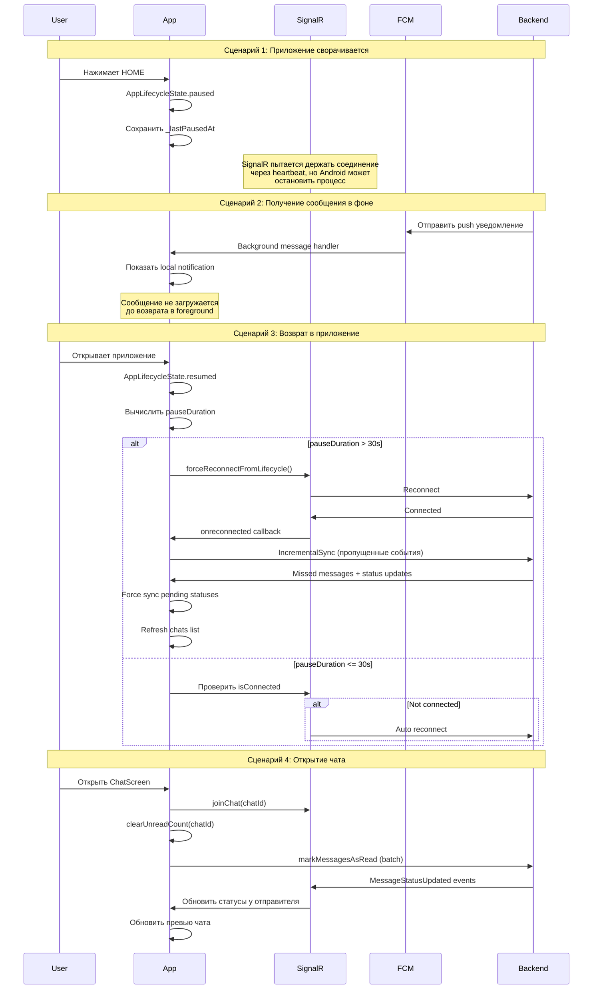

# Фикс фоновой работы May Messenger

## Проблемы

После анализа кода выявлены следующие критические проблемы:

### 1. **Бесконечное переподключение SignalR**

- В [`signalr_service.dart`](_may_messenger_mobile_app/lib/data/datasources/signalr_service.dart) метод `_attemptReconnect()` вызывает `connect()`, который создает **новый** `HubConnection`
- Это конфликтует с уже существующим connection, который пытается reconnect автоматически через `withAutomaticReconnect()`
- Race condition между ручным и автоматическим reconnect приводит к зацикливанию

### 2. **Потеря SignalR соединения в фоне**

- Android агрессивно останавливает фоновые процессы
- SignalR heartbeat (каждые 30 секунд) не выполняется, когда приложение свернуто
- При resume в [`main.dart`](_may_messenger_mobile_app/lib/main.dart) reconnect происходит слишком поздно

### 3. **Статусы сообщений не синхронизируются**

- [`status_sync_service.dart`](_may_messenger_mobile_app/lib/data/services/status_sync_service.dart) работает каждые 10 секунд, но таймер останавливается в фоне
- Когда SignalR disconnected, статусы не доходят до сервера
- При reconnect нет механизма для **приоритетной** синхронизации pending status updates

### 4. **Сообщения отображаются не с той стороны**

- В [`messages_provider.dart`](_may_messenger_mobile_app/lib/presentation/providers/messages_provider.dart) методе `loadMessages()`:
- При восстановлении из Hive кэша `clientMessageId` может быть потерян
- Deduplication полагается на clientMessageId, но fallback на content matching не всегда работает
- Outbox messages могут дублироваться с synced messages

### 5. **Превью чатов не обновляются**

- [`main_screen.dart`](_may_messenger_mobile_app/lib/presentation/screens/main_screen.dart) загружает чаты только в `initState()`
- Нет автоматического refresh при возврате с `ChatScreen`
- `clearUnreadCount()` вызывается локально, но сервер может не получить уведомление о прочитанных сообщениях, если SignalR disconnected

---

## Решение

### **Часть 1: Фикс бесконечного переподключения SignalR**

#### 1.1 Улучшить логику reconnect в `signalr_service.dart`

**Проблема:** Создание нового HubConnection конфликтует с автоматическим reconnect.**Решение:**

- Удалить создание нового connection в `_attemptReconnect()`
- Использовать только `withAutomaticReconnect()` с правильными retry delays
- Добавить флаг для предотвращения одновременных reconnect attempts
- При `forceReconnectFromLifecycle()` сначала проверять состояние соединения

**Изменения:**

```dart
// signalr_service.dart

// 1. Добавить флаг для отслеживания manual reconnect
bool _isManualReconnecting = false;

// 2. Упростить _attemptReconnect - не создавать новый connection
Future<void> _attemptReconnect() async {
  if (_isManualReconnecting || _hubConnection?.state == HubConnectionState.Connected) {
    return;
  }
  
  _isManualReconnecting = true;
  
  try {
    // Просто ждем автоматического reconnect, не вмешиваясь
    await Future.delayed(Duration(seconds: 2));
    
    // Если после задержки все еще disconnected, пробуем restart
    if (_hubConnection?.state == HubConnectionState.Disconnected) {
      await _hubConnection?.start();
    }
  } finally {
    _isManualReconnecting = false;
  }
}

// 3. Улучшить forceReconnectFromLifecycle
Future<void> forceReconnectFromLifecycle() async {
  if (_hubConnection?.state == HubConnectionState.Connected) {
    return; // Уже подключены
  }
  
  if (_hubConnection?.state == HubConnectionState.Reconnecting) {
    return; // Переподключение уже идет
  }
  
  // Только если Disconnected - пытаемся reconnect
  await _attemptReconnect();
}
```


#### 1.2 Добавить лучшую обработку lifecycle в `main.dart`

**Проблема:** Reconnect происходит только при resumed, но нет проверки before pause.**Решение:**

- При `paused` сохранить timestamp
- При `resumed` проверить, сколько времени прошло
- Если > 30 секунд, делать force reconnect + incremental sync

**Изменения:**

```dart
// main.dart - в _MyAppState

DateTime? _lastPausedAt;

@override
void didChangeAppLifecycleState(AppLifecycleState state) {
  super.didChangeAppLifecycleState(state);
  
  if (state == AppLifecycleState.paused) {
    _lastPausedAt = DateTime.now();
    print('[LIFECYCLE] App paused at ${_lastPausedAt}');
  } else if (state == AppLifecycleState.resumed) {
    final authState = ref.read(authStateProvider);
    
    if (authState.isAuthenticated) {
      final pauseDuration = _lastPausedAt != null 
          ? DateTime.now().difference(_lastPausedAt!)
          : Duration.zero;
      
      print('[LIFECYCLE] App resumed after ${pauseDuration.inSeconds}s');
      
      // Если приложение было в фоне > 30 секунд, reconnect + sync
      if (pauseDuration.inSeconds > 30) {
        _performResumeSync();
      } else {
        // Просто проверить соединение
        final signalRState = ref.read(signalRConnectionProvider);
        if (!signalRState.isConnected) {
          ref.read(signalRConnectionProvider.notifier).reconnect();
        }
      }
    }
  }
}

Future<void> _performResumeSync() async {
  // 1. Reconnect SignalR
  await ref.read(signalRConnectionProvider.notifier).reconnect();
  
  // 2. Force sync pending status updates
  final statusSyncService = ref.read(statusSyncServiceProvider);
  await statusSyncService.forceSync();
  
  // 3. Refresh chats list to get updated unreads
  await ref.read(chatsProvider.notifier).loadChats(forceRefresh: true);
}
```

---

### **Часть 2: Фикс статусов сообщений**

#### 2.1 Приоритетная синхронизация статусов при reconnect

**Проблема:** `status_sync_service.dart` синхронизирует статусы каждые 10 секунд, но таймер останавливается в фоне.**Решение:**

- В `signalr_service.dart` в `onreconnected` вызвать немедленную синхронизацию статусов
- Добавить метод для немедленного flush pending status updates

**Изменения:**

```dart
// signalr_service.dart - в onreconnected handler

_hubConnection?.onreconnected(({connectionId}) async {
  print('[SignalR] Reconnected! Connection ID: $connectionId');
  _isReconnecting = false;
  _reconnectAttempts = 0;
  
  _startHeartbeatTimer();
  
  // ДОБАВИТЬ: Немедленная синхронизация статусов
  await _performIncrementalSync();
  
  // Триггерить callback для force sync статусов
  if (_onReconnectedCallback != null) {
    await _onReconnectedCallback!();
  }
});

// Добавить callback
Function()? _onReconnectedCallback;

void setOnReconnectedCallback(Function() callback) {
  _onReconnectedCallback = callback;
}
```


```dart
// signalr_provider.dart - в _initialize()

_signalRService.setOnReconnectedCallback(() async {
  // Force sync pending status updates
  final statusSyncService = _ref.read(statusSyncServiceProvider);
  await statusSyncService.forceSync();
  print('[SignalR] Pending status updates synced after reconnect');
});
```


#### 2.2 Улучшить периодическую синхронизацию

**Проблема:** Timer может останавливаться в фоне на Android.**Решение:**

- Использовать `Timer.periodic` с проверкой app lifecycle state
- Добавить sync при app resume
- Уменьшить интервал до 5 секунд (вместо 10) для более быстрой синхронизации

**Изменения:**

```dart
// status_sync_service.dart

void startPeriodicSync({Duration interval = const Duration(seconds: 5)}) {
  // Изменить интервал на 5 секунд
}
```

---

### **Часть 3: Фикс deduplication сообщений**

#### 3.1 Улучшить сохранение clientMessageId в кэш

**Проблема:** При сохранении в Hive кэш `clientMessageId` может не сохраняться.**Решение:**

- Убедиться, что `clientMessageId` всегда сохраняется в Hive
- При загрузке из кэша восстанавливать `clientMessageId`

**Изменения:**

```dart
// В local_datasource.dart (нужно проверить, что clientMessageId входит в JSON)

// Убедиться, что при toJson() clientMessageId включается:
Map<String, dynamic> toJson() {
  return {
    'id': id,
    'chatId': chatId,
    // ...
    'clientMessageId': clientMessageId, // ВАЖНО!
    'localId': localId,
    // ...
  };
}
```


#### 3.2 Улучшить логику deduplication в `messages_provider.dart`

**Проблема:** Сложная логика matching может ошибаться.**Решение:**

- Упростить deduplication - полагаться только на `clientMessageId` и server `id`
- Убрать content-based matching как ненадежный

**Изменения:**

```dart
// messages_provider.dart - в addMessage()

// Упростить deduplication:
final exists = state.messages.any((m) {
  // 1. Проверка по server ID (самая надежная)
  if (message.id.isNotEmpty && m.id == message.id) {
    return true;
  }
  
  // 2. Проверка по clientMessageId
  if (message.clientMessageId != null && message.clientMessageId!.isNotEmpty) {
    if (m.clientMessageId == message.clientMessageId || 
        m.localId == message.clientMessageId) {
      return true;
    }
  }
  
  return false;
});
```

---

### **Часть 4: Фикс превью чатов**

#### 4.1 Автоматический refresh при возврате на MainScreen

**Проблема:** `main_screen.dart` загружает чаты только один раз.**Решение:**

- Добавить `didChangeDependencies()` или использовать lifecycle для refresh
- При навигации назад на MainScreen refresh chats

**Изменения:**

```dart
// main_screen.dart

@override
void didChangeDependencies() {
  super.didChangeDependencies();
  
  // Refresh chats when returning to this screen
  WidgetsBinding.instance.addPostFrameCallback((_) {
    if (mounted) {
      ref.read(chatsProvider.notifier).loadChats(forceRefresh: true);
    }
  });
}
```

**Альтернативный подход (лучше):** Использовать `RouteObserver` для отслеживания navigation.

#### 4.2 Обновление unreadCount через SignalR

**Проблема:** `clearUnreadCount()` работает только локально.**Решение:**

- При входе в ChatScreen отправлять batch markAsRead через SignalR
- Сервер должен обновить unreadCount для всех клиентов
- При получении status update "read" обновлять unreadCount в chats_provider

**Изменения:**

```dart
// chats_provider.dart - добавить метод

void updateUnreadCountOnStatusUpdate(String chatId, String messageId, MessageStatus status) {
  if (status != MessageStatus.read) return;
  
  final index = state.chats.indexWhere((c) => c.id == chatId);
  if (index != -1) {
    final chat = state.chats[index];
    
    // Проверить, было ли это сообщение непрочитанным
    // Если да, уменьшить unreadCount
    if (chat.unreadCount > 0) {
      final updatedChat = Chat(
        id: chat.id,
        type: chat.type,
        title: chat.title,
        avatar: chat.avatar,
        lastMessage: chat.lastMessage,
        unreadCount: (chat.unreadCount - 1).clamp(0, 9999),
        createdAt: chat.createdAt,
        otherParticipantId: chat.otherParticipantId,
      );
      
      final updatedChats = [...state.chats];
      updatedChats[index] = updatedChat;
      state = state.copyWith(chats: updatedChats);
    }
  }
}
```


```dart
// signalr_provider.dart - в onMessageStatusUpdated

_signalRService.onMessageStatusUpdated((messageId, status) {
  // ... existing code ...
  
  // Обновить unreadCount в превью чатов
  if (status == MessageStatus.read) {
    // Найти chatId для этого сообщения
    final chatsState = _ref.read(chatsProvider);
    for (final chat in chatsState.chats) {
      if (chat.lastMessage?.id == messageId) {
        _ref.read(chatsProvider.notifier).updateUnreadCountOnStatusUpdate(
          chat.id, 
          messageId, 
          status
        );
        break;
      }
    }
  }
});
```

---

## Архитектура решения



---

## Порядок реализации

**Приоритет 1: Фикс reconnecting loop**

1. Изменить [`signalr_service.dart`](_may_messenger_mobile_app/lib/data/datasources/signalr_service.dart) - упростить `_attemptReconnect()`
2. Добавить флаг `_isManualReconnecting`
3. Улучшить `forceReconnectFromLifecycle()`

**Приоритет 2: Фикс lifecycle sync**

4. Изменить [`main.dart`](_may_messenger_mobile_app/lib/main.dart) - добавить `_lastPausedAt` и `_performResumeSync()`
5. Добавить onReconnected callback в [`signalr_service.dart`](_may_messenger_mobile_app/lib/data/datasources/signalr_service.dart)
6. Триггерить force sync статусов в [`signalr_provider.dart`](_may_messenger_mobile_app/lib/presentation/providers/signalr_provider.dart)

**Приоритет 3: Фикс статусов**

7. Уменьшить интервал sync в [`status_sync_service.dart`](_may_messenger_mobile_app/lib/data/services/status_sync_service.dart) до 5 секунд
8. Добавить приоритетную синхронизацию при reconnect

**Приоритет 4: Фикс deduplication**

9. Упростить deduplication в [`messages_provider.dart`](_may_messenger_mobile_app/lib/presentation/providers/messages_provider.dart)
10. Убедиться, что clientMessageId сохраняется в Hive

**Приоритет 5: Фикс превью чатов**

11. Добавить `didChangeDependencies()` в [`main_screen.dart`](_may_messenger_mobile_app/lib/presentation/screens/main_screen.dart)
12. Добавить `updateUnreadCountOnStatusUpdate()` в [`chats_provider.dart`](_may_messenger_mobile_app/lib/presentation/providers/chats_provider.dart)
13. Обновлять unreadCount при получении status updates

---

## Тестирование

После реализации протестировать:

1. **Тест reconnecting:**

- Открыть чат, отправить сообщение
- Свернуть приложение на 1 минуту
- Открыть приложение
- Проверить: нет бесконечного "Reconnecting..."

2. **Тест статусов:**

- Два устройства, оба в чате
- Отправить сообщение с устройства A
- Устройство B сворачивает приложение
- Отправить еще сообщение с A
- Устройство B открывает приложение и сразу заходит в чат
- Проверить: статусы "доставлено" и "прочитано" корректно обновляются на устройстве A

3. **Тест превью:**

- Два устройства, оба в списке чатов
- Отправить сообщение с устройства A
- Устройство B получает уведомление, открывает чат, читает сообщение
- Устройство B возвращается на главный экран
- Проверить: unreadCount = 0 на устройстве B
- Проверить: статус "прочитано" на устройстве A

4. **Тест дублирования:**

- Открыть чат
- Отправить сообщение
- Быстро свернуть приложение
- Открыть приложение через 1 минуту
- Проверить: сообщение НЕ дублируется (не отображается дважды)

---

## Альтернативные решения (НЕ рекомендуется)

### Foreground Service (отклонено)

Можно было бы использовать foreground service с постоянным уведомлением для поддержания SignalR соединения в фоне. Однако:

- ❌ Значительно расходует батарею
- ❌ Пользователи негативно воспринимают постоянное уведомление
- ❌ Google может отклонить приложение в Play Store без веской причины
- ✅ Решение через FCM + быстрый reconnect более эффективно

### WebSocket Keep-Alive через WorkManager (отклонено)

Можно было бы использовать WorkManager для периодических ping к серверу. Однако:

- ❌ Сложная реализация
- ❌ Ограничения на частоту запросов (минимум 15 минут)