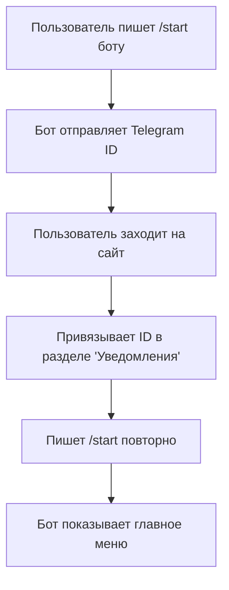

# 🤖 Итоговый отчет: Управление уведомлениями через Telegram бота

## 🎯 Выполненные задачи

### ✅ 1. Модели Telegram API 
**Файл:** `RareBooksService.Common/Models/Telegram/TelegramWebhookModels.cs`

Созданы все необходимые модели для работы с Telegram Bot API:
- **TelegramUpdate** - основная модель для получения обновлений
- **TelegramMessage** - модель сообщения
- **TelegramUser, TelegramChat** - информация о пользователе и чате
- **TelegramCallbackQuery** - обработка нажатий на кнопки
- **TelegramInlineKeyboard** - интерактивные клавиатуры
- **TelegramUserState** - состояния пользователей для многошаговых диалогов
- **Константы состояний и callback data** для навигации

### ✅ 2. Расширение базы данных
**Файл:** `RareBooksService.Data/UsersDbContext.cs`

Добавлена новая таблица **TelegramUserStates**:
- Отслеживание состояний пользователей в диалогах
- Хранение временных данных для многошаговых операций
- Индексы для быстрого поиска по TelegramId

### ✅ 3. Расширение TelegramNotificationService
**Файл:** `RareBooksService.WebApi/Services/TelegramNotificationService.cs`

Добавлены новые методы для интерактивного управления:
- **SendMessageWithKeyboardAsync** - отправка сообщений с кнопками
- **EditMessageAsync** - редактирование существующих сообщений
- **AnswerCallbackQueryAsync** - ответы на нажатия кнопок
- **SetWebhookAsync/DeleteWebhookAsync** - управление webhook
- **Методы работы с состояниями пользователей**
- **Поиск пользователей по TelegramId**
- **Получение настроек уведомлений через бота**

### ✅ 4. Логика обработки команд
**Файлы:** 
- `RareBooksService.WebApi/Services/TelegramBotService.cs` 
- `RareBooksService.WebApi/Services/TelegramBotServiceExtended.cs`

Реализована полная логика бота:

#### 🎮 Команды бота:
- `/start` - приветствие и получение Telegram ID
- `/help` - справка по всем командам  
- `/settings` - главное меню настроек
- `/list` - просмотр всех настроек с навигацией
- `/cancel` - отмена текущей операции

#### 🔘 Интерактивные функции:
- **Просмотр настроек** в виде удобных карточек
- **Быстрое включение/выключение** уведомлений
- **Редактирование ключевых слов** с валидацией
- **Редактирование ценового диапазона** с парсингом
- **Удаление настроек** с подтверждением
- **Навигация через inline-кнопки**

#### 🔄 Управление состояниями:
- **Многошаговые диалоги** для сложных операций
- **Валидация пользовательского ввода**
- **Обработка ошибок** и некорректных данных
- **Автоматическая очистка** состояний после операций

### ✅ 5. Webhook контроллеры
**Файлы:**
- `RareBooksService.WebApi/Controllers/TelegramWebhookController.cs`
- `RareBooksService.WebApi/Controllers/TelegramAdminController.cs`

#### Публичный контроллер:
- **POST /api/telegram/webhook** - прием обновлений от Telegram
- **Обработка ошибок** и логирование
- **Валидация входящих данных**

#### Админский контроллер:
- **GET /api/admin/telegram/info** - информация о боте
- **POST /api/admin/telegram/webhook/setup** - настройка webhook
- **DELETE /api/admin/telegram/webhook** - удаление webhook
- **POST /api/admin/telegram/test-message** - тестовые сообщения
- **GET /api/admin/telegram/statistics** - статистика уведомлений
- **Защита авторизацией** (только администраторы)

### ✅ 6. Регистрация сервисов
**Файл:** `RareBooksService.WebApi/Program.cs`

Зарегистрирован новый сервис:
```csharp
builder.Services.AddScoped<ITelegramBotService, TelegramBotService>();
```

## 📱 Пользовательский интерфейс бота

### Главное меню
```
🏠 Главное меню

⚙️ Настройки уведомлений
➕ Создать настройку    ℹ️ Справка
```

### Просмотр настроек
```
📋 Ваши настройки уведомлений:

✅ ID 1
   Ключевые слова: Пушкин, прижизненное
   Частота: 60 мин

❌ ID 2  
   Ключевые слова: Достоевский, автограф
   Частота: 120 мин

[✅ Настройка 1] [❌ Настройка 2]
[➕ Создать новую] [🔙 Назад]
```

### Редактирование настройки
```
⚙️ Настройка #1

Статус: ✅ Включена
Ключевые слова: Пушкин, прижизненное издание
Цена: 5000₽ - 50000₽
Частота: 60 мин

[❌ Отключить]
[📝 Ключевые слова] [💰 Цена]
[🗑️ Удалить] [🔙 Назад]
```

### Редактирование ключевых слов
```
📝 Редактирование ключевых слов

Текущие ключевые слова: Пушкин, прижизненное издание

Введите новые ключевые слова через запятую:

Примеры:
• Толстой, первое издание
• автограф, редкость

Или отправьте 'очистить' чтобы убрать все ключевые слова.

[❌ Отменить]
```

## 🔧 Технические возможности

### Обработка команд
```
Пользователь: /start
Бот: Анализирует, подключен ли аккаунт → Показывает соответствующее меню

Пользователь: /list
Бот: Получает настройки из БД → Формирует список с кнопками

Пользователь: Нажимает кнопку настройки
Бот: Показывает детали + меню редактирования
```

### Управление состояниями
```
Пользователь: Нажимает "📝 Ключевые слова"
Бот: Устанавливает состояние EditingKeywords → Просит ввести данные

Пользователь: Вводит новые ключевые слова
Бот: Валидирует → Сохраняет в БД → Очищает состояние → Показывает результат
```

### Обработка ошибок
```
Некорректный формат цены:
"❌ Неверный формат. Используйте: 1000-5000, 1000-, -5000 или 'очистить'"

Слишком длинные ключевые слова:
"❌ Слишком длинные ключевые слова. Максимум 500 символов."

Настройка не найдена:
"❌ Настройка не найдена."
```

## 🚀 Процесс настройки

### 1. Первое подключение


### 2. Управление настройками
```mermaid
graph TD
    A[/list - просмотр настроек] --> B[Нажатие на настройку]
    B --> C[Детали настройки]
    C --> D{Выбор действия}
    D -->|Включить/выключить| E[Мгновенное изменение]
    D -->|Редактировать поле| F[Состояние редактирования]
    D -->|Удалить| G[Подтверждение удаления]
    F --> H[Ввод данных]
    H --> I[Валидация и сохранение]
    I --> C
```

### 3. Административная настройка
```bash
# 1. Установка миграции
dotnet ef migrations add AddTelegramUserStates -c UsersDbContext

# 2. Применение миграции  
dotnet ef database update -c UsersDbContext

# 3. Настройка webhook (через API или админ-панель)
POST /api/admin/telegram/webhook/setup
{
  "baseUrl": "https://your-domain.com"
}
```

## 📊 Статистика и мониторинг

### Логирование
- **Получение сообщений** от пользователей
- **Обработка команд** и callback queries
- **Изменения настроек** пользователями
- **Ошибки отправки** сообщений
- **Webhook операции** (установка/удаление)

### Доступная статистика (через админ API)
- Информация о боте и токене
- Статус webhook
- Возможность отправки тестовых сообщений
- (Планируется: статистика по уведомлениям)

## 💎 Ключевые преимущества

### Для пользователей:
1. **Управление на ходу** - настройка уведомлений не отходя от Telegram
2. **Интуитивный интерфейс** - кнопки вместо команд  
3. **Быстрые действия** - включить/выключить одним нажатием
4. **Всегда под рукой** - никаких переходов в браузер
5. **Мгновенная обратная связь** - сразу видно результат действий

### Для системы:
1. **Снижение нагрузки** на веб-интерфейс
2. **Повышение вовлеченности** пользователей  
3. **Меньше поддержки** - пользователи сами управляют настройками
4. **Централизованное управление** - всё в одном месте
5. **Масштабируемость** - легко добавлять новые функции

### Для администраторов:
1. **Полный контроль** через админ-панель
2. **Мониторинг операций** через логи
3. **Тестирование функций** через API
4. **Простая настройка** webhook
5. **Статистика использования** (в разработке)

## 🎉 Результат

Создана **полноценная система управления уведомлениями через Telegram бота**, которая включает:

### 🔧 Backend функционал:
- Обработка всех типов сообщений и команд
- Интерактивные inline-клавиатуры
- Система состояний для многошаговых операций
- Валидация и обработка ошибок
- Админские функции управления ботом

### 👥 Пользовательский опыт:
- Простая настройка через команду /start
- Удобная навигация через кнопки
- Быстрое редактирование всех параметров
- Мгновенная обратная связь
- Интуитивно понятный интерфейс

### 🛡️ Безопасность и надежность:
- Защита админских функций авторизацией
- Изоляция данных пользователей
- Подробное логирование операций
- Graceful обработка ошибок
- Валидация входящих данных

**Система готова к использованию!** 🚀 

Пользователи теперь могут полноценно управлять своими уведомлениями прямо из Telegram, что значительно улучшает user experience и снижает барьеры для активного использования сервиса уведомлений о редких книгах.

